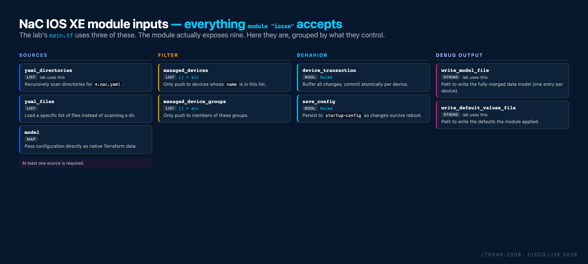

# Appendix V - Quick reference card

One-page cheat sheet covering everything you need to rerun the lab - at home, on your own devices, or from memory. Bookmark this page; print it if that's your style.

## Lab devices

| Device     | Role           | Mgmt IP        | User  | Pass  |
|------------|----------------|----------------|-------|-------|
| **core**     | Core switch (Catalyst 9000v) | `198.18.130.10` | cisco | cisco |
| **border**   | Border router (Catalyst 8000v) | `198.18.130.20` | cisco | cisco |
| **access01** | Access switch (Catalyst 9000v) | `198.18.130.11` | cisco | cisco |
| **access02** | Access switch (Catalyst 9000v) | `198.18.130.12` | cisco | cisco |
| **isp**      | Upstream BGP peer (pre-configured) | `198.18.130.200` | cisco | cisco |
| **host01** / **host02** | End-hosts (CML console only) | `192.168.100.100/200` | cisco | cisco |
| ntp-server   | NTP service (Ubuntu VM) | `198.18.129.11` | - | - |
| syslog-server | Syslog service (Ubuntu VM) | `198.18.129.12` | - | - |

Network as Code manages the top four. The rest are pre-configured and used for verification only.

## Lab VMs

| VM | Address | User | Pass | Access |
|----|---------|------|------|--------|
| Windows 10 | `198.18.133.20`  | admin  | cisco       | RDP |
| CML        | `198.18.130.34`  | guest  | CiscoLive   | HTTPS |
| Ubuntu     | `198.18.133.101` | guest  | CiscoLive   | SSH |
| GitLab     | `198.18.133.101` | root   | C1sco12345  | HTTPS |

GitLab and Ubuntu share the host (same `198.18.133.101`), different services.

## Automation seed config (on each Network as Code-managed device)

```text
username nac_admin privilege 15 secret cisco
netconf-yang
```

That's the minimum. `restconf` + `ip http secure-server` are optional if you want RESTCONF-based verification as well.

## Environment variables

```bash
export IOSXE_USERNAME=nac_admin
export IOSXE_PASSWORD=cisco
export IOSXE_PROTOCOL=netconf   # or restconf
```

Load per-session with `source .env`, or append to `~/.bashrc` for persistence.

## NETCONF reachability preflight

```bash
ssh -s -p 830 -o StrictHostKeyChecking=no $IOSXE_USERNAME@<device_ip> netconf
```

Expect an XML `<hello>` with a capability list. **Ctrl+C** to exit.

## Project layout

```text
~/nac-iosxe/
├── .env                                   # credentials
├── .schema.yaml                           # NAC schema (for nac-validate)
├── main.tf                                # Terraform module configuration
├── data/                                  # your YAML intent
│   ├── devices/core.nac.yaml        # one file per device
│   ├── devices/border.nac.yaml
│   ├── devices/access01.nac.yaml
│   ├── devices/access02.nac.yaml
│   ├── global.nac.yaml             # applies to all devices
│   ├── groups/access.nac.yaml       # applies to ACCESS_SWITCHES group
│   └── template-*.nac.yaml                # optional reusable templates
├── tftpl/                                 # optional .tftpl template files
├── tests/                                 # optional nac-test suite
├── model.yaml        ← generated by `terraform apply`
├── defaults.yaml     ← generated
└── terraform.tfstate ← generated (Terraform state)
```

## `main.tf` skeleton

```terraform
module "iosxe" {
  source                    = "git::https://github.com/netascode/terraform-iosxe-nac-iosxe.git"
  yaml_directories          = ["data/"]
  write_model_file          = "model.yaml"
  write_default_values_file = "defaults.yaml"
}
```

In production, pin to a specific tag: `?ref=v0.12.3`.

## Module inputs reference

The IOS XE as Code module accepts nine input variables. The lab uses three. Here are all nine, grouped by what they control:

<figure markdown>
  { width="100%" }
</figure>

Quick decision table:

| You want to… | Set |
|--------------|-----|
| Scan a directory of YAML files | `yaml_directories = ["data/"]` |
| Load a specific list of files | `yaml_files = ["data/core.nac.yaml", ...]` |
| Provide config as a Terraform map | `model = { … }` |
| Push to only a subset of devices | `managed_devices = ["core", "border"]` |
| Push to only members of certain groups | `managed_device_groups = ["ACCESS_SWITCHES"]` |
| Commit atomically per device (multi-RPC safety) | `device_transaction = true` |
| Persist to `startup-config` so config survives reboot | `save_config = true` |
| Write the merged data model for inspection | `write_model_file = "model.yaml"` |
| Write the resolved defaults for inspection | `write_default_values_file = "defaults.yaml"` |

## Fleet-level vs per-device transactions

Two separate "atomicity" layers are worth distinguishing because they're easy to conflate:

| Scope | Mechanism | Guarantee |
|-------|-----------|-----------|
| **Single device, single apply** | NETCONF candidate datastore + `<commit>` (see Task 01 diagram) | All RPCs in one Terraform-to-device session commit together, or all roll back. Requires `netconf-yang feature candidate-datastore` on the device. |
| **Multiple RPCs, single apply, same device** | Module's `device_transaction = true` input | Terraform buffers all changes destined for a device and commits them in one NETCONF transaction. Same guarantee, applied per-device across every changeset Terraform computes. |
| **Fleet-level (across devices)** | Not available - Terraform applies per-device | If an apply touches 10 devices and device #7 fails, the first six have their changes committed; devices 7-10 don't. There is **no** "all 10 devices or none" primitive. |

For the lab's 4-device deployment, the per-device transaction layer is what matters. For real production rollouts, plan for the fleet-level case: stage rollouts by pipeline phase, roll back via a subsequent `apply` that reverses the intent, or use `managed_devices` to scope the blast radius.

## Terraform command reference

| Command | What it does | Changes devices? |
|---------|--------------|------------------|
| `terraform init` | Download module + provider, once per project | No |
| `terraform init -upgrade` | Pull latest module versions | No |
| `terraform validate` | Check `.tf` syntax | No |
| `terraform fmt` | Auto-format `.tf` files | No |
| `terraform plan` | Diff: desired vs actual. Print the plan | No |
| `terraform plan -out=plan.tfplan` | Same, save for later apply | No |
| `terraform apply` | Execute the plan (prompts to confirm) | **Yes** |
| `terraform apply -auto-approve` | Apply without confirmation (CI only) | **Yes** |
| `terraform apply plan.tfplan` | Apply a previously-saved plan | **Yes** |
| `terraform destroy` | Remove all Terraform-managed config | **Yes** |
| `terraform show` | Display current state | No |
| `terraform state list` | List tracked resources | No |

## `nac-validate` - pre-deployment schema check

```bash
pip install nac-validate
export PATH=$PATH:~/.local/bin

# Validate every YAML under data/ against .schema.yaml
nac-validate -s .schema.yaml data/
```

Exit code 0 = valid. Non-zero + `ERROR - Syntax error ...` = something's wrong. The error message names the exact merged-model path at fault.

## `nac-test` - post-deployment verification

```bash
pip install nac-test

# Assumes `tests/` directory is present (see Task 11)
nac-test \
  --data ./model.yaml \
  --data ./defaults.yaml \
  --templates ./tests/templates \
  --filters ./tests/filters \
  --output ./tests/results
```

Artifacts in `./tests/results/`:

- `report.html` - human-readable summary, open in browser
- `log.html` - step-by-step execution log
- `xunit.xml` - JUnit XML for CI integration

## GitLab CI/CD stages

| Stage | Job | Runs on MR? | Runs on main? |
|-------|-----|:-----------:|:-------------:|
| `validate` | `terraform fmt -check`, `nac-validate` | ✅ | ✅ |
| `plan`     | `terraform plan` + post plan to MR comment | ✅ | ✅ |
| `deploy`   | `terraform apply -auto-approve plan.tfplan` | ❌ | ✅ |
| `test`     | `nac-test` integration + `terraform plan -detailed-exitcode` idempotency | ❌ | ✅ |
| `notify`   | Webex / email on success or failure | ❌ | ✅ |

MR pipelines are preview-only. `main` pipelines deploy.

## Further reading

- [netascode.cisco.com](https://netascode.cisco.com) - Network as Code data models + tool docs for IOS XE, SD-WAN, ACI, Catalyst Center, Nexus Dashboard
- [`terraform-iosxe-nac-iosxe`](https://github.com/netascode/terraform-iosxe-nac-iosxe) - the module used in this lab (Apache 2.0)
- [`terraform-provider-iosxe`](https://github.com/CiscoDevNet/terraform-provider-iosxe) - the IOS XE Terraform provider underneath
- [netascode on GitHub](https://github.com/netascode) - all the modules, tools, and data models

---

**← Previous:** [Appendix IV - ISP Router Configuration](Appendix-IV.md)
