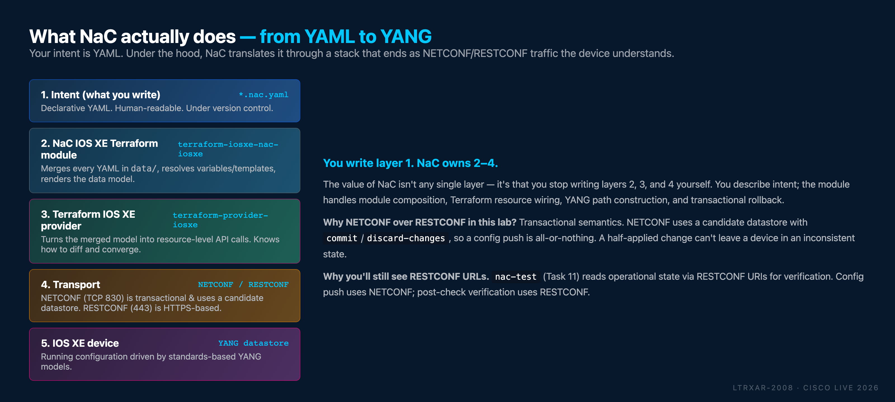

This step-by-step guide walks you through the **Network as Code for IOS XE** lab. By the end, you will know how to deploy and manage IOS XE devices with declarative infrastructure-as-code and CI/CD pipelines.

!!! tip "New to these acronyms?"
    The guide uses ~18 networking and automation terms (YANG, NETCONF, HCL, WSL, dCloud, etc.). See **[Glossary](Glossary.md)** in the top nav for one-line definitions. Keep it open in a side tab if you hit one you don't recognize.

## What is Network as Code?

**Network as Code (NaC)** is a methodology that applies DevOps principles to network management through declarative data models. Rather than writing scripts or clicking through GUIs, network engineers describe their intended network state in human-readable YAML files. The Network as Code toolchain - built on Terraform - handles the how: translating intent into device-specific configuration, tracking state, and pushing only what changed.

Network as Code is an umbrella that spans multiple Cisco platforms and architectures. Each platform has its own Terraform module and provider, but they all share the same methodology: YAML intent files → Terraform module → platform provider → device. The [supported platforms](https://netascode.cisco.com/resources/supported_products) include ACI, Catalyst SD-WAN, Meraki, Catalyst Center, ISE, NX-OS, IOS XR, and - the focus of this lab - **IOS XE**.

**IOS XE as Code** is the Network as Code implementation for Cisco IOS XE devices (Catalyst 9000, C8000V, ISR, ASR, etc.). It uses the [`terraform-iosxe-nac-iosxe`](https://github.com/netascode/terraform-iosxe-nac-iosxe) module and the [`terraform-provider-iosxe`](https://github.com/CiscoDevNet/terraform-provider-iosxe) provider to push YANG-modelled configuration over NETCONF. If you learn the workflow here, you can apply the same patterns to any other Network as Code-supported platform - the data model schemas differ (after all, these are very different products!), but the overall approach of driving intended configuration through declarative YAML and Terraform is intentionally consistent across the family.

## Why this lab matters

Traditional network management relies on manual CLI commands, scripts, and brittle templates. The typical failure modes - configuration drift, human error, no change history, and no safe way to preview or test changes - are well understood but rarely solved at scale.

This lab shows how Network as Code addresses each of them using:

- **Declarative configuration** - define the desired state, not the steps to reach it
- **Terraform** - industry-standard Infrastructure-as-Code engine
- **Schema validation** - catch misconfigurations before they ever reach a device
- **Post-deployment testing** - verify what was deployed actually matches what you asked for
- **GitLab CI/CD pipelines** - automate validation, deployment, and testing end-to-end

!!! note "Terminology"
    *IOS XE as Code* and *Network as Code for IOS XE* are used interchangeably in this guide - both refer to the same automation solution.

## What the stack looks like

Network as Code isn't a single tool - it's a layered stack. You write intent in YAML; the stack turns that into actual configuration on the device:

<figure markdown>
  { width="100%" }
</figure>

You'll spend all your time in **layer 1** (the YAML). The rest of the stack - the Terraform module, the IOS XE provider, the NETCONF transport - is maintained by Cisco and the Network as Code open-source community.

## Lab scope

This lab uses virtualized IOS XE devices in Cisco Modeling Labs (CML) and a GitLab instance running in the lab environment. It is designed for learning; the configurations shown are **not intended for production use as-is**. Production deployments require additional considerations around state storage, secret management, access control, and approval workflows - most of which we note in context but do not implement here.

## What you'll learn

By completing this lab, you will gain hands-on experience with:

- Writing declarative IOS XE configurations in Network as Code YAML format
- Deploying configurations using the Network as Code Terraform module
- Understanding the Network as Code configuration hierarchy: **global → group → device**
- Using variables and templates for reusable, scalable configurations
- Pre-deployment validation with `nac-validate` (schema and semantic checks)
- Post-deployment validation with `nac-test` (automated Robot Framework tests)
- Automating the full Infrastructure-as-Code lifecycle with GitLab CI/CD pipelines
- Implementing GitOps workflow safeguards (branch protection, merge requests)

## About this guide

Authored by Andrea Testino and Christopher Hart, building on the original Amsterdam delivery by Asier Arlegui and Balu Novak-Bohak.

---

**Next:** [Lab Content](Intro02_all_learners.md)
