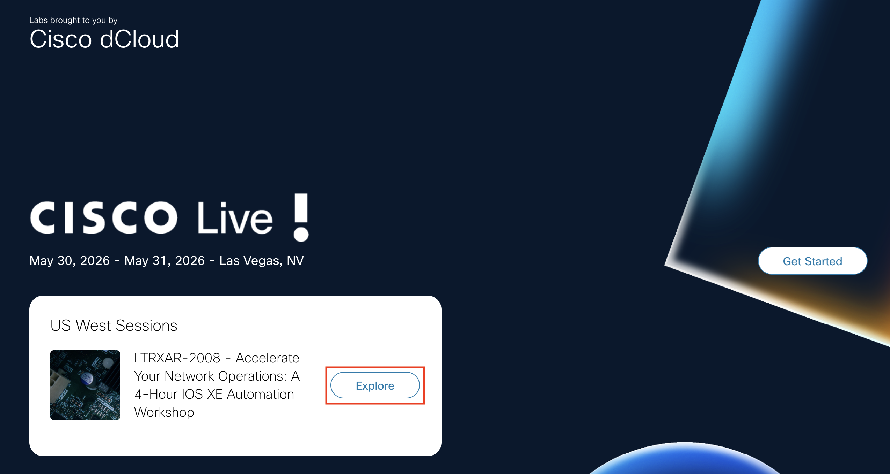
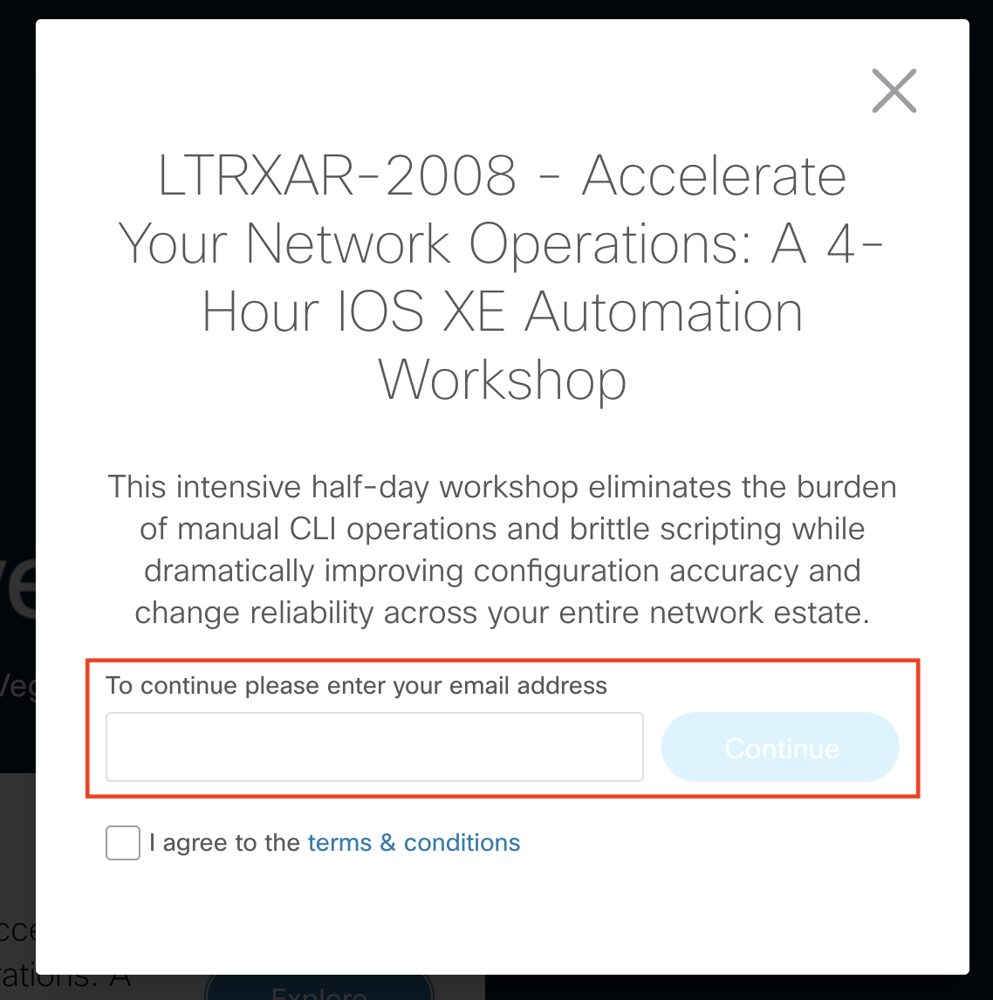
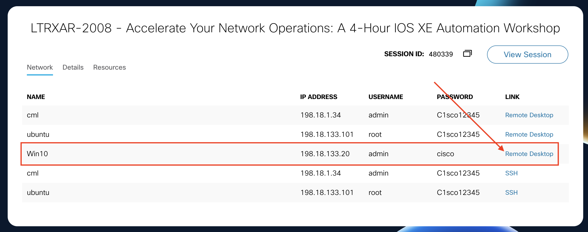

# Getting started

## Connecting to your lab environment

Follow these three steps to open the Windows 10 VM where you'll do all your work.

**Step 1 - Click Explore.** On the right monitor at your station, locate the dCloud session card for **LTRXAR-2008** and click the **Explore** hyperlink.

{ width="80%" }

**Step 2 - Enter your email.** In the dialog that appears, type the email address you used to register for Cisco Live and click **Continue**.

{ width="60%" }

**Step 3 - Open the Win10 Remote Desktop.** You'll see a resource details page listing the virtual machines in your lab pod. Find the row for **Win10** and click the **Remote Desktop** link - this opens a Web RDP session directly in your browser.

{ width="100%" }

Once the Web RDP session loads, you're inside the lab VM. Everything you need - VS Code, Solar-PuTTY, WSL Ubuntu, and Chrome - is already installed. You'll open the **WSL Ubuntu terminal** frequently throughout the lab; it's the orange Ubuntu icon on the desktop labelled **Ubuntu 22.04.5 LTS**.

!!! warning "Read the lab guide from your laptop, not from inside the VM"
    The Chrome start page bookmarked on the Win10 VM currently points to an **older copy of this guide from a previous Cisco Live delivery** - a known deployment-side issue we weren't able to correct in time. Please ignore that bookmark.

    The current guide is the one already open on your laptop's left monitor when you sit down: **[https://cl-ltr.ciscolabs.com/4eb6f2de2e/](https://cl-ltr.ciscolabs.com/4eb6f2de2e/)**. Keep that tab in front of you for the entire session.

    You will still do every hands-on action (VS Code edits, WSL terminal commands, Solar-PuTTY sessions) **inside the Win10 VM**. The only thing that lives on your laptop is this guide. Copy-paste from your laptop into the Web RDP window takes an extra moment compared to staying inside the VM, but that is a much smaller cost than following outdated instructions.

For the full topology diagram and device inventory, see **[Topologies](Intro05_topologies.md)** (also linked from the top navigation bar throughout the lab).

## How the tasks flow

!!! info "Tasks are sequential - each builds on the previous one"
    The **Recommended** path (Tasks 01 through 06, then 10, 12, 13) is
    designed to be followed **in order**. Each task uses configuration,
    files, or state produced by earlier tasks. Skipping a task means the
    next one's instructions won't match what's on your disk.

    **Optional** tasks (07-09 Templates, 11 Post-checks, 14 Extended
    pipeline, 15 Merge requests) can be cherry-picked based on your
    interest and remaining time. Where the order of optionals matters
    (e.g. Task 11 must run before Task 12 destroys its artifacts), the
    affected task page has its own callout at the top.

    **If you have ~90 minutes only:** Tasks 01 -> 02 -> 03 -> 05 -> 06 ->
    10 -> 12 -> 13 gets you through the full "write intent, validate,
    deploy via CI/CD" loop. Skip Task 04 and all Optional tasks.

## Readiness check (2 minutes, before Task 01)

Before sinking time into the first task, confirm the lab's three moving
pieces are actually reachable. Open the **WSL Ubuntu terminal** - it's
the orange Ubuntu icon on the desktop labelled **Ubuntu 22.04.5 LTS** -
and run these three commands:

```bash
# 1. Can you reach a lab device over SSH?
ssh -o StrictHostKeyChecking=no cisco@198.18.130.10 "show version | include Cisco IOS"
```

```text { .no-copy }
Warning: Permanently added '198.18.130.10' (RSA) to the list of known hosts.
(cisco@198.18.130.10) Password:

Cisco IOS XE Software, Version 17.15.01
Cisco IOS Software [IOSXE], Catalyst L3 Switch Software (CAT9K_IOSXE), Version 17.15.1, RELEASE SOFTWARE (fc4)
Cisco IOS-XE software, Copyright (c) 2005-2024 by Cisco Systems, Inc.
All rights reserved.  Certain components of Cisco IOS-XE software are

client_loop: send disconnect: Broken pipe
```

!!! tip "Password prompt or access denied is fine here"
    The goal of this check is simply that the device **responds**. If it prompts for a password, SSH is working. If it says `Permission denied` or drops the connection after login, the device is reachable and healthy. Only flag it to a proctor if the command hangs or times out with no output.

```bash
# 2. Can you reach GitLab?
curl -sk https://198.18.133.101 -o /dev/null -w "gitlab HTTP %{http_code}\n"
```

!!! tip "`200` or `302` are both fine"
    GitLab usually answers the bare host with a `302` redirect (to `/users/sign_in`) on a freshly-logged-out browser session and a `200` once you've hit it before. Either response means the server is reachable - flag a proctor only if you get a connection timeout, `000`, or a 5xx.

```text { .no-copy }
gitlab HTTP 200
```

```bash
# 3. Is Terraform on your PATH?
terraform version | head -1
```

```text { .no-copy }
Terraform v1.12.2
```

If all three produce the expected output, you're ready. If any fails, flag
it to a lab proctor now rather than hitting it mid-task.

---

**← Previous:** [Disclaimer](Intro03_disclaimer.md)  ·  **Next:** [Task 01 - SSH to Devices](Task01_SSH_to_network_devices.md)
