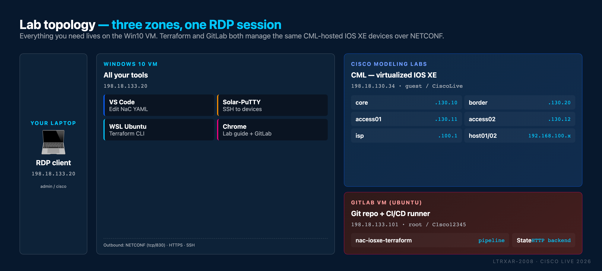

From your workstation, you will work on a Web RDP session to the Windows 10 VM with IP address 198.18.133.20 and credentials admin / C1sco12345.

Below is the dCloud lab topology diagram:

<figure markdown>
  { width="100%" }
</figure>

This lab consists of:

- Multiple **IOS XE** virtual switches running in CML (Cisco Modeling Labs - network simulation platform)
- **GitLab** as Git repository and to run CI/CD pipelines, running in an Ubuntu VM
- Windows 10 VM with:
    - **VS Code** for editing Infrastructure as Code YAML files
    - SSH client **Solar-PuTTY** to access the IOS XE devices
    - **Windows Subsystem for Linux (WSL)** to run Terraform

!!! tip "Recommendation: Use the Lab Guide from Within the VM"
    We recommend reading this lab guide directly from the **Windows 10 VM** rather than from your laptop. The lab guide is already bookmarked in **Chrome** on the VM. **Why?** Copy/paste between your laptop and the RDP session is not straightforward. Since you'll need to copy YAML configurations from this guide into VS Code, working entirely within the VM will be much more practical and save you time.
