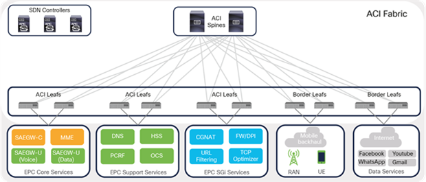

# Lab 1 - Getting Started

## Lab Environment

This lab consistems of:
- Multiple **IOS XE** virtual routers
- **VSCode** for editing Infrastructure as Code YAML files
- SSH client **Solar-PuTTY** to access the IOSXE devices
- **Windows Subsystem for Linux (WSL)** to run Terraform
- **GitLab** as Git repository and to run CI/CD pipeline


## Section 1

Please use the following credentials to connect to device:

| <!-- -->         | <!-- -->         |
| ---------------- | ---------------- |
| `IP Address`     | 1.1.1.1          |
| `Username`       | admin            |
| `Password`       | C1sco123         |


My content

!!! note
    This is a note

Cisco IOS code block:

```ios
hostname ABC
interface GigabitEthernet1
 ip address 122.1.1.1
```


Image:

<figure markdown>
  { width="100%" }
</figure>

## Section 2

More content

## Section 3 - Example of J2 variables usage (from data/macro_vars.yaml)

To show POD-specific variable - example var value is the name of the POD1: {{ pod1.name }}

Similarly, the name of the POD2 from the macro_vars.yaml file is the "{{ pod2.name }}"

All PODs have IP addresses in the {{ pod_default.ip }} format.
 
Global var value for global answer to everything is {{ global.answer_var }}.


