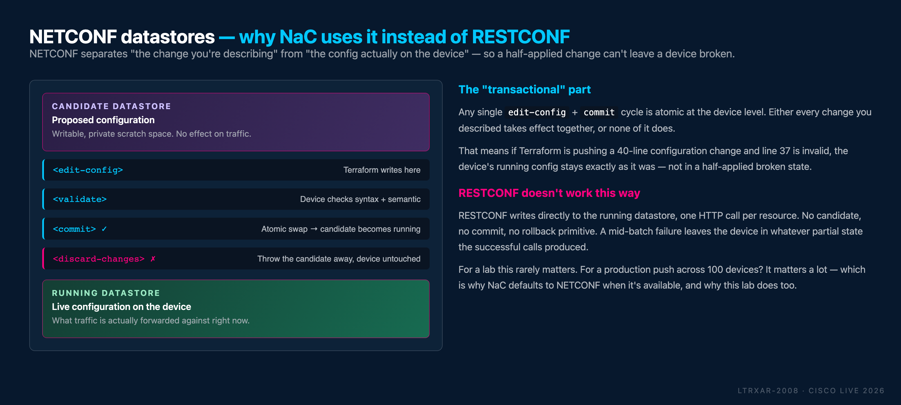

# Task 01 - SSH to the lab devices

**Estimated Time to Complete:** ~10 minutes

Before you deploy any Network as Code configuration, you'll confirm baseline connectivity to the IOS XE lab devices and see what's already on them. You'll use Solar-PuTTY to SSH into each device, verify the running configuration, and identify the minimal "seed" config that makes Terraform-driven automation possible.

## What you'll learn

- How to connect to IOS XE devices using Solar-PuTTY
- How to verify device information with basic `show` commands
- What minimal configuration is required to enable NETCONF automation

!!! info "This lab uses NETCONF"
    IOS XE as Code uses **NETCONF** for both configuration and verification in this lab:

    - **Terraform pushes configuration over NETCONF** - it's transactional (all-or-nothing), uses a candidate datastore, and produces rich error reporting.
    - **`nac-test` (Optional Task 11) queries the device over NETCONF** - the generated Robot tests read operational state for post-deployment verification.

### Why NETCONF's "transactional" property matters

!!! abstract "What's a NETCONF datastore?"
    A NETCONF **datastore** is just a named container for configuration - think of it as a git branch for your device's config. A device exposes multiple datastores; the two that matter here are **`candidate`** (writable scratch space) and **`running`** (the live configuration actually driving the forwarding plane). You propose changes to `candidate`, then `<commit>` them into `running` atomically. If anything fails mid-way, `<discard-changes>` throws the proposal away and `running` is untouched.

NETCONF separates the change you're describing (candidate datastore) from the config actually driving traffic (running datastore). Terraform writes to `candidate`, asks the device to validate, then issues `commit` - which atomically swaps candidate into running. If the commit fails at any point, `discard-changes` throws the proposed config away and the device keeps running exactly the same config it was running before.

<figure markdown>
  { width="100%" }
</figure>

That's the whole "transactional" story in one picture: a broken `apply` can't leave a device half-configured, because "half-configured" isn't a state NETCONF allows. RESTCONF has no equivalent - it writes directly to `running`, one HTTP call per resource. A mid-batch failure leaves whatever the successful calls produced.

## Open Solar-PuTTY


Solar-PuTTY is an enhanced SSH client with a tabbed interface for managing multiple device connections. It's pre-installed on the Win10 VM.

1. Double-click the **Solar-PuTTY** icon on the Win10 VM desktop.
2. You'll see the Solar-PuTTY interface with the lab devices already listed.

<figure markdown>
  { width="95%" }
</figure>

## Connect to the lab devices

Credentials are **pre-configured** for all devices - just double-click the device name and you're in.

| Device     | Role           | Management IP   |
|------------|----------------|-----------------|
| **core**     | Core switch    | 198.18.130.10   |
| **border**   | Border router  | 198.18.130.20   |
| **access01** | Access switch  | 198.18.130.11   |
| **access02** | Access switch  | 198.18.130.12   |

<figure markdown>
  { width="100%" }
</figure>

!!! info "Additional devices in the topology"
    The lab also includes an **isp** router, **host01** / **host02** end-hosts, and **ntp-server** / **syslog-server** VMs. These are pre-configured for connectivity testing and are not managed via Network as Code in this lab. The NTP and Syslog servers are reachable via the management interface of each lab device (they're omitted from the diagram above for clarity).

!!! tip "Reference any time"
    The [Topologies](Intro05_topologies.md) page (top navigation bar) has the full topology diagram, device IPs, and credentials for quick reference.

**To connect:** double-click the **core** device. Solar-PuTTY logs you in automatically.

<figure markdown>
  { width="95%" }
</figure>

## Verify device information

Once you're on the device, run:

```bash
show version
```

!!! tip "Copy/paste from this guide"
    Every fenced command block has a copy icon in its top-right corner. Click it, then right-click inside Solar-PuTTY to paste.

You should see output confirming:

- **IOS XE version** (e.g., 17.x)
- **Platform** - `Cisco IOS XE Software, Version 17.x` with `Catalyst 9000` or `C8000V` hardware line
- **Uptime** and system details

This is a virtual Catalyst 9000 switch running IOS XE in CML.

## Review the current configuration

```bash
show run
```

The running configuration is intentionally minimal. The devices are a clean slate for you to configure via Terraform - but you'll see a few essential lines that make that automation possible.

Look for:

```text { .no-copy }
username nac_admin privilege 15 secret cisco
...
netconf-yang
```

### What each line does

| Line | Purpose |
|------|---------|
| `username nac_admin privilege 15 secret cisco` | Dedicated admin user that Terraform (and `nac-test`) authenticates as. Separating human and automation accounts is a core security practice. |
| `netconf-yang` | Enables the NETCONF-over-SSH server on TCP/830. This is the channel Terraform uses to push YANG-modelled configuration and `nac-test` uses to verify operational state. |

Repeat `show version` and `show run` on **access01**, **access02**, and **border**. All four devices should look the same: minimal config plus the seed automation plumbing above.

## What to observe across all devices

- Every device has a near-empty running configuration - ready for Network as Code to take over.
- Every device has the `nac_admin` user provisioned and **NETCONF** enabled for configuration and verification.
- No device has any of the configuration you're about to deploy (banners, ACLs, VLANs, BGP, etc.).

## Enabling NETCONF manually (already done - reference only)

The lab devices are already configured with NETCONF enabled. **You do not need to run anything in this section** - it's here so you know what to do on your own devices after Cisco Live.

??? note "Commands to enable NETCONF on your own devices"

    ```text
    configure terminal
     username nac_admin privilege 15 secret cisco
     netconf-yang
     netconf-yang feature candidate-datastore
    end
    write memory
    ```

    After enabling `netconf-yang`, give the subsystem ~60 seconds to initialize before pointing Terraform at the device.

    The `netconf-yang feature candidate-datastore` command is the one that activates the candidate/commit/discard-changes flow shown in the datastore diagram above. Without it, NETCONF on IOS XE falls back to a simpler mode that writes directly to running - which works for single-RPC changes but loses the "all-or-nothing across many RPCs" guarantee. Enabling the candidate datastore is what makes `device_transaction = true` on the module useful (see [Task 03](Task03_Global_configuration.md)).

You'll verify NETCONF reachability from WSL Ubuntu in [Task 03](Task03_Global_configuration.md) using a quick `ssh -s` handshake against port 830.

## What you've accomplished

- ✅ Connected to all four IOS XE devices via Solar-PuTTY
- ✅ Verified device information with `show version`
- ✅ Reviewed the minimal running configuration
- ✅ Identified the configuration lines that enable Network as Code automation (`username nac_admin …` and `netconf-yang`)
- ✅ Confirmed all devices are ready for Network as Code deployment

In the next task, you'll start creating the YAML configuration files that describe your desired network state.

---

**← Previous:** [Getting Started](Intro04_getting_started.md)  ·  **Next:** [Task 02 - Editing YAML Files](Task02_Editing_YAML_files.md)
