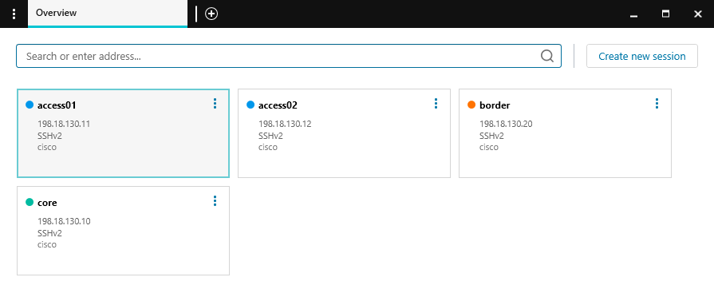
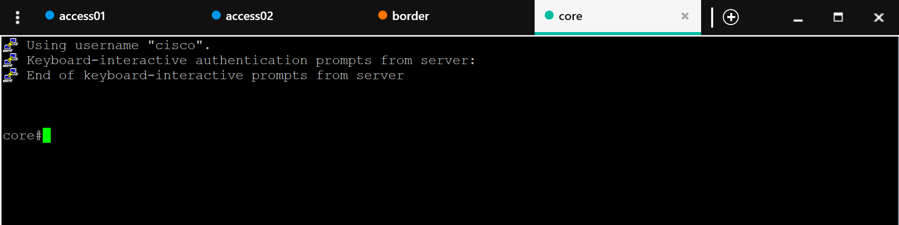

# Task 01 — SSH to the lab devices

**⏱ ~10 minutes**

Before we deploy any Network-as-Code configuration, let's confirm baseline connectivity to the IOS XE lab devices and see what's already on them. You'll use Solar-PuTTY to SSH into each device, verify the running configuration, and identify the minimal "seed" config that makes Terraform-driven automation possible.

## What You'll Learn

- How to connect to IOS XE devices using Solar-PuTTY
- How to verify device information with basic `show` commands
- What minimal configuration is required to enable NETCONF automation

!!! info "This lab uses NETCONF for config, RESTCONF for verification"
    NAC IOS XE supports both **NETCONF** and **RESTCONF**. In this lab:

    - **Terraform pushes configuration over NETCONF** — it's transactional (all-or-nothing), uses a candidate datastore, and produces much richer error reporting than RESTCONF.
    - **`nac-test` (Optional Task 11) queries the device over RESTCONF** — the generated Robot tests read operational state via RESTCONF URLs for post-deployment verification.

    That's why the lab devices have **both** protocols enabled. In production you can run NAC IOS XE over NETCONF only if you prefer; `nac-test` can be configured to use NETCONF as well.

## Open Solar-PuTTY

Solar-PuTTY is an enhanced SSH client that provides a tabbed interface for managing multiple device connections. The application is pre-installed in the lab Win10 VM and ready to use.

**To launch Solar-PuTTY:**

1. Look for the **Solar-PuTTY** icon on your lab's Win10 VM
2. Double-click to open the application
3. You'll see the Solar-PuTTY interface with a list of devices

<figure markdown>
  { width="95%" }
</figure>

## Connect to the lab devices

The lab environment includes multiple IOS XE switches. All device credentials are **pre-configured** in Solar-PuTTY, so you can connect immediately without entering any login information.

**Devices in this lab:**

- **access01** - Access switch (198.18.130.11)
- **access02** - Access switch (198.18.130.12)
- **border** - Border switch (198.18.130.20)
- **core** - Core switch (198.18.130.10)

!!! info "Additional Devices"
    The lab topology also includes **isp**, **host01**, **host02**, **ntp-server**, and **syslog-server** devices. These are pre-configured for connectivity testing and will not be managed via Network-as-Code in this lab. The figure below shows the switches, routers, and hosts and their connections to each other. The NTP and SYSLOG servers (omitted from the diagram) are reachable via the management interface of each lab device.

<figure markdown>
  { width="60%" }
</figure>

!!! tip "Lab Topologies Reference"
    At any time during the lab, you can refer to [Topologies](Intro05_topologies.md) (see the top navigation bar of this page) for the topology diagrams, device IP addresses and credentials.

**To connect to a device:**

1. In Solar-PuTTY, **double-click** on a device (e.g. the **core** device)
2. You'll be automatically logged in with the pre-configured credentials

<figure markdown>
  { width="95%" }
</figure>

## Verify Device Information

Once you're on the device, run:

```bash
show version
```

!!! tip "Copy/paste from this guide"
    Every fenced command block has a copy icon in its top-right corner. Click it, then right-click inside Solar-PuTTY to paste.

You should see output confirming:

- **IOS XE version** (e.g., 17.x)
- **Platform** — `Cisco IOS XE Software, Version 17.x` with `Catalyst 9000` or `C8000V` hardware line
- **Uptime** and system details

This is a virtual Catalyst 9000 switch running IOS XE in CML.

## Review the current configuration

```bash
show run
```

The running configuration is intentionally minimal. The devices are a clean slate for you to configure via Terraform — but you'll see a few essential lines that make that automation possible.

## Configuration Required for Terraform Access

Look for:

```text { .no-copy }
username nac_admin privilege 15 secret cisco
...
ip http secure-server
...
netconf-yang
...
restconf
```

### What each line does

| Line | Purpose |
|------|---------|
| `username nac_admin privilege 15 secret cisco` | Dedicated admin user that Terraform (and `nac-test`) authenticates as. Separating human and automation accounts is a core security practice. |
| `ip http secure-server` | Enables the HTTPS server. Required by RESTCONF — `nac-test` uses this channel for post-deployment verification. |
| `netconf-yang` | Enables the NETCONF-over-SSH server on TCP/830. This is the primary channel Terraform uses to push YANG-modelled configuration. |
| `restconf` | Enables the RESTCONF API alongside NETCONF. Used by `nac-test` (Task 11) to read operational state for verification. |

Repeat `show version` and `show run` on **access01**, **access02**, and **border**. All four devices should look the same: minimal config plus the seed automation plumbing above.

## Enabling NETCONF + RESTCONF manually (reference only)

!!! info "You don't need to run these — the lab devices are already configured."
    If you want to try NAC IOS XE on your own devices after Cisco Live, these are the minimum commands to enable both protocols:

    ```text
    configure terminal
     username nac_admin privilege 15 secret cisco
     ip http secure-server
     netconf-yang
     restconf
    end
    write memory
    ```

    After enabling `netconf-yang`, give the subsystem ~60 seconds to initialize before pointing Terraform at the device.

    For a pure NETCONF setup, you can omit `ip http secure-server` and `restconf` — but you'll then need to configure `nac-test` to use NETCONF as well. See the [`terraform-provider-iosxe` documentation](https://registry.terraform.io/providers/CiscoDevNet/iosxe/latest/docs#protocol-3) for the full protocol selection matrix.

You'll verify NETCONF reachability from WSL Ubuntu in [Task 03](Task03_Global_configuration.md) using a quick `ssh -s` handshake against port 830.


## What to observe across all devices

- Every device has a near-empty running configuration — ready for NAC to take over.
- Every device has the `nac_admin` user provisioned, **NETCONF** enabled for config push, and **RESTCONF** enabled for verification.
- No device has any of the configuration you're about to deploy (banners, ACLs, VLANs, BGP, etc.).

## What you've accomplished

- ✅ Connected to all four IOS XE devices via Solar-PuTTY
- ✅ Verified device information with `show version`
- ✅ Reviewed the minimal running configuration
- ✅ Identified the configuration lines that enable NAC automation (`username nac_admin …`, `netconf-yang`, and `restconf`)
- ✅ Confirmed all devices are ready for Network-as-Code deployment

In the next task, you'll start creating the YAML configuration files that describe your desired network state.

---

**Next:** [Task 02 — Editing YAML Files](Task02_Editing_YAML_files.md)
