# Task 02 - Editing YAML files in VS Code

**Estimated Time to Complete:** ~15 minutes

In this task you'll set up the project directory and use VS Code to edit Network as Code IOS XE intent configuration YAML files.

## What you'll learn

By the end of this task you will have:

- Set up an IOS XE as Code project directory under `~/nac-iosxe/` in WSL
- Edited YAML configuration files using VS Code and the Red Hat YAML extension
- Registered all four lab devices in their own per-device YAML files

## Create the project directory

You'll create a dedicated project directory in your Windows Subsystem for Linux (WSL) home directory to organize your Network as Code configuration files and related resources. This location will serve as your workspace for storing YAML configuration files, Terraform files, and state information.

### What is WSL?

Windows Subsystem for Linux (WSL) allows you to run a Linux environment directly on Windows without a virtual machine. WSL is pre-installed in this lab, and you'll use it to run Terraform commands because most DevOps tools are designed for Linux.

### Open WSL terminal (Ubuntu)


Open Windows Subsystem for Linux (WSL) terminal. You can use the desktop shortcut, the icon on the taskbar, or on the Start menu.

<figure markdown>
  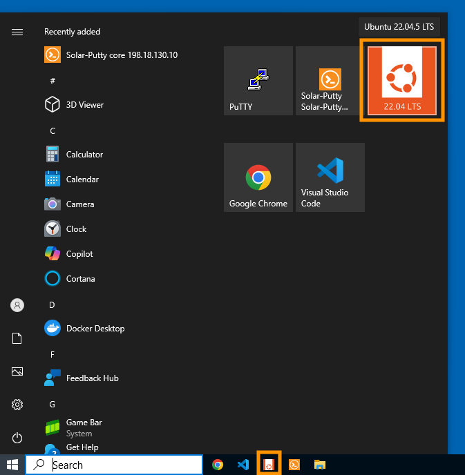{ width="80%" }
</figure>

When you open WSL, you'll automatically start in your home directory (`/home/cisco` or `~/`).

**Verify your current location:**

```bash
pwd
```

You should see `/home/cisco` displayed.

<figure markdown>
  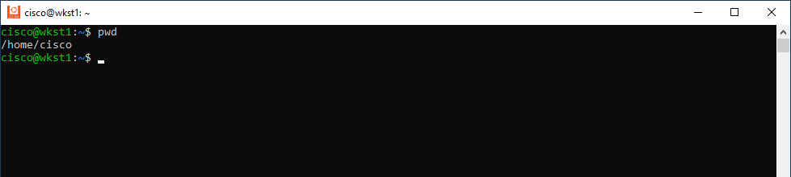{ width="80%" }
</figure>

**Create the IOS XE as Code project directory:**

```bash
mkdir nac-iosxe
```

!!! tip "Copy and Paste"
    You can copy commands directly from this lab guide by clicking on the icon at the top right corner of the command block and paste them into the WSL terminal using **right-click**.

This creates a dedicated folder named `nac-iosxe` for all your Network as Code IOS XE project files.

**Navigate into the new directory:**

```bash
cd nac-iosxe
```

**Verify you're in the correct location:**

```bash
pwd
```

You should now see `/home/cisco/nac-iosxe` displayed.

<figure markdown>
  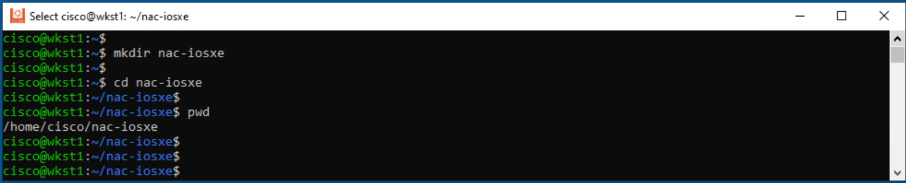{ width="80%" }
</figure>

## Create project structure

Now you'll create a folder structure and placeholder files for your Network as Code IOS XE project.

**Create the data directory structure:**

```bash
mkdir -p data/devices data/groups data/templates
```

This creates a `data/` folder with subdirectories to organize your configuration by scope: `devices/` for per-device files, `groups/` for device-group files, and `templates/` for reusable template definitions.

## Create placeholder files

Create the skeleton files you'll fill in below.

```bash
touch .env                                        # credentials for the IOS XE devices
touch main.tf                                     # Terraform entry point
touch data/devices/core.nac.yaml                  # per-device configuration files
touch data/devices/border.nac.yaml
touch data/devices/access01.nac.yaml
touch data/devices/access02.nac.yaml
```

One file per device is the pattern you'll use for the whole lab. It keeps each device's configuration self-contained and makes it obvious which YAML file to edit when you need to change something for a specific device.

!!! note "Why one file per device, not a single inventory file?"
    The IOS XE as Code data model exposes a top-level `iosxe.devices` list. YAML allows the same list to be split across multiple files and merged at load time - **but only if every list entry is uniquely identified by its `name` field.** Defining each device in its own file (with its own `name`) keeps that invariant obvious, and it scales cleanly: adding a device later is "create one file," not "edit three."

The pattern works because Network as Code merges entries across files by the `name` field. If you typo a device's `name` in one file, you'll end up with **two separate entries** instead of one merged one - it's the single most common way a learner's config silently misbehaves. You'll see merge behavior in detail in [Task 04](Task04_Device_group_config.md) once you have three files contributing to one device's config at once.

<figure markdown>
  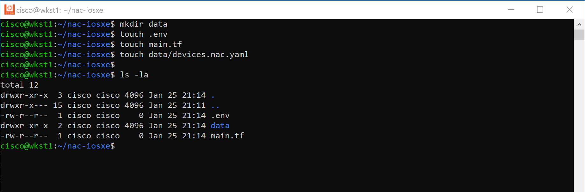{ width="80%" }
</figure>

## Verify your project structure

```bash
tree -a
```

You should see:

```text { .no-copy }
cisco@wkst1:~/nac-iosxe$ tree -a
.
├── .env
├── data
│   ├── devices
│   │   ├── access01.nac.yaml
│   │   ├── access02.nac.yaml
│   │   ├── border.nac.yaml
│   │   └── core.nac.yaml
│   ├── groups
│   └── templates
└── main.tf

4 directories, 6 files
```

You're now ready to populate the files. Every subsequent step in this guide assumes your current working directory is `/home/cisco/nac-iosxe`.

## Open Visual Studio Code


Now that the project structure exists, you'll open it in VS Code to edit the files.

### What is VS Code?

Visual Studio Code, commonly known as VS Code, is a free, lightweight, yet powerful source code editor developed by Microsoft. It runs on Windows, macOS, and Linux and has become one of the most popular code editors among developers and IT professionals.

<figure markdown>
  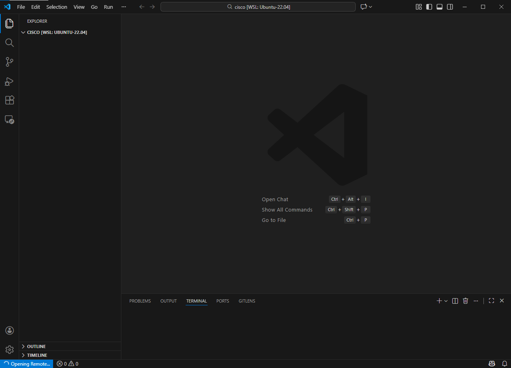{ width="100%" }
</figure>

**Key features that make VS Code ideal for Network as Code:**

- **Syntax highlighting** - Colors and formats YAML files for easy readability
- **IntelliSense** - Provides intelligent code completion and suggestions
- **Integrated terminal** - Run commands directly within the editor
- **Extensions** - Add functionality like YAML validators and schema support
- **Git integration** - Built-in version control for tracking changes
- **Multi-file editing** - Work with multiple configuration files simultaneously
- **File explorer** - Easy navigation through project folders and files

### YAML linting with RedHat extension (pre-installed)


Since Network as Code configurations are written in YAML, having proper syntax validation is essential. VS Code supports YAML linting through the **YAML extension by Red Hat**, which helps catch syntax errors and enforce best practices as you write your configuration files.

!!! success "Pre-installed in your lab VM"
    This extension is already installed in your lab's VS Code - no action required.

<figure markdown>
  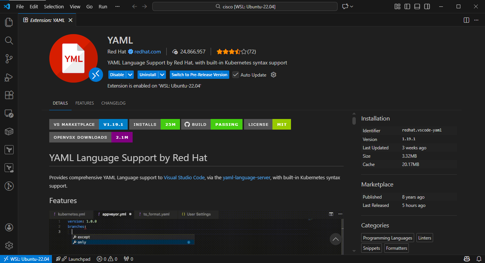{ width="100%" }
</figure>

This extension provides:

- **Real-time syntax validation** - Highlights errors as you type
- **Auto-completion** - Suggests valid YAML structures
- **Formatting** - Automatically formats your YAML files
- **Schema validation** - Can validate against predefined schemas

!!! warning "File Extension"
    The YAML extension recognizes only files ending with `.nac.yaml` as Network as Code YAML files. To benefit from the VS Code extension, ensure your configuration files end with `.nac.yaml`.

### Open the project folder

**To open the folder in VS Code:**

1. Double-click the **Visual Studio Code Code** icon on the Windows desktop
2. Click **File** → **Open Folder**
3. In the address bar, type or paste: `/home/cisco/nac-iosxe`
4. Click **OK**

<figure markdown>
  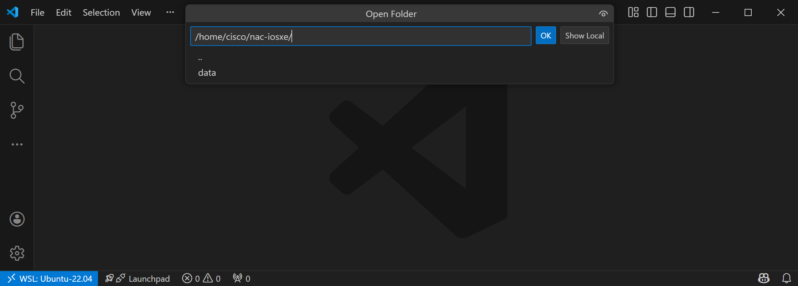{ width="100%" }
</figure>

!!! note "VS Code automatically connects to WSL (pre-configured)"
    The **WSL** VS Code extension is pre-installed, so VS Code connects to your Ubuntu environment automatically.
    You'll see a `WSL: Ubuntu-22.04` indicator in the bottom-left corner confirming the connection - files you edit in VS Code are saved directly to the WSL filesystem.

VS Code will now open with your project folder, and you'll see the file explorer on the left showing your three configuration files.

<figure markdown>
  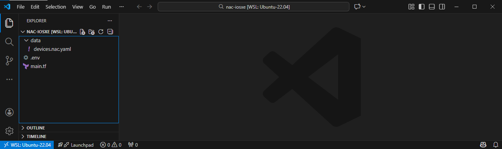{ width="100%" }
</figure>

## Edit .env file

Edit `.env` file containing the environment variables required by the Network as Code Terraform modules to connect to the Cisco IOS XE devices. This file stores your IOS XE credentials and connection details in a secure and reusable format:

```bash title=".env"
export IOSXE_USERNAME=nac_admin
export IOSXE_PASSWORD=cisco
```

The figure below illustrates how to edit the `.env` file using Visual Studio Code:

<figure markdown>
  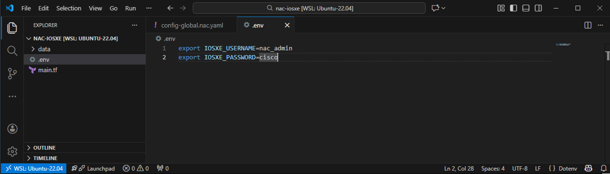{ width="100%" }
</figure>

!!! warning "Never commit `.env` to a real repository"
    The `.env` file holds device credentials in plaintext. In this lab it's harmless (every attendee has the same throwaway lab switches), but in a real project add `.env` to your `.gitignore` **before** the first commit. If credentials ever land on a feature branch and are pushed, rotate them - deleting the file from history isn't enough.

!!! tip "If `source .env` fails with a weird error, check line endings"
    VS Code on Windows sometimes saves files with Windows-style (`CRLF`) line endings. WSL's Bash chokes on those in a sourced file. If `source .env` errors, run `dos2unix .env` in the WSL terminal and try again. You can also configure VS Code to always use LF - see the status-bar indicator at the bottom-right of the editor window.


## Edit Terraform main.tf file

Next, edit a Terraform `main.tf` file with the following content. This file serves as the entry point for the Terraform configuration and defines the necessary resources and modules to interact with the IOS XE device:

```text title="main.tf"
module "iosxe" {
  source                    = "git::https://github.com/netascode/terraform-iosxe-nac-iosxe.git"
  yaml_directories          = ["data/"]
  write_model_file          = "model.yaml"
  write_default_values_file = "defaults.yaml"
}
```

!!! tip "Formatting matters"
    Terraform (`.tf`) files use braces `{}` and indentation for structure. Unlike YAML, Terraform is forgiving about whitespace, but consistent formatting makes your code readable. The snippets in this guide are formatted with `terraform fmt`; if you type manually, run `terraform fmt` after to clean up.

**Understanding the configuration:**

- **`module "iosxe"`** - declares a Terraform module named `iosxe`. Modules package reusable Terraform logic; you invoke them with `module.iosxe`.
- **`source = "git::https://github.com/netascode/terraform-iosxe-nac-iosxe.git"`** - tells Terraform where to fetch the module. This is the Cisco-maintained Network as Code module that translates your YAML into the low-level resource calls the `terraform-provider-iosxe` understands.
- **`yaml_directories = ["data/"]`** - tells the module which directories to scan for YAML. Every `*.nac.yaml` file inside `data/` is auto-discovered and merged. This is why you can split configurations across many files without wiring them up individually.
- **`write_model_file = "model.yaml"`** - after merging, the module writes the final merged data model to `model.yaml`. You'll use this file to debug variable substitution and as input to `nac-test` for post-deployment validation.
- **`write_default_values_file = "defaults.yaml"`** - similar, but for the default values the module applies when your YAML omits a field. Useful for understanding "where did this setting come from?"

!!! note "Why no version pin?"
    For the lab we source directly from the module's default branch (`main`) to always get the latest schema and features. In production you should pin to a specific tag or commit (for example, `?ref=v0.12.3`) so every `terraform init` yields a reproducible build. Unpinned sources are convenient for experimentation but will occasionally break learners when upstream ships schema changes - pin once you ship.

The figure below illustrates the `main.tf` file in Visual Studio Code:

<figure markdown>
  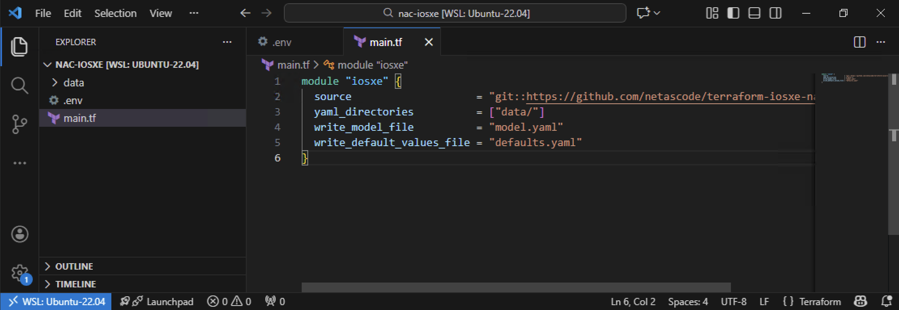{ width="100%" }
</figure>

## Populate the per-device files

Each per-device file registers one device with Network as Code - it declares the device's **name** (which every other YAML file will reference) and its **management IP address**. You'll add actual configuration to these files in later tasks.

Open `data/devices/core.nac.yaml` in VS Code and paste:

```yaml title="data/devices/core.nac.yaml"
---
iosxe:
  devices:
    - name: core
      host: 198.18.130.10
```

Open `data/devices/border.nac.yaml` and paste:

```yaml title="data/devices/border.nac.yaml"
---
iosxe:
  devices:
    - name: border
      host: 198.18.130.20
```

Open `data/devices/access01.nac.yaml` and paste:

```yaml title="data/devices/access01.nac.yaml"
---
iosxe:
  devices:
    - name: access01
      host: 198.18.130.11
```

Open `data/devices/access02.nac.yaml` and paste:

```yaml title="data/devices/access02.nac.yaml"
---
iosxe:
  devices:
    - name: access02
      host: 198.18.130.12
```

!!! warning "Indentation matters in YAML"
    YAML uses **spaces** (not tabs) and relies on consistent indentation to express structure. Each level of nesting should be exactly 2 spaces. Copy-pasting from this guide preserves the right indentation; if you type manually, watch for the red squiggles from the VS Code YAML extension - they point at exactly the line that's off.

**What each key means:**

- `---` - YAML document-start marker (optional but conventional).
- `iosxe:` - root key. Every IOS XE as Code YAML starts here.
- `devices:` - the top-level list of devices Network as Code manages.
- `name:` - unique identifier for the device. Other YAML files will match against this name.
- `host:` - management IP Network as Code connects to.

!!! note "Why one device per file?"
    Network as Code merges all YAML files in `data/` into a single data model at load time. Because `devices` is a list, keeping each device in its own file makes it immediately obvious which file owns which device, and avoids the accidental-merge bugs that can happen when several files all append to the same list. You'll extend these files with real configuration starting in [Task 05](Task05_Single_device_config.md).

<figure markdown>
  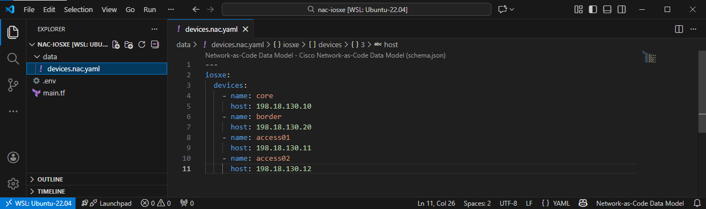{ width="100%" }
</figure>

## Auto-save is enabled

VS Code has auto-save enabled, so your files are saved a few seconds after you stop typing. At this point your project contains:

- `.env` - device credentials and protocol
- `main.tf` - Terraform module configuration
- `data/devices/*.nac.yaml` - four per-device skeleton files

## How the project will grow

Every subsequent task in this lab will either extend the per-device files or introduce a new file type under `data/`, `tftpl/`, or `tests/`. Here's the **final** layout you'll end up with by the time you reach Task 11 - refer back to this any time you lose track of which file owns what:

<figure markdown>
  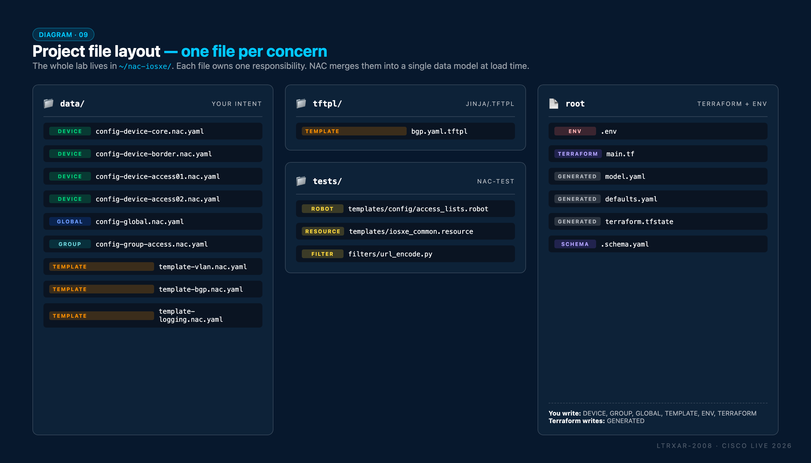{ width="100%" }
</figure>

## What you've accomplished

- ✅ Set up the project directory `/home/cisco/nac-iosxe` with a `data/` subfolder
- ✅ Created `.env` with your IOS XE credentials and the NETCONF protocol setting
- ✅ Created `main.tf` pointing to the Network as Code module
- ✅ Registered all four lab devices in their own per-device YAML files

**Tools introduced:**

- **VS Code** (with the Red Hat YAML extension) - YAML-aware editing, validation, linting
- **WSL Ubuntu** - the Linux environment where you'll run Terraform and other CLI tools

In the next task, you'll deploy your first piece of configuration - a login banner - to all four devices using Terraform.

---

**← Previous:** [Task 01 - SSH to the lab devices](Task01_SSH_to_network_devices.md)  ·  **Next:** [Task 03 - Global Configuration](Task03_Global_configuration.md)

