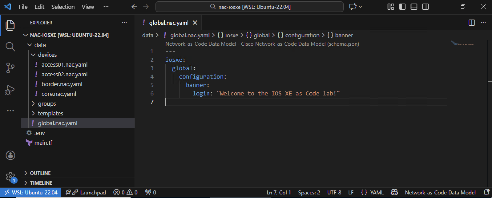
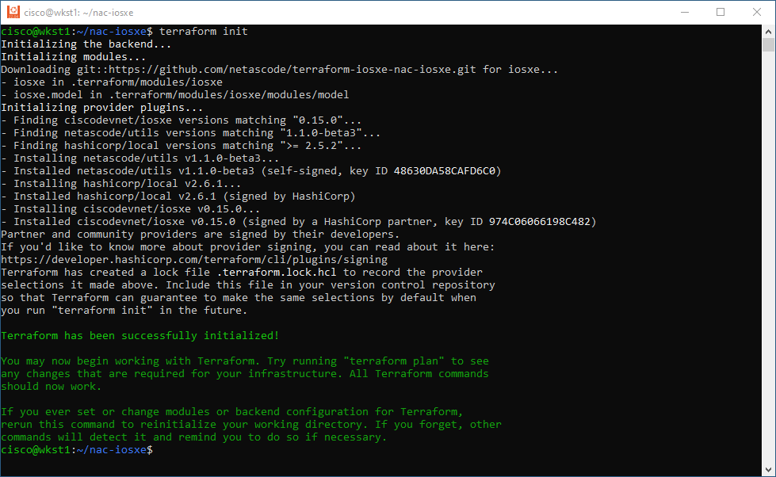
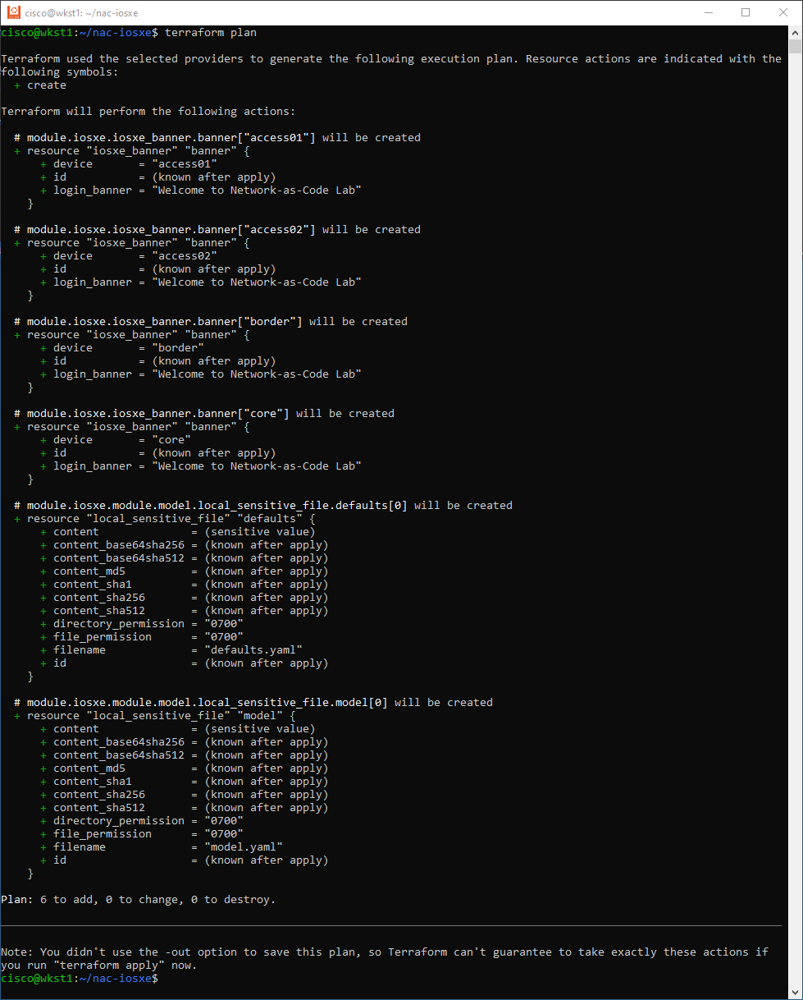
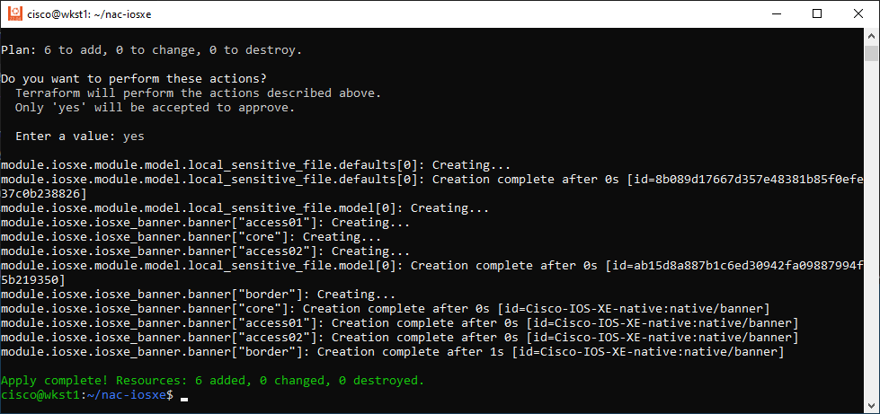
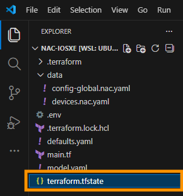

In this task, you'll learn how to use **global configuration** to apply settings across all devices at once. Using a login banner as an example, you'll see how global settings eliminate the need to repeat the same configuration for each device.

## Understanding Global Configuration

Global configurations define network-wide settings that apply to all devices unless explicitly overridden at the device group or device level. This provides the foundation layer of your network configuration hierarchy.

As describe in the [IOS XE Global Configuration documentation](https://netascode.cisco.com/docs/data_models/iosxe/entity/global/), the configuration precedence hierarchy works as follows:

1. **Device** (highest precedence) - device-specific overrides
2. **Device Group** (medium precedence) - role or location-specific settings  
3. **Global** (lowest precedence) - organization-wide defaults

By placing the banner in the `global` section, it will automatically apply to all devices listed in your configuration, ensuring consistency without duplication.

## Create the Global Configuration File

First, create the global configuration file using your **WSL Ubuntu terminal**:

```bash
touch ~/nac-iosxe/data/config-global.nac.yaml
```

Then open `data/config-global.nac.yaml` in VS Code and add the following content. Notice how the banner is defined once in the `global` section and will be applied to all devices defined in `devices.nac.yaml`:

```yaml
iosxe:
  global:
    configuration:
      banner:
        login: "Welcome to Network-as-Code Lab"
```

**Key elements explained:**

- **`iosxe:`** - Root key indicating IOS XE specific configuration
- **`global:`** - Defines configurations that apply to all devices
- **`configuration:`** - Contains the actual configuration settings
- **`banner:`** - Specifies banner configurations (note: singular, not "banners")
- **`login:`** - The login banner text shown when users connect to the device

!!! note "Separation of Concerns"
    Notice how the global configuration is in a separate file (`config-global.nac.yaml`) from the device inventory (`devices.nac.yaml`). This modular approach keeps your configurations organized and maintainable. The NAC module automatically merges all YAML files in the `data/` directory.

The figure below illustrates how to create the `data/config-global.nac.yaml` file with Visual Studio Code:

<figure markdown>
  { width="100%" }
</figure>

## Applying Configuration with Terraform CLI

Now that you've created your configuration files, it's time to deploy them to your network devices using Terraform. Terraform follows a simple three-step workflow that ensures safe and predictable infrastructure changes.

## Understanding the Terraform Workflow

Terraform uses a declarative approach where you define the desired state (in your YAML files), and Terraform figures out how to achieve that state. The workflow consists of:

1. **Initialize** - Download required modules and providers
2. **Plan** - Preview what changes Terraform will make
3. **Apply** - Execute the changes on your devices

## Step 1: Open WSL (Ubuntu) and Navigate to Your Project

Open Windows Subsystem for Linux (WSL) terminal and navigate to your project directory:

```bash
cd ~/nac-iosxe
```

Verify you're in the correct directory:

```bash
pwd
```

You should see `/home/cisco/nac-iosxe` displayed.

List the files in your directory:

```bash
tree -a
```

You should see your project structure:

```
/home/cisco/nac-iosxe/
├── .env
├── main.tf
└── data/
    ├── config-global.nac.yaml    # ← New file you're creating
    └── devices.nac.yaml
```


## Step 2: Load Environment Variables from .env File

Before running Terraform, you need to load the credentials from your `.env` file. Your `.env` file contains simple key-value pairs (`IOSXE_USERNAME=nac_admin` and `IOSXE_PASSWORD=cisco`).

**Convert the file to Unix format to avoid encoding issues:**

Because you edited the `.env` file in VS Code on Windows, it may have Windows-style line endings (CRLF). Convert it to Unix format:

```bash
dos2unix .env
```

To load these variables and make them available to Terraform, use this simple command:

```bash
export $(cat .env | xargs)
```


**What this command does:**

- `cat .env` - Reads the contents of the `.env` file
- `xargs` - Converts the file contents into command-line arguments
- `export` - Exports all the variables, making them available to child processes like Terraform

**Verify the variables are loaded:**

```bash
env | grep IOSXE
```

You should see both variables displayed:
```
cisco@wkst1:~/nac-iosxe$ env | grep IOSXE
IOSXE_USERNAME=nac_admin
IOSXE_PASSWORD=cisco
cisco@wkst1:~/nac-iosxe$
```

These credentials allow Terraform to authenticate with your IOS XE devices.

**Making Environment Variables Persistent:**

Environment variables exported in your current shell session are not persistent - they disappear when you close the terminal. If you exit WSL and later open a new session, you must re-export them by executing `export $(cat .env | xargs)` again.

To avoid manually exporting variables every time you open WSL, you can add the export command to your `~/.bashrc` file. This file runs automatically whenever you start a new bash session, so your environment variables will be loaded automatically.

**To make the export permanent, add it to your bashrc:**

```bash
echo 'export $(cat ~/nac-iosxe/.env | xargs)' >> ~/.bashrc
```

This appends the export command to your `~/.bashrc` file. Now every time you open WSL, your IOSXE credentials will be automatically loaded from the `.env` file.


## Step 3: Initialize Terraform

Initialize your Terraform project to download the required Network-as-Code module:

```bash
terraform init
```

**What happens during initialization:**

- Terraform reads your `main.tf` file
- Downloads the `netascode/nac-iosxe` module from the Terraform Registry
- Creates a `.terraform` directory with downloaded modules
- Creates a `.terraform.lock.hcl` file to lock module versions

**Expected output:**

<figure markdown>
  { width="100%" }
</figure>

## Step 4: Preview Changes with Terraform Plan

Before making any changes, preview what Terraform will do:

```bash
terraform plan
```

**What Terraform plan does:**

- Reads your `data/devices.nac.yaml` configuration
- Connects to your IOS XE devices (using credentials from environment variables)
- Compares desired state (YAML) vs. current state (device configuration)
- Shows you what will be added, changed, or deleted

**Expected output:**

<figure markdown>
  { width="100%" }
</figure>

**Review the plan carefully** to ensure Terraform will make the changes you expect. This is your safety check!

## Step 5: Apply Configuration to Devices

If the plan looks good, apply the configuration:

```bash
terraform apply
```

Terraform will show you the plan again and ask for confirmation:

```
Do you want to perform these actions?
  Terraform will perform the actions described above.
  Only 'yes' will be accepted to approve.

  Enter a value: 
```

Type `yes` and press Enter to proceed.

**What happens during apply:**

- Terraform connects to each device via HTTPS
- Translates your YAML configuration into IOS XE CLI commands
- Applies the commands to the devices
- Tracks the applied state in `terraform.tfstate` file

**Expected output:**

<figure markdown>
  { width="100%" }
</figure>


## Step 6: Verify the Global Configuration

After Terraform completes successfully, verify the banner was applied to **all devices**. Because you used **global configuration**, the banner should be deployed to all four switches automatically.

**Open Solar-PuTTY and connect to each switch:**

1. Open **Solar-PuTTY** from your desktop
2. Connect to the **BORDER** switch first
3. Run the verification command (shown below)
4. Repeat for **CORE**, **ACCESS01**, and **ACCESS02** switches

**Check the banner configuration on each device:**

Once connected to each switch, run the following command:

```bash
show run | include banner
```

**Expected output (same on all four devices):**

```
<hostname>#show run | include banner
banner login ^CWelcome to Network-as-Code Lab^C
<hostname>#
```

The `^C` characters represent control characters used by IOS XE to delimit the banner text. The important part is that you see your banner text "Welcome to Network-as-Code Lab" in the output.

**What you should observe:**

- ✅ The banner appears on the **CORE** switch (198.18.130.10)
- ✅ The banner appears on the **BORDER** switch (198.18.130.20)
- ✅ The banner appears on the **ACCESS01** switch (198.18.130.11)
- ✅ The banner appears on the **ACCESS02** switch (198.18.130.12)

**Success!** You've just deployed your first Network-as-Code configuration using Terraform! Notice how you defined the banner once in the global section, and it was automatically applied to all four devices - this is the power of Network-as-Code!

## Terraform Command Reference

Here's a quick reference of the most common Terraform commands:

| Command | Purpose |
|---------|---------|
| `terraform init` | Initialize project and download modules |
| `terraform plan` | Preview changes without applying them |
| `terraform apply` | Apply configuration to devices |
| `terraform apply -auto-approve` | Apply without confirmation prompt |
| `terraform destroy` | Remove all managed resources |
| `terraform show` | Display current state |
| `terraform validate` | Check configuration syntax |

## Understanding Terraform State

After running `terraform apply`, Terraform creates a `terraform.tfstate` file that tracks:
- What resources have been created
- Current configuration of each resource
- Device connection details

<figure markdown>
  { width="70%" }
</figure>

**Important:** The state file is critical for Terraform to manage your infrastructure. Don't manually edit or delete it!

## Troubleshooting Common Issues

**Issue: "Error: Failed to connect to device"**

- **Solution:** Verify your device host address is correct and the device is reachable. 

**Issue: "Error: Invalid credentials"**

- **Solution:** Check that your environment variables are set correctly with `env | grep IOSXE`. If they're not set, run `export $(cat .env | xargs)` again

**Issue: "Module not found"**

- **Solution:** Run `terraform init` again to download the required modules

## What's Next?

Congratulations! You've successfully:

- ✅ Created YAML configuration files
- ✅ Initialized Terraform with the Network-as-Code module
- ✅ Previewed changes with `terraform plan`
- ✅ Applied configuration to your network devices with `terraform apply`
- ✅ Verified the banner on your device

In the next task, you'll learn how to use device groups to apply configurations to multiple devices efficiently.
