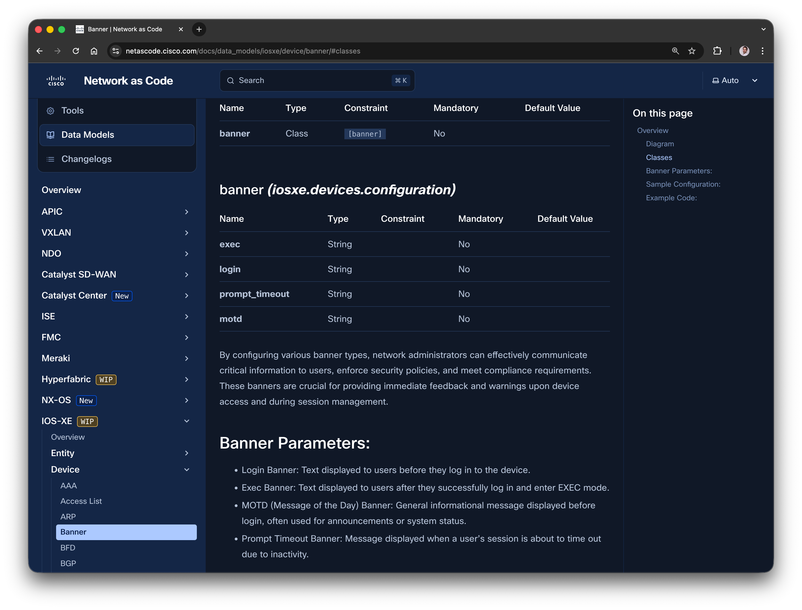
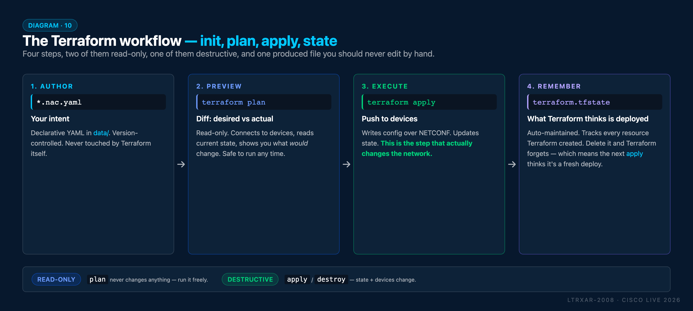
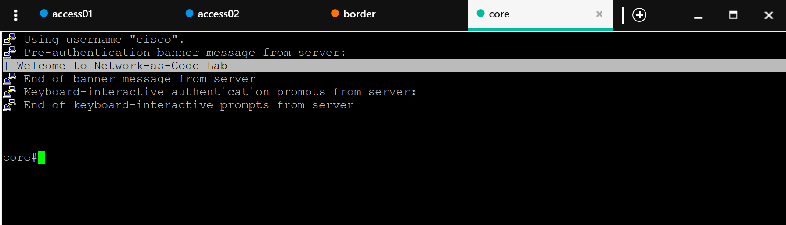

# Task 03 - Global configuration

**⏱ ~20 minutes**

In this task you'll use IOS XE as Code **global configuration** to apply settings across all devices at once. A login banner is the example - you'll see how global settings eliminate the need to repeat the same configuration on each device individually.

## What you'll learn

By the end of this task you will have:

- Written a **global** Network as Code configuration file that applies to every registered device
- Run the full Terraform workflow end-to-end: `init` → `plan` → `apply`
- Verified the deployed banner by SSH-ing to each device

## Global Configuration

Global configurations define network-wide settings that apply to all devices unless explicitly overridden at the device group or device level. The configuration precedence hierarchy works as follows:

1. **Device** (highest precedence) - device-specific overrides
2. **Device Group** (medium precedence) - role or location-specific settings
3. **Global** (lowest precedence) - organization-wide defaults

By placing the banner in the `global` section, it will automatically apply to all devices listed in your configuration, ensuring consistency without duplication.

## Create the Global Configuration File

First, create the global configuration file using your **WSL Ubuntu terminal**:

```bash
touch ~/nac-iosxe/data/global.nac.yaml
```

!!! tip "Alternative: File creation with VS Code"
    You can also create the file using VS Code by clicking on the `data/` folder in the Explorer sidebar, then on the *new file* icon next to the `NaC-IOSXE` folder name,
    or by **right-clicking** the `data/` folder and selecting **New File**.

    Throughout this lab guide, you will use the `touch` command in WSL to create files, but feel free to use VS Code if you prefer a graphical interface.

Then open `data/global.nac.yaml` in VS Code and add the following content. Notice how the banner is defined once in the `global` section and will be applied to every device registered in the per-device files you created in Task 02:

```yaml title="data/global.nac.yaml"
---
iosxe:
  global:
    configuration:
      banner:
        login: "Welcome to Network as Code Lab"
```

**Key elements explained:**

- **`---`** - YAML document start marker
- **`iosxe:`** - Root key indicating IOS XE specific configuration
- **`global:`** - Defines configurations that apply to all devices
- **`configuration:`** - Contains the actual configuration settings
- **`banner:`** - Specifies banner configurations (note: singular, not "banners")
- **`login:`** - The login banner text displayed to users before they log in to the device

!!! note "Separation of concerns"
    The global configuration lives in its own file (`global.nac.yaml`), separate from the per-device files. This modular layout keeps "what applies to everyone" distinct from "what applies to one device" - NaC merges them all automatically when it reads the `data/` directory.

The figure below illustrates how to create the `data/global.nac.yaml` file with Visual Studio Code:

<figure markdown>
  { width="100%" }
</figure>


## Documentation Reference

But how do you know what configuration options are supported, and what the correct YAML structure is?

The data model documentation is published on the [Network as Code website](https://netascode.cisco.com/docs/data_models/).
Specifically, the banner configuration is described here: [IOS XE Banner Configuration](https://netascode.cisco.com/docs/data_models/iosxe/device/banner/).

<figure markdown>
  { width="100%" }
</figure>

You can refer to this documentation at any time for more details on available configuration options, data types and guides. The curated configuration examples provide excellent references to help you create your own configurations.


## Applying Configuration with Terraform CLI

Now that you've created your configuration files, it's time to deploy them to your network devices using Terraform. Terraform follows a simple three-step workflow that ensures safe and predictable infrastructure changes.

## Terraform Workflow

Terraform uses a declarative approach where you define the desired state (in your YAML files), and Terraform figures out how to achieve that state. There are four moving parts:

<figure markdown>
  { width="100%" }
</figure>

1. **Author** (`*.nac.yaml`) - the YAML you write. Version-controlled, never touched by Terraform itself.
2. **Preview** (`terraform plan`) - read-only. Connects to devices, reads current state, shows you what *would* change. Safe to run any time.
3. **Execute** (`terraform apply`) - writes configuration over NETCONF and updates state. **This is the step that actually changes the network.**
4. **Remember** (`terraform.tfstate`) - auto-maintained. Tracks every resource Terraform has created, so subsequent plans know what's already there.

Of the three commands, only `apply` (and its counterpart `destroy`) change anything on the wire. `plan` is a read-only diff and can be run freely.

!!! info "Why state matters - Terraform vs. stateless tools"
    Because Terraform maintains a local state file that records exactly what it has configured on each device, it can compute a precise diff between your desired YAML and the actual device state - then push **only the changes**. If nothing changed in your YAML, `terraform plan` reports "No changes" without touching the network at all.

    This also gives you `terraform plan` - a fast, guaranteed-safe preview of exactly what would change on every device before you commit. Terraform's plan/apply separation is enforced at the framework level: providers cannot make write calls during plan, so it's architecturally read-only. By contrast, Ansible's check mode (`--check`) is opt-in per module - each module developer must explicitly implement dry-run support, and many modules don't, leaving you without a reliable preview for parts of your playbook.

    This is a fundamental advantage over stateless automation tools (such as Ansible), which have no local record of what's on the device. Those tools must connect to the device and gather its current configuration on every run before they can determine whether a change is needed. Terraform's state-based approach means faster runs, less network traffic, and a clear audit trail of what was deployed and when.

### Step 1: In WSL (Ubuntu) and Navigate to Your Project

In Windows Subsystem for Linux (WSL) terminal, navigate to your project directory:

```bash
cd ~/nac-iosxe
```

!!! tip "Integrated Terminal in VS Code"
    You can also open the WSL terminal directly in VS Code by going to the menu and selecting **Terminal > New Terminal**. This opens a terminal at the root of your project, making it easy to run Terraform commands without switching windows.

    Whenever this guide mentions running commands in WSL, you can use either the standalone WSL terminal or the integrated terminal in VS Code.


List the files in your directory:

```bash
tree -a
```

You should see your project structure:

```text  { .no-copy hl_lines="9" }
cisco@wkst1:~/nac-iosxe$ tree -a
.
├── .env
├── data
│   ├── devices/access01.nac.yaml
│   ├── devices/access02.nac.yaml
│   ├── devices/border.nac.yaml
│   ├── devices/core.nac.yaml
│   └── global.nac.yaml    # ← File with banner configuration
└── main.tf

1 directory, 7 files
cisco@wkst1:~/nac-iosxe$
```

### Step 2: Load Environment Variables from .env File

Before running Terraform, you need to load the credentials from your `.env` file. Your `.env` file contains simple key-value pairs (e.g. `IOSXE_USERNAME=nac_admin`).


!!! tip "Convert the file to Unix format to avoid encoding issues"
    You might encounter a situation where you have edited the `.env` file on Windows, causing it to have Windows-style line endings (CRLF). Run the following command in your **WSL Ubuntu terminal** to convert the `.env` file to Unix format: `dos2unix .env`

To load these variables and make them available to Terraform, use this simple command:

```bash
source .env
```

<!-- ??? note "Using source vs. export"
    The `source` command reads and executes the contents of the `.env` file.
    Since `export` is included in each line of the `.env` file, using `source` is sufficient to load and export the variables.

    Alternatively, you can omit the `export` keywords in the `.env` file and run the following command to export all variables at once:

    ```bash
    export $(cat .env | xargs)
    ```

    This command does three things:

      1. `cat .env` - Reads the contents of the `.env` file
      2. `xargs` - Converts the file contents into command-line arguments
      3. `export` - Exports all the variables, making them available to processes like Terraform -->


**Verify the variables are loaded:**

```bash
env | grep IOSXE
```

You should see the environment variables displayed:
```text  { .no-copy hl_lines="2-4" }
cisco@wkst1:~/nac-iosxe$ env | grep IOSXE
IOSXE_USERNAME=nac_admin
IOSXE_PASSWORD=cisco
IOSXE_PROTOCOL=netconf
cisco@wkst1:~/nac-iosxe$
```

These credentials allow Terraform to authenticate with your IOS XE devices over NETCONF.

**Making Environment Variables Persistent:**

Environment variables exported in your current shell session are not persistent - they disappear when you close the terminal. If you exit WSL and later open a new session, you must export them again.

To avoid manually exporting variables every time you open WSL, you can add the export command to your `~/.bashrc` file. This file runs automatically whenever you start a new bash session, so your environment variables will be loaded automatically.

**To make the export permanent, add it to your bashrc**

```bash
echo 'source ~/nac-iosxe/.env' >> ~/.bashrc
```

This appends the source command to your `~/.bashrc` file. Now every time you open WSL, your IOS XE credentials will be automatically loaded from the `.env` file.


### Step 3: Verify NETCONF reachability

Before running Terraform, confirm the NETCONF subsystem is up on one of the lab devices. NETCONF listens on TCP/830 by default, and the simplest way to check it from WSL is a one-shot SSH handshake against the `netconf` subsystem - the device replies with an XML `<hello>` message containing its supported capabilities.

Test against **access01** (`198.18.130.11`):

```bash
ssh -s -p 830 -o StrictHostKeyChecking=no $IOSXE_USERNAME@198.18.130.11 netconf
```

When prompted, enter the password (`cisco`).

What each flag does:

- `-s` - request an SSH **subsystem** (rather than an interactive shell).
- `-p 830` - NETCONF's default port.
- `-o StrictHostKeyChecking=no` - skip the first-connection host-key prompt (lab-only; never use this in production).
- `netconf` - the subsystem name.

```text { title="Expected output (truncated)" hl_lines="1 2" .no-copy }
<?xml version="1.0" encoding="UTF-8"?>
<hello xmlns="urn:ietf:params:xml:ns:netconf:base:1.0">
  <capabilities>
    <capability>urn:ietf:params:netconf:base:1.0</capability>
    <capability>urn:ietf:params:netconf:base:1.1</capability>
    <capability>urn:ietf:params:netconf:capability:candidate:1.0</capability>
    <capability>urn:ietf:params:netconf:capability:confirmed-commit:1.1</capability>
    <capability>urn:ietf:params:netconf:capability:rollback-on-error:1.0</capability>
    ...
  </capabilities>
  <session-id>123</session-id>
</hello>
]]>]]>
```

If you see the `<hello>` XML with a capability list, NETCONF is reachable and your credentials work. Press **Ctrl+C** to exit - Terraform will manage its own NETCONF sessions from here on.


### Step 4: Initialize Terraform

Initialize your Terraform project to download the required Network as Code module:

```bash
terraform init
```

**What happens during initialization:**

- Terraform reads your `main.tf` file
- Downloads the `netascode/nac-iosxe` module from GitHub (as defined in `main.tf`)
- Creates a `.terraform` directory with downloaded modules
- Creates a `.terraform.lock.hcl` file to lock module versions

**Expected output:**

<figure markdown>
  { width="80%" }
</figure>

??? info "What the `terraform init` output tells you (annotated)"
    First-time Terraform users can find the init output intimidating because Terraform is chatty - it narrates everything it does. Here's a typical healthy run, annotated:

    ```text
    Initializing the backend...             ← Reading backend config from main.tf.

    Initializing modules...                 ← Found `module "iosxe"` in main.tf.
    Downloading git::https://github.com/
      netascode/terraform-iosxe-nac-iosxe.
      git for iosxe...                      ← Cloning the Network as Code module from GitHub.
    - iosxe in .terraform/modules/iosxe     ← Stored locally under .terraform/.

    Initializing provider plugins...        ← Now downloading the IOS XE provider
                                              the Network as Code module declares.
    - Finding ciscodevnet/iosxe versions
      matching "~> 0.6"...
    - Installing ciscodevnet/iosxe v0.6.1...
    - Installed ciscodevnet/iosxe v0.6.1
      (signed by a HashiCorp partner)       ← Signature-verified. Good.

    Terraform has created a lock file
      .terraform.lock.hcl                   ← Next init will pin these versions.

    Terraform has been successfully
      initialized!                          ← 🎉 You're ready to run `plan`.
    ```

    Things that look scary but are normal:

      - **"Downloading git::https://..."** - Terraform is pulling the Network as Code module
        fresh. Happens every `init` unless the module's already cached.
      - **"Finding ... versions matching"** - version-constraint resolution.
        Lines like "Reusing previous version of ciscodevnet/iosxe" on subsequent
        runs mean the lock file is doing its job.
      - **"Terraform has created a lock file"** - this is good. `.terraform.lock.hcl`
        pins provider versions. Commit it alongside `main.tf` in a real project.

    Things that actually mean something's wrong:

      - **"Could not download module"** - internet access broken, or the module
        URL is wrong, or the referenced ref/tag doesn't exist.
      - **"Failed to install provider"** - provider registry unreachable or the
        version constraint can't be satisfied. Re-run `terraform init`; if it
        keeps failing, check the `~> 0.6` constraint matches a published version.
      - **"Backend configuration changed"** - not applicable for this lab (we use
        the default local backend), but in CI/CD projects with remote state
        you'll see this if someone reconfigured the backend and you need to
        migrate state.

!!! warning "Internet Connection Required"
    As shown in this lab, the `terraform init` step requires an active internet connection to download the necessary modules from GitHub. In production environments, you may want to set up a private module registry or use a local mirror to avoid dependency on external connectivity.


!!! note "Initialization Only Once"
    You only need to run `terraform init` once per project. To add or update modules later, you can run it again to download any additional dependencies.
    To upgrade to a newer version of a module or provider in a production environment, you would update the version reference in your `main.tf` (e.g. change `?ref=v0.12.3` to `?ref=v0.13.0`), then run `terraform init -upgrade` to pull the new version. However, in this lab environment, there is no need to change version references or run `terraform init -upgrade`.


### Step 5: Preview Changes with Terraform Plan

Before applying any changes to the lab devices, preview what Terraform will do:

```bash
terraform plan
```

**What Terraform plan does:**

- Reads your `data/*.yaml` configuration files
- Connects to your IOS XE devices (using credentials from environment variables)
    - Checks the current state of all previously applied resources
    - This is skipped on the first run since no resources have been created yet
- Compares desired state (YAML) vs. current state (device configuration)
- Shows you what will be added, changed, or deleted

**Expected output:**

<figure markdown>
  { width="80%" }
</figure>

**Review the plan carefully** to ensure Terraform will make the changes you expect. This is your safety check!

In this case, you will configure the login banner on all four devices. Terraform will create a resource for each banner on each device. This is indicated by the `+` signs in the plan output.

!!! info "What are the `local_sensitive_file` resources in the plan?"
    You'll also see Terraform planning to create `local_sensitive_file.model` and `local_sensitive_file.defaults`. These are **not** device configurations - they're local files the NaC module writes to disk based on the `write_model_file` and `write_default_values_file` settings in your `main.tf`. The module uses `local_sensitive_file` (rather than plain `local_file`) because the merged model may contain device credentials or other sensitive data that shouldn't appear in Terraform's log output. The resulting files (`model.yaml` and `defaults.yaml`) are useful for debugging variable substitution and as input to `nac-test` (Task 11), but they don't affect what gets pushed to the devices.


### Step 6: Apply Configuration to Devices

If the plan looks good, apply the configuration:

```bash
terraform apply
```

Terraform will show you the plan again and ask for confirmation:

```text { .no-copy hl_lines="8" }
...
Plan: 6 to add, 0 to change, 0 to destroy.

Do you want to perform these actions?
  Terraform will perform the actions described above.
  Only 'yes' will be accepted to approve.

  Enter a value:
```

Type `yes` and press Enter to proceed.

**What happens during apply:**

- Terraform opens a NETCONF session to each device over SSH (TCP/830)
- Uses the Network as Code modules and Terraform IOS XE provider to translate your YAML configuration into YANG data and writes it to the device's `candidate` datastore over NETCONF
- Issues `<commit>` so the candidate config is atomically swapped into `running`
- Applies the commands to the devices
- Tracks the applied state in `terraform.tfstate` file

**Expected output:**

<figure markdown>
  { width="80%" }
</figure>

!!! tip "Automate approval with `-auto-approve`"
    To skip the confirmation prompt, add the `-auto-approve` flag:

    ```bash
    terraform apply -auto-approve
    ```

    Useful in CI/CD pipelines (Tasks 13-15) where the job runs
    unattended. The plan + apply still happen; only the "Do you
    want to proceed? yes/no" prompt is skipped.

!!! warning "…but not everywhere"
    Do **not** run `terraform apply -auto-approve` against production
    devices from a developer laptop. The interactive "yes/no" prompt
    is the last line of defence against a `plan` that accidentally
    proposes destroying a loopback, re-shutting an interface, or
    deleting every route-map because someone renamed a YAML key.

    In a CI/CD pipeline the equivalent safeguard is different and
    higher-leverage: protected branches + merge-request review
    gates (Task 15). `-auto-approve` is safe **inside** a pipeline
    because the pipeline itself can only run after a reviewed merge
    to the target branch.

    Rule of thumb: interactive shell → always confirm. Pipeline job
    behind a reviewed merge → `-auto-approve` is fine.

!!! note "Skipping the Plan Step"
    As shown above, `terraform apply` first generates and displays the plan before asking for confirmation to proceed with the changes.
    This makes it possible to skip the previous redundant `terraform plan` step when performing `terraform apply` manually.

    However, when automating with CI/CD pipelines, you can rather save the plan output to a file and supply it to `terraform apply` for non-interactive execution.

!!! warning "Want the config to survive a device reboot? Set `save_config = true`"
    By default, Network as Code writes to the **running configuration** only. If the device reboots, anything Terraform pushed is lost unless it was explicitly saved to `startup-config`. This is usually fine in the lab (devices don't reboot mid-session), but it's a real production footgun.

    The module exposes a flag for this:

    ```terraform title="main.tf"
    module "iosxe" {
      source      = "git::https://github.com/netascode/terraform-iosxe-nac-iosxe.git"
      # ... other arguments ...
      save_config = true     # persist to startup-config after every apply
    }
    ```

    With `save_config = true`, the module instantiates an `iosxe_commit` resource that executes `write memory` (via RESTCONF/NETCONF) after config apply - so subsequent reboots boot with the configuration intact.

    For this lab you can leave it at the default (`false`) - the lab devices don't reboot. For your own devices at home, turn it on before you walk away from the terminal.


### Step 7: Verify the Global Configuration

After Terraform completes successfully, verify the banner was applied to **all devices**. Because you used **global configuration**, the banner should be deployed to all four switches automatically.

**Open Solar-PuTTY and connect to each switch:**

1. Open **Solar-PuTTY** from your desktop
2. Connect to the **core** switch first
3. Verify that the pre-authentication banner appears upon ssh connection (shown below)
4. Repeat for **border** router, then the **access01** and **access02** switches

Upon successful config deployment, you should see the following banner message:

<figure markdown>
  { width="95%" }
</figure>


Additionally, you can also verify the banner configuration by examining the running configuration. Once connected to each switch, run the following command:

```bash
show run | include banner
```

```text { title="Expected Output" hl_lines="2" .no-copy }
core#show run | include banner
banner login ^CWelcome to Network as Code Lab^C
core#
```

The `^C` characters represent control characters used by IOS XE to delimit the banner text. The important part is that you see your configured text in the output.

**What you should observe:**

- ✅ The banner appears on the **core** switch (198.18.130.10)
- ✅ The banner appears on the **border** switch (198.18.130.20)
- ✅ The banner appears on the **access01** switch (198.18.130.11)
- ✅ The banner appears on the **access02** switch (198.18.130.12)

??? tip "Check all four in one shot (WSL one-liner)"
    If you don't want to open Solar-PuTTY four times, this loop hits
    every managed device and prints the banner line from each running
    config. Paste it into your WSL terminal:

    ```bash
    for ip in 198.18.130.10 198.18.130.20 198.18.130.11 198.18.130.12; do
      echo "--- $ip ---"
      sshpass -p cisco ssh -o StrictHostKeyChecking=no -o UserKnownHostsFile=/dev/null \
        nac_admin@$ip "show run | include banner" 2>/dev/null
    done
    ```

    You should see `banner login ^CWelcome to Network as Code Lab^C` four
    times - one per device. If any device prints no banner line, that
    apply didn't land; check its entry in `terraform.tfstate` and re-run
    `terraform apply` for just that device with
    `terraform apply -target=module.iosxe.iosxe_banner.core_banner`
    (substitute the device name) to retry.

    `sshpass` is already pre-installed on the lab VM; no extra setup.

!!! Success "You've just deployed your first Network as Code configuration using Terraform!"
    Notice how you defined the banner once in the global section, and it was automatically applied to all four devices. This is the power of Network as Code!

???+ note "Terraform Command Reference"
    Here's a quick reference of the most common Terraform commands:

    | Command                          | Purpose                                 |
    |----------------------------------|-----------------------------------------|
    | `terraform init`                 | Initialize project and download modules |
    | `terraform plan`                 | Preview changes without applying them   |
    | `terraform apply`                | Apply configuration to devices          |
    | `terraform apply -auto-approve`  | Apply without confirmation prompt       |
    | `terraform destroy`              | Remove all managed resources            |
    | `terraform show`                 | Display current state                   |
    | `terraform validate`             | Check configuration syntax              |


## Terraform State

After running `terraform apply`, Terraform creates a `terraform.tfstate` file that tracks:

- What resources have been created
- Current configuration of each resource
- Device connection details

<figure markdown>
  { width="90%" }
</figure>

!!! warning "Important"
    The state file is sensitive and critical for Terraform to manage your infrastructure. Don't manually edit or delete it!

???+ note "State File Location"
    This lab uses the default local state file (`terraform.tfstate`) stored in your project directory.

    While this is easy to use for learning and small projects, it's not suitable for production environments.
    In real-world scenarios, consider using remote state backends like **Terraform Cloud**, **AWS S3**, **Azure Blob Storage**, **HTTP backends**, **Postgres databases**, etc. to securely store and share state files.

    For more information, refer to the Terraform documentation [here](https://developer.hashicorp.com/terraform/language/backend).


## Troubleshooting Common Issues

??? failure "Error: Failed to connect to device"
    **Solution:** Verify your device host address is correct and the device is reachable.

??? failure "Error: Invalid credentials"
    **Solution:** Check that your environment variables are set correctly with `env | grep IOSXE`. If they're not set, run `source .env` again

??? failure "Module not found"
    **Solution:** Run `terraform init` again to download the required modules


## What You've Accomplished

Congratulations! You've successfully:

- ✅ Created YAML configuration files
- ✅ Initialized Terraform with the Network as Code module
- ✅ Previewed changes with `terraform plan`
- ✅ Applied configuration to your network devices with `terraform apply`
- ✅ Verified the banner on your devices

## What's Next?

In the next task, you'll learn how to use device groups to apply configurations to multiple devices efficiently.

---

**← Previous:** [Task 02 - Editing YAML files](Task02_Editing_YAML_files.md)  ·  **Next:** [Task 04 - Device group configuration](Task04_Device_group_config.md)
