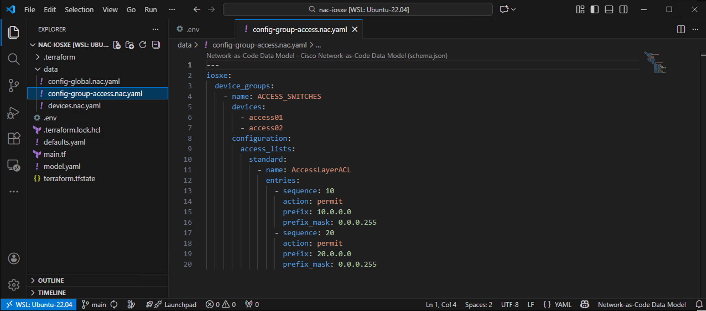
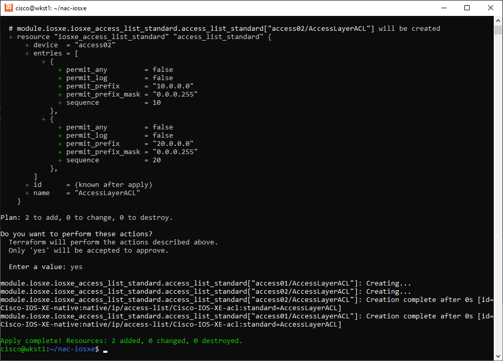
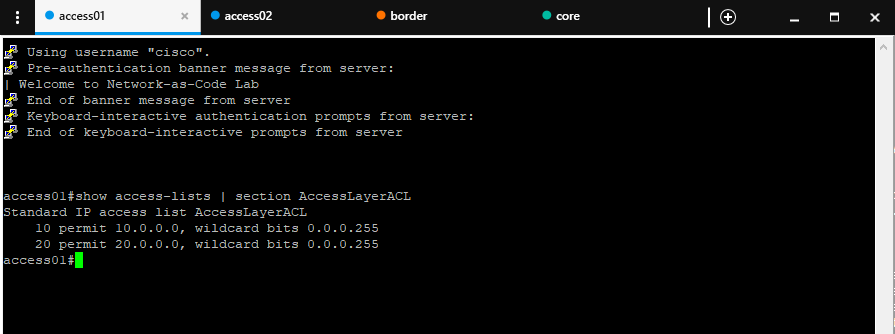
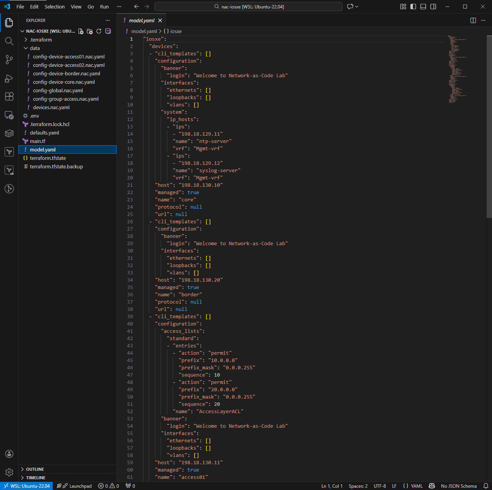

# Task 04 — Device group configuration

**⏱ ~15 minutes**

In this task you'll apply configuration to a **group of devices** at once using device groups. An Access Control List (ACL) is the example — device groups let you apply the same configuration to every device that shares a role or location, without duplicating the YAML.

## What you'll learn

By the end of this task you will have:

- Defined an `ACCESS_SWITCHES` device group and its two member devices
- Applied a standard ACL to the group via a single YAML file
- Confirmed the ACL landed on `access01` + `access02` only (not `core` or `border`)

## Device Groups

Device groups provide a mechanism for applying configurations to multiple devices without repeating the same settings for each device.

Device groups are particularly effective for:

- **Role-based configuration**: Grouping devices by function (access switches, core switches, border switches)
- **Location-based configuration**: Grouping devices by physical or logical location (data center, branch office)
- **Service deployment**: Rolling out consistent service configurations across multiple devices
- **Security policies**: Applying common ACLs or security settings to device groups

## Use Case: Standard ACL for Access Switches

In this example, you'll create a device group called **ACCESS_SWITCHES** that includes the **access01** and **access02** switches. These switches need a standard ACL to permit traffic from specific network ranges (`10.0.0.0/24` and `20.0.0.0/24`) – a typical requirement for access layer devices controlling traffic from known networks.

!!! note "The power of Device Groups: Scalability"
    Using device groups may appear unnecessary for just two access switches – in this example. However, consider a large network with more than 1,000 access switches. Utilizing device groups helps keep the configuration organized and scalable.

## Step 1: Create the Device Group Configuration File

First, create the file using your **WSL Ubuntu terminal**:

```bash
touch ~/nac-iosxe/data/groups/access.nac.yaml
```

The file will appear in VS Code's Explorer panel. Click on `groups/access.nac.yaml` to open it and add the following content. Notice how the ACL is defined once in the device group and automatically applies to both **access01** and **access02** switches:

```yaml title="groups/access.nac.yaml"
---
iosxe:
  device_groups:
    - name: ACCESS_SWITCHES
      devices:
        - access01
        - access02
      configuration:
        access_lists:
          standard:
            - name: AccessLayerACL
              entries:
                - sequence: 10
                  action: permit
                  prefix: 10.0.0.0
                  prefix_mask: 0.0.0.255
                - sequence: 20
                  action: permit
                  prefix: 20.0.0.0
                  prefix_mask: 0.0.0.255
```

The image below illustrates the ACL configuration in VS Code:

<figure markdown>
  { width="100%" }
</figure>

### Configuration Breakdown

Let's break down the key elements:

**Device Group Section:**

- **`device_groups:`** - Defines one or more device groups
- **`name: ACCESS_SWITCHES`** - The group name identifier
- **`devices:`** - Lists member devices (`access01`, `access02`)
- **`configuration:`** - Contains settings applied to all group members

??? tip "Alternative: You could also define group membership from devices"

    Try this at home!

    You can also add a device to a device group from under the device configuration section by specifying the `device_groups` attribute. This is useful when you want to assign a device to multiple groups or prefer defining group membership alongside device-specific settings.

    ```yaml
    ---
    iosxe:
      devices:
        - name: example-device
          device_groups:
            - EXAMPLE_GROUP1
            - EXAMPLE_GROUP2
            - EXAMPLE_GROUP3
          configuration:
            # device-specific configuration here
            ...
    ```

    The reference between the device and device group can be configured from both sides.

**Access List Configuration:**

- **`access_lists:`** - Top-level ACL configuration
- **`standard:`** - Specifies standard ACL type (filters based on source address only)
- **`name: AccessLayerACL`** - The ACL name
- **`entries:`** - Individual ACL rules (processed in sequence order)

**ACL Entry Details:**

- `sequence 10`: Permits traffic from the `10.0.0.0/24` network
    * `action: permit` - Allows matching traffic
    * `prefix: 10.0.0.0` - The network address
    * `prefix_mask: 0.0.0.255` - Wildcard mask (matches `10.0.0.0` through `10.0.0.255`)

- `sequence 20`: Permits traffic from the `20.0.0.0/24` network
    * `action: permit` - Allows matching traffic
    * `prefix: 20.0.0.0` - The network address
    * `prefix_mask: 0.0.0.255` - Wildcard mask (matches `20.0.0.0` through `20.0.0.255`)

!!! info "About Standard ACLs"
    Standard ACLs filter traffic based on source IP address only. There's an implicit deny at the end of every ACL, so traffic from any other networks will be denied.


## How Device Groups Work

When Terraform processes this configuration:

1. The **global banner** applies to all devices (**border**, **core**, **access01**, **access02**)
2. The **ACCESS_SWITCHES** group's configuration (in our case the ACL **AccessLayerACL**) applies only to **access01** and **access02** switches
3. If you later add device-specific configuration to the **access01** device, it could override global or group settings (e.g., changing the banner)

This hierarchical approach ensures:

- No configuration duplication (ACL defined once, applied to multiple devices)
- Easy maintenance (update ACL in one place, changes apply to all group members)
- Scalability (add more switches by just adding them to the group's device list)


## Step 2: Apply Access-list Configuration

Open your WSL Ubuntu terminal and navigate to your project directory. Run Terraform to deploy the ACL configuration to the device group:

```bash
cd ~/nac-iosxe
```

!!! note "terraform init not required"
    You do not need to run `terraform init` again, as the project has already been initialized in a previous task.


It is good practice to run `terraform plan` first to preview the changes that will be made. You could also skip this step as the plan is automatically generated during `terraform apply`.

```bash
terraform plan
```

Now, run the following command to apply the configuration:

```bash
terraform apply
```

When prompted, type `yes` to confirm the deployment. Terraform will create the standard ACL on all devices in the **ACCESS_SWITCHES** group (**access01** and **access02**).

<figure markdown>
  { width="80%" }
</figure>

## Step 3: Verify Device Group Configuration

After successfully running `terraform apply`, verify that the ACL was deployed only to the switches in the **ACCESS_SWITCHES** group.

**Use Solar-PuTTY to connect and verify:**

1. Open **Solar-PuTTY** from your desktop
2. Connect to the **access01** switch
3. Check if the ACL is present using the command below
4. Repeat for the **access02** switch

Use the following command on both **access01** and **access02** switches to verify the ACL:
```bash
show access-lists | section AccessLayerACL
```

<figure markdown>
  { width="95%" }
</figure>


This confirms the standard ACL was successfully deployed to both **access01** and **access02** switches with both network permit entries.

<!-- ??? info "Validation via `show run`"
    Alternatively, you can verify the ACL configuration by checking the running configuration:

    ```bash
    show run | section AccessLayerACL
    ```

    ???+ quote "put"
        ```
        access01#show run | section AccessLayerACL
        ip access-list standard AccessLayerACL
        10 permit 10.0.0.0 0.0.0.255
        20 permit 20.0.0.0 0.0.0.255
        access01#
        ``` -->

!!! note "Key observation"
    The ACL only appears on devices that are members of the **ACCESS_SWITCHES** group. If you check border or core switches (not in the group), they won't have this ACL, demonstrating the selective deployment capability of device groups.


## Generated Model File

When Terraform applies your configuration, the Network as Code module performs a deep merge of all your YAML files — global configuration, device group configuration, and device-specific configuration — into a single per-device view. The result is written to `model.yaml` (because you set `write_model_file = "model.yaml"` in `main.tf`).

The merge follows the same precedence hierarchy you've been working with: **global → device group → device**, where more specific levels override less specific ones for the same keys. Variables are substituted, templates are rendered, and the output is a flat list of devices, each with its fully resolved configuration.

<figure markdown>
  { width="100%" }
</figure>

Open `model.yaml` in VS Code to see the result. Notice how the ACL from the **ACCESS_SWITCHES** group appears under `access01` and `access02` but not under `core` or `border`:

<figure markdown>
  { width="100%" }
</figure>

**Why this matters:**

- **Debugging** — if a device gets unexpected configuration, `model.yaml` shows you exactly what the module computed for that device after all merges and variable substitutions.
- **Verification** — `nac-test` (Task 11) uses `model.yaml` as its input to generate post-deployment tests. The tests assert against what the model says *should* be on the device.
- **Transparency** — rather than trusting the module as a black box, you can inspect the fully resolved intent for every device in one file.


## What You've Accomplished

In this task, you have:

- ✅ Learned about device groups and configuration hierarchy
- ✅ Created an **ACCESS_SWITCHES** device group with **access01** and **access02** switches
- ✅ Applied a standard ACL to multiple devices using a single definition
- ✅ Verified selective configuration deployment to group members only

---

**← Previous:** [Task 03 — Global configuration](Task03_Global_configuration.md)  ·  **Next:** [Task 05 — Single-device configuration](Task05_Single_device_config.md)

