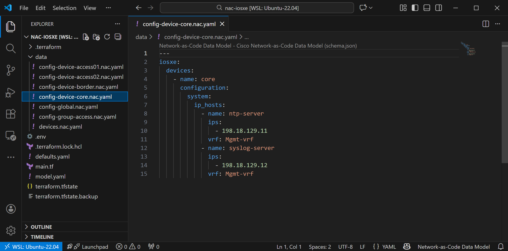
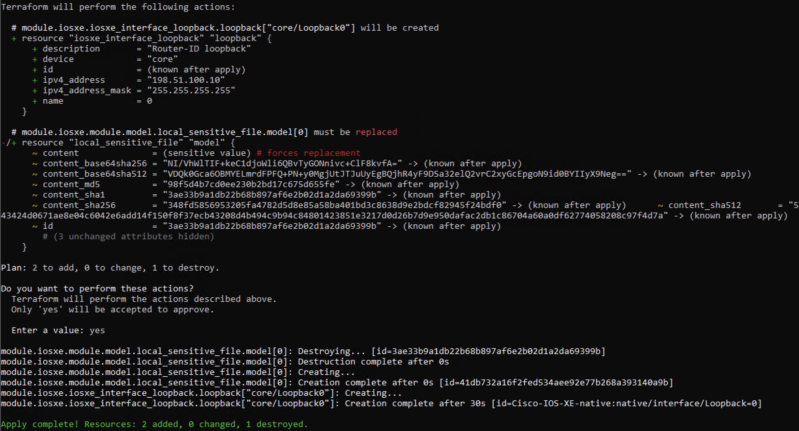
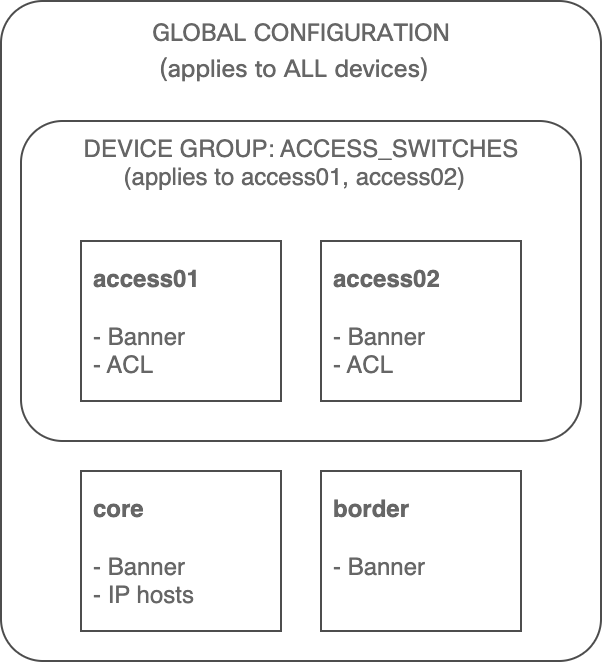

In this task, you'll learn how to apply configuration to a **single specific device** rather than globally or to a group. This is the highest level in the configuration precedence hierarchy and is used when a device requires unique settings that are specific to a given device.

## Device-Specific Configuration

Device-specific configurations are applied directly to individual devices and take the highest precedence in the Network-as-Code hierarchy. This approach is ideal for:

- **Unique device settings**: Configuration that only applies to one device (e.g., management IP hosts, device-specific routing)
- **Override scenarios**: When a device needs different settings than its group or global defaults
- **Special-purpose devices**: Management switches or devices with unique roles

**Configuration Precedence Hierarchy (reminder):**

1. **Global** (lowest precedence) - organization-wide defaults ← *Task03*
2. **Device Group** (medium precedence) - role or location-specific settings ← *Task04*
3. **Device** (highest precedence) - device-specific overrides ← *This task*

## Use Case: IP Host Entries for core Switch

In this example, you'll add IP host entries to the **core** switch only. IP hosts create static DNS-like mappings that allow you to reference devices by name instead of IP address. This is particularly useful on core switches that need to reference multiple infrastructure devices.

You'll configure the core switch to resolve these hostnames in its management VRF:

- `ntp-server` → `198.18.129.11`
- `syslog-server` → `198.18.129.12`

## Step 1: Create Device-Specific Configuration Files

First, create placeholder files for each device using your **WSL Ubuntu terminal**. This establishes a consistent structure for device-specific configurations:

```bash
touch ~/nac-iosxe/data/config-device-core.nac.yaml
touch ~/nac-iosxe/data/config-device-border.nac.yaml
touch ~/nac-iosxe/data/config-device-access01.nac.yaml
touch ~/nac-iosxe/data/config-device-access02.nac.yaml
```

!!! tip "Placeholder Files"
    Creating placeholder files for all devices establishes a consistent naming pattern. Even if a device doesn't have specific configuration yet, the file is ready when you need it. Empty files are ignored by NAC.

Now open `data/config-device-core.nac.yaml` in VS Code and add the following content. Notice how the configuration references the device by name:

```yaml title="data/config-device-core.nac.yaml"
---
iosxe:
  devices:
    - name: core
      configuration:
        system:
          ip_hosts:
            - name: ntp-server
              ips:
                - 198.18.129.11
              vrf: Mgmt-vrf
            - name: syslog-server
              ips:
                - 198.18.129.12
              vrf: Mgmt-vrf
```

The image below illustrates the device-specific configuration in VS Code:

<figure markdown>
  { width="100%" }
</figure>

### Configuration Breakdown

Let's break down the key elements:

**Device Section:**

- **`devices:`** - Defines device-specific configurations
- **`name: core`** - Targets the specific device by name (must match the device name in `devices.nac.yaml`)
- **`configuration:`** - Contains settings applied only to this device

**System Configuration:**

- **`system:`** - System-level configurations
- **`ip_hosts:`** - List of IP host entries (static hostname-to-IP mappings)

**IP Host Entry Details:**

- **`name: ntp-server`** / **`syslog-server`** - The hostnames to create
- **`ips:`** - List of IP addresses associated with the hostname
- **`198.18.129.11`** / **`198.18.129.12`** - The IP addresses of the NTP and Syslog servers that resolve when using the hostnames
- **`vrf: Mgmt-vrf`** - Specifies the VRF context for the IP host entry

!!! note
    This configuration will only be applied to the **core** device. The **border**, **access01**, and **access02** devices will not receive these IP host entries.

### File Organization

At this point, your `data/` folder contains multiple YAML files, each serving a different purpose:

```text { .no-copy hl_lines="8" }
/home/cisco/nac-iosxe/
├── .env
├── main.tf
└── data/
    ├── config-device-access01.nac.yaml  # Device-specific (placeholder)
    ├── config-device-access02.nac.yaml  # Device-specific (placeholder)
    ├── config-device-border.nac.yaml    # Device-specific (placeholder)
    ├── config-device-core.nac.yaml      # Device-specific (IP hosts) ← This task
    ├── config-global.nac.yaml           # Global configuration (banner) ← Task03
    ├── config-group-access.nac.yaml     # Device Group configuration (ACL) ← Task04
    └── devices.nac.yaml                 # Device inventory (name + host) ← Task02
```

!!! tip "File Organization"
    This modular approach keeps configurations organized and easy to maintain.

    This is how the files are organized for this lab guide, but you can organize your own projects in whatever way makes sense for your design.


## Step 2: Apply Device-Specific Configuration

Open your WSL Ubuntu terminal and run the following steps:

Navigate to your project directory:

```bash
cd ~/nac-iosxe
```

Optionally, preview the changes Terraform will make:

```bash
terraform plan
```

Apply the configuration:

```bash
terraform apply
```

When prompted, type `yes` to confirm the deployment. Terraform will create the IP host entries only on the core device.

**What to observe in the plan output:**

- Terraform shows changes only for the **core** device
- No changes are proposed for **border**, **access01**, or **access02**

<figure markdown>
  { width="80%" }
</figure>

## Step 3: Verify Device-Specific Configuration

After successfully running `terraform apply`, verify that the IP host entries were deployed only to the core switch.

**Verify on core Switch (should have the configuration)**

1. Open **Solar-PuTTY** from your desktop
2. Connect to the **core** switch
3. Run the verification commands below

**Verification via host resolution and ping:**

```
ping vrf Mgmt-vrf ntp-server
```

```
ping vrf Mgmt-vrf syslog-server
```


```text { title="Expected Output" .no-copy }
core#ping vrf Mgmt-vrf ntp-server
Type escape sequence to abort.
Sending 5, 100-byte ICMP Echos to 198.18.129.11, timeout is 2 seconds:
!!!!!
Success rate is 100 percent (5/5), round-trip min/avg/max = 1/1/2 ms
core#ping vrf Mgmt-vrf syslog-server
Type escape sequence to abort.
Sending 5, 100-byte ICMP Echos to 198.18.129.12, timeout is 2 seconds:
!!!!!
Success rate is 100 percent (5/5), round-trip min/avg/max = 1/201/1002 ms
core#
```


**Verification via `show hosts`**

```
show hosts vrf Mgmt-vrf
```

```text { title="Expected Output" .no-copy }
core#show hosts vrf Mgmt-vrf
Name lookup VRF: Mgmt-vrf
Default domain is not set
Name servers are 255.255.255.255
NAME  TTL  CLASS   TYPE      DATA/ADDRESS
-----------------------------------------
11.129.18.198.in-addr.arpa     10      IN      PTR     ntp-server
12.129.18.198.in-addr.arpa     10      IN      PTR     syslog-server
ntp-server     10      IN      A       198.18.129.11
syslog-server  10      IN      A       198.18.129.12

core#
```


<!-- ??? info "Verification via `show run | include ip host`"
    ```bash
    show run | include ip host
    ```

    ???+ quote "Expected output"
        ```
        core#show run | include ip host
        ip host vrf Mgmt-vrf ntp-server 198.18.129.11
        ip host vrf Mgmt-vrf syslog-server 198.18.129.12
        core#
        ``` -->

You should see both IP host entries configured on the **core** switch.


**Verify on Other Devices (should NOT have the configuration)**

Connect to the **border** switch and run the same command:

```bash
show run | include ip host
```

**Expected output on border:**

The command should return no output, confirming that the IP host entries were NOT applied to the border switch.


!!! note "Key observation"
    The IP host configuration only appears on the **core** device because it was defined under the device-specific configuration section.


## Configuration Hierarchy Comparison

Now that you've completed Tasks 03, 04, and 05, you've experienced all three levels of the configuration hierarchy. Here's a summary:

| Level            | Scope             | Example      | File                           |
|------------------|-------------------|--------------|--------------------------------|
| **Global**       | All devices       | Login banner | `config-global.nac.yaml`       |
| **Device Group** | Subset of devices | Standard ACL | `config-group-access.nac.yaml` |
| **Device**       | Single device     | IP hosts     | `config-device-core.nac.yaml`  |

In case of conflicting settings, the higher precedence level overrides the lower. For example, you can have a global banner, and configure a different banner for a specific device.

<figure markdown>
  { width="50%" }
</figure>

## When to Use Each Configuration Level

| Use Case                                                      | Recommended Level |
|---------------------------------------------------------------|-------------------|
| Organization-wide standards (banners, NTP, logging)           | **Global**        |
| Role-based settings (ACLs for access layer, routing for core) | **Device Group**  |
| Location-specific settings (site-specific config, Timezone)   | **Device Group**  |
| Unique device requirements (management IPs, special features) | **Device**        |
| Overriding group or global settings for one device            | **Device**        |

## What You've Accomplished

In this task, you have:

- ✅ Learned about device-specific configuration
- ✅ Created a dedicated NAC YAML file for core switch configuration
- ✅ Configured IP host entries for infrastructure services
- ✅ Verified selective deployment to a single device only
- ✅ Understood the configuration precedence hierarchy: Global < Device Group < Device

You've now mastered all three levels of the Network-as-Code configuration hierarchy: Global, Device Group, and Device-specific configurations!

---

**Next:** [Task06 - Variables](Task06_Variables.md)
