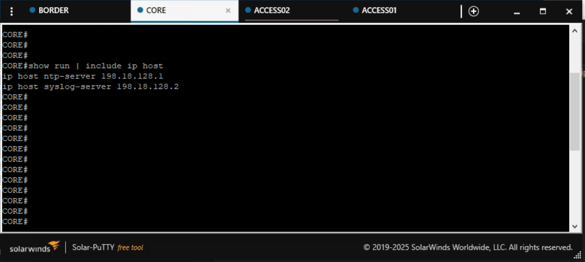

In this task, you'll learn how to apply configuration to a **single specific device** rather than globally or to a group. This is the highest level in the configuration precedence hierarchy and is used when a device requires unique settings that shouldn't be shared with other devices.

## Understanding Device-Specific Configuration

Device-specific configurations are applied directly to individual devices and take the highest precedence in the Network-as-Code hierarchy. This approach is ideal for:

- **Unique device settings**: Configuration that only applies to one device (e.g., management IP hosts, device-specific routing)
- **Override scenarios**: When a device needs different settings than its group or global defaults
- **Special-purpose devices**: Core switches, management servers, or devices with unique roles

**Configuration Precedence Hierarchy (reminder):**

1. **Global** (lowest precedence) - organization-wide defaults ← *Task03*
2. **Device Group** (medium precedence) - role or location-specific settings ← *Task04*
3. **Device** (highest precedence) - device-specific overrides ← *This task*

## Use Case: IP Host Entries for Core Switch

In this example, you'll add IP host entries to the **CORE** switch only. IP hosts create static DNS-like mappings that allow you to reference devices by name instead of IP address. This is particularly useful on core switches that need to reference multiple infrastructure devices.

You'll configure the CORE switch to resolve these hostnames:

- `ntp-server` → 198.18.128.1
- `syslog-server` → 198.18.128.2

## Create Device-Specific Configuration Files

First, create placeholder files for each device using your **WSL Ubuntu terminal**. This establishes a consistent structure for device-specific configurations:

```bash
touch ~/nac-iosxe/data/config-device-core.nac.yaml
touch ~/nac-iosxe/data/config-device-border.nac.yaml
touch ~/nac-iosxe/data/config-device-access01.nac.yaml
touch ~/nac-iosxe/data/config-device-access02.nac.yaml
```

!!! tip "Placeholder Files"
    Creating placeholder files for all devices establishes a consistent naming pattern. Even if a device doesn't have specific configuration yet, the file is ready when you need it. Empty files are ignored by the NAC module.

Now open `data/config-device-core.nac.yaml` in VS Code and add the following content. Notice how the configuration references the device by name:

```yaml
iosxe:
  devices:
    - name: core
      configuration:
        system:
          ip_hosts:
            - name: ntp-server
              ips:
                - 198.18.128.1
            - name: syslog-server
              ips:
                - 198.18.128.2
```

The image below illustrates the device-specific configuration in VS Code:

<figure markdown>
  { width="100%" }
</figure>

## Configuration Breakdown

Let's break down the key elements:

**Device Section:**

- **`devices:`** - Defines device-specific configurations
- **`name: core`** - Targets the specific device by name (must match the device name in `devices.nac.yaml`)
- **`configuration:`** - Contains settings applied only to this device

**System Configuration:**

- **`system:`** - System-level configurations
- **`ip_hosts:`** - List of IP host entries (static hostname-to-IP mappings)

**IP Host Entry Details:**

- **`name: ntp-server`** - The hostname to create
- **`ips:`** - List of IP addresses associated with the hostname
- **`198.18.128.1`** - The IP address that resolves when using the hostname

**Important:** This configuration will only be applied to the **core** device. The **border**, **access01**, and **access02** devices will not receive these IP host entries.

## Understanding File Organization

At this point, your `data/` folder contains multiple YAML files, each serving a different purpose:

```
/home/cisco/nac-iosxe/
├── .env
├── main.tf
└── data/
    ├── config-device-access01.nac.yaml  # Device-specific (placeholder)
    ├── config-device-access02.nac.yaml  # Device-specific (placeholder)
    ├── config-device-border.nac.yaml    # Device-specific (placeholder)
    ├── config-device-core.nac.yaml      # Device-specific (IP hosts)
    ├── config-global.nac.yaml           # Global configuration (banner)
    ├── config-group-access.nac.yaml     # Device Group configuration (ACL)
    └── devices.nac.yaml                 # Device inventory (name + host)
```

This modular approach keeps configurations organized and easy to maintain. This is how we've organized the files for this lab guide, but you can organize your own projects in whatever way makes sense for your environment:

- **Device inventory** in `devices.nac.yaml` - the device list
- **Global settings** in `config-global.nac.yaml` - applies to all devices
- **Group-specific settings** in `config-group-*.nac.yaml` files
- **Device-specific settings** in `config-device-*.nac.yaml` files

## Apply Device-Specific Configuration

Open your WSL Ubuntu terminal and run the following steps:

**Step 1:** Navigate to your project directory:

```bash
cd ~/nac-iosxe
```

**Step 2:** Preview the changes Terraform will make:

```bash
terraform plan
```

**Step 3:** Apply the configuration:

```bash
terraform apply
```

When prompted, type `yes` to confirm the deployment. Terraform will create the IP host entries only on the CORE device.

**What to observe in the plan output:**

- Terraform shows changes only for the **core** device
- No changes are proposed for **border**, **access01**, or **access02**

<figure markdown>
  { width="100%" }
</figure>

## Verify Device-Specific Configuration

After successfully running `terraform apply`, verify that the IP host entries were deployed only to the CORE switch.

**Step 1: Verify on CORE Switch (should have the configuration)**

1. Open **Solar-PuTTY** from your desktop
2. Connect to the **CORE** switch (198.18.130.10)
3. Run the verification command below

```bash
show run | include ip host
```

**Expected output on CORE:**

<figure markdown>
  { width="100%" }
</figure>

You should see both IP host entries configured on the **CORE** switch.

**Step 2: Verify on Other Devices (should NOT have the configuration)**

Connect to the **BORDER** switch (198.18.130.20) and run the same command:

```bash
show run | include ip host
```

**Expected output on BORDER:**

The command should return no output, confirming that the IP host entries were NOT applied to the BORDER switch.

**Key observation:** The IP host configuration only appears on the CORE device because it was defined in the device-specific section. This demonstrates how device-level configuration takes precedence and remains isolated to the targeted device.

## Configuration Hierarchy Comparison

Now that you've completed Tasks 03, 04, and 05, you've experienced all three levels of the configuration hierarchy. Here's a summary:

| Level | Scope | Example | File |
|-------|-------|---------|------|
| **Global** | All devices | Login banner | `config-global.nac.yaml` |
| **Device Group** | Subset of devices | Standard ACL | `config-group-access.nac.yaml` |
| **Device** | Single device | IP hosts | `config-device-core.nac.yaml` |

**Visual representation:**

```text
┌──────────────────────────────────────────────────────────────┐
│                    GLOBAL CONFIGURATION                  │
│                   (applies to ALL devices)               │
│                                                          │
│  ┌─────────────────────────────────────────────────────┐ │
│  │              DEVICE GROUP: ACCESS_SWITCHES       │   │
│  │           (applies to ACCESS01, ACCESS02)        │   │
│  │                                                  │   │
│  │  ┌──────────────┐        ┌──────────────┐         │   │
│  │  │  ACCESS01   │        │  ACCESS02   │          │   │
│  │  │             │        │             │          │   │
│  │  │ - Banner    │        │ - Banner    │          │   │
│  │  │ - ACL       │        │ - ACL       │          │   │
│  │  └──────────────┘        └──────────────┘         │   │
│  └─────────────────────────────────────────────────────┘ │
│                                                          │
│  ┌───────────────────┐        ┌─────────────────┐        │
│  │      CORE       │        │     BORDER      │         │
│  │                 │        │                 │         │
│  │ - Banner        │        │ - Banner        │         │
│  │ - IP Hosts      │        │                 │         │
│  │                 │        │                 │         │
│  └───────────────────┘        └─────────────────┘        │
└──────────────────────────────────────────────────────────────┘
```

## When to Use Each Configuration Level

| Use Case | Recommended Level |
|----------|-------------------|
| Organization-wide standards (banners, NTP, logging) | **Global** |
| Role-based settings (ACLs for access layer, routing for core) | **Device Group** |
| Unique device requirements (management IPs, special features) | **Device** |
| Overriding group or global settings for one device | **Device** |

## What You've Accomplished

In this task, you have:

- ✅ Learned about device-specific configuration and its place in the hierarchy
- ✅ Created a dedicated YAML file for CORE switch configuration
- ✅ Configured IP host entries for infrastructure services
- ✅ Verified selective deployment to a single device only
- ✅ Understood the complete configuration precedence hierarchy

**Success!** You've now mastered all three levels of the Network-as-Code configuration hierarchy: Global, Device Group, and Device-specific configurations!

---

**Next:** Continue with the remaining tasks to explore more advanced Network-as-Code features like schema validation and CI/CD pipelines.

