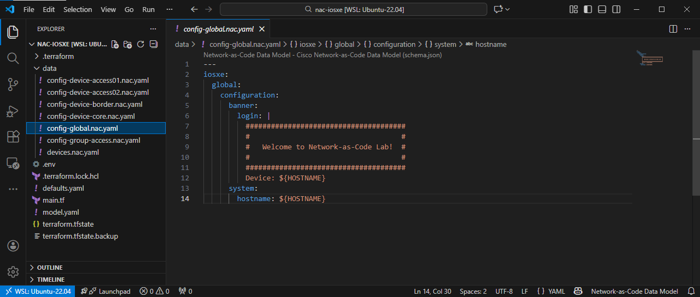
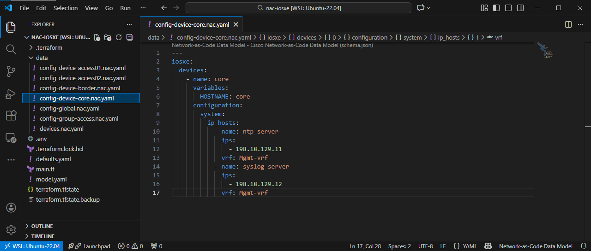
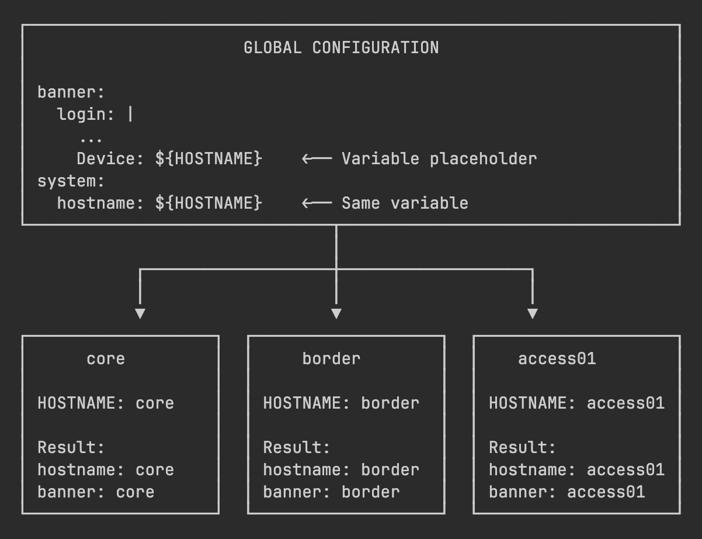
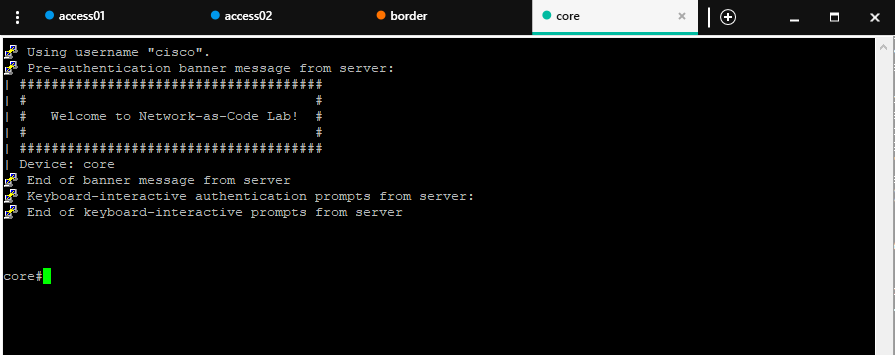

In this task, you'll learn how to use **variables** in your Network-as-Code configurations. Variables allow you to define values once and reference them throughout your configuration files, making your configurations more dynamic, reusable, and easier to maintain.

## Variables in Network-as-Code

Variables in NAC work similarly to variables in programming languages. You define a variable with a value at one level (device, device group, or global), and then reference it elsewhere using the `${VARIABLE_NAME}` syntax. When the Network-as-Code module processes your configuration, it substitutes the variable references with their actual values.

**Benefits of using variables:**

- **Consistency**: Define a value once, use it everywhere
- **Maintainability**: Change a value in one place, it updates everywhere it's used
- **Reusability**: Same configuration template can be used with different variable values
- **Device-specific customization**: Each device can have its own variable values while sharing configuration structure

## Use Case: Dynamic Hostname in Banner and System Config

In this example, you'll update the login banners on each device to display its own hostname. Instead of creating separate banner configurations for each device, you'll:

1. Define the banner template once in the **global** configuration with a variable placeholder, called `HOSTNAME`
2. Define the system hostname once in the **global** configuration using the same variable
3. Set the `HOSTNAME` variable value per **device**
4. Let NAC substitute the variable automatically in both the banner and system hostname configuration

!!! tip "The power of variables"
    One banner template, multiple device-specific outputs!

    One place to define the hostname variable per device, used in multiple configuration sections.


## Step 1: Update the Global Configuration File

First, let's update the global configuration to use a variable in the banner. Open `data/config-global.nac.yaml` in VS Code and update it with the following content:

```yaml title="data/config-global.nac.yaml" hl_lines="6-14"
---
iosxe:
  global:
    configuration:
      banner:
        login: |
          ######################################
          #                                    #
          #   Welcome to Network-as-Code Lab!  #
          #                                    #
          ######################################
          Device: ${HOSTNAME}
      system:
        hostname: ${HOSTNAME}
```

**Key elements explained:**

- **`banner: login:`** - The login banner text shown when users connect
- **`|`** - YAML multi-line string indicator (preserves line breaks and formatting)
- **`${HOSTNAME}`** - Variable reference that will be replaced with the actual hostname
- **`system: hostname:`** - Sets the device hostname using the same variable

!!! note "Variable Syntax"
    Variables use the `${VARIABLE_NAME}` syntax. The variable name is case-sensitive, so `${HOSTNAME}` and `${hostname}` are different variables.

    In this lab, we're using uppercase variable names by convention, to improve readability and distinguish them from other text. You can choose any naming convention that works for you.

The image below illustrates the updated global configuration in VS Code:

<figure markdown>
  { width="100%" }
</figure>

!!! warning "YAML Formatting"
    When pasting multi-line strings in YAML (like this banner), ensure the indentation is correct. The `|` character indicates a multi-line string, and the following lines should be indented properly to be part of that string.

    To learn more about the multi-line string (block scalar) YAML syntax, refer to [yaml-multiline.info](https://yaml-multiline.info/).

## Step 2: Define Variables at Device Level

Now you need to define the `HOSTNAME` variable for each device. Open `data/config-device-core.nac.yaml` in VS Code and update it with the following content:

```yaml title="data/config-device-core.nac.yaml" hl_lines="5 6"
---
iosxe:
  devices:
    - name: core
      variables:
        HOSTNAME: core
      configuration:
        system:
          ip_hosts:
            - name: ntp-server
              ips:
                - 198.18.129.11
              vrf: Mgmt-vrf
            - name: syslog-server
              ips:
                - 198.18.129.12
              vrf: Mgmt-vrf
```

**What's new:**

- **`variables:`** - Section where you define device-specific variables
- **`HOSTNAME: core`** - Sets the `HOSTNAME` variable to `core` for this device

The image below illustrates the device configuration with variables in VS Code:

<figure markdown>
  { width="100%" }
</figure>

## Step 3: Add Variables to Other Devices

Now add the `HOSTNAME` variable to the other device configuration files.

**Update `data/config-device-border.nac.yaml`:**

```yaml title="data/config-device-border.nac.yaml"
---
iosxe:
  devices:
    - name: border
      variables:
        HOSTNAME: border
```

**Update `data/config-device-access01.nac.yaml`:**

```yaml title="data/config-device-access01.nac.yaml"
---
iosxe:
  devices:
    - name: access01
      variables:
        HOSTNAME: access01
```

**Update `data/config-device-access02.nac.yaml`:**

```yaml title="data/config-device-access02.nac.yaml"
---
iosxe:
  devices:
    - name: access02
      variables:
        HOSTNAME: access02
```

!!! note "Name and hostname"
    The `name` attribute under `devices` identifies the device in NAC. The `HOSTNAME` variable value you set is what will be used in the system hostname and banner configuration. They can be the same or different, depending on your design.


## How Variable Substitution Works

When Terraform processes your configuration, it performs variable substitution at each level, for each device.

<figure markdown>
  { width="70%" }
</figure>

## Variable Precedence

Variables can be defined at multiple levels. When the same variable is defined at different levels, the more specific level takes precedence:

1. **Device variables** (highest precedence) - Override everything
2. **Device group variables** (medium precedence) - Override global
3. **Global variables** (lowest precedence) - Default values

This allows you to define default values globally and override them per device or device group when needed.

```yaml title="Variable Precedence Example" hl_lines="5 9"
---
iosxe:
  global:
    variables:
      TIMEZONE: UTC  # Global default
  devices:
    - name: example-device
      variables:
        TIMEZONE: America/New_York  # Overrides global default
```

## Step 4: Apply Configuration

Open your WSL Ubuntu terminal and navigate to your project directory:

```bash
cd ~/nac-iosxe
```

Optionally, preview the changes Terraform will make:

```bash
terraform plan
```

Apply the configuration:

```bash
terraform apply
```
When prompted, type `yes` to confirm the deployment.

!!! tip "View the Merged Model"
    After running `terraform apply`, open the `model.yaml` file in VS Code to see how variables are resolved. You'll see each device with its variable values substituted into the configuration.


## Step 5: Verify Variable Substitution

After Terraform completes successfully, verify the configuration was applied correctly on each device.

**Use Solar-PuTTY to connect and verify:**

1. Open **Solar-PuTTY** from your desktop
2. Connect to the **core** switch (`198.18.130.10`)
3. Verify the updated hostname and banner
4. Repeat for other switches (**border**, **access01**, **access02**) to see their specific hostnames

<figure markdown>
  { width="80%" }
</figure>

??? info "Alternative Verification Commands"
    You can use the following commands to verify the hostname and banner on each device:

    ???+ quote "Verify Hostname via `show run`"
        ```
        show running-config | include hostname
        ```

        ???+ quote "Expected output on **core**:"
            ```
            core#show running-config | include hostname
            hostname core
            core#
            ```

    ???+ quote "Verify Banner via `show banner login`"
        ```
        show banner login
        ```

        ???+ quote "Expected output on **access01**:"
            ```
            access01#show banner login
            ######################################
            #                                    #
            #   Welcome to Network-as-Code Lab!  #
            #                                    #
            ######################################
            Device: access01

            access01#
            ```

Each device shows its own hostname in the banner - demonstrating that the same template produced device-specific results.


## Common Variable Use Cases

Variables are powerful for many scenarios beyond hostnames (device identity). Here are some common use cases:

| Use Case             | Variable Example               | Benefit                           |
|----------------------|--------------------------------|-----------------------------------|
| **Network segments** | `${MGMT_VLAN}`, `${DATA_VLAN}` | Easy VLAN changes across devices  |
| **IP addressing**    | `${LOOPBACK_IP}`, `${GATEWAY}` | Device-specific IP configuration  |
| **Credentials**      | `${SNMP_COMMUNITY}`            | Centralized credential management |
| **Thresholds**       | `${LOG_LEVEL}`, `${TIMEOUT}`   | Environment-specific tuning       |


## Environment Variables

Environment variables can also be used in NAC configurations. They are defined outside of the configuration files and can be referenced using the syntax below:

```yaml title="Environment Variable Example"
---
iosxe:
  devices:
    - name: example-device
      system:
        enable_secret: !env ENABLE_SECRET
        enable_secret_type: "0"
```

In this example, the `ENABLE_SECRET` environment variable is referenced and used for the device's enable secret.

!!! tip "Security Best Practice"
    Using environment variables is good practice for sensitive information like passwords.


## What You've Accomplished

In this task, you have:

- ✅ Learned how variables work in Network-as-Code configurations
- ✅ Updated the global configuration to use a variable placeholder
- ✅ Defined device-specific variable values
- ✅ Understood variable substitution and precedence rules
- ✅ Applied and verified variable-based configuration

---

**Next Steps:**

You can either explore **optional** template tasks or continue with the **recommended** path:

- **Optional:** [Task07 - Templates Type Model](Task07_Templates_type_model.md) - Learn how to create reusable YAML-based configuration templates
- **Recommended:** [Task10 - Schema Validation](Task10_Schema_validation.md) - Skip templates and continue with pre-change validation
