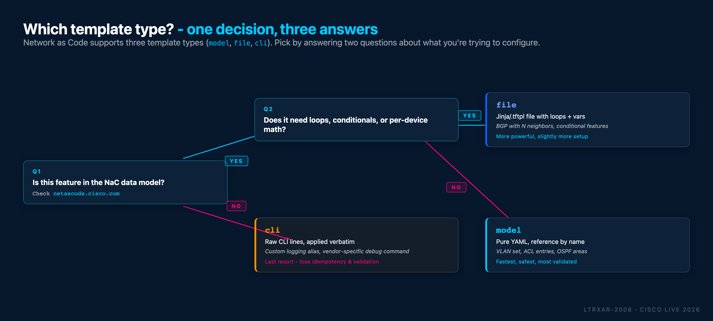

# Task 07 - Templates type `model` (Optional)

**Estimated Time to Complete:** ~10 minutes

In this task you'll use **templates of type `model`** to define reusable YAML-based configuration blocks that can be applied to multiple devices. Templates promote reuse, reduce duplication, and keep configuration consistent across the network.

## What you'll learn

By the end of this task you will have:

- Written a reusable `model`-type template (`access_switch_vlans`) that defines three VLANs
- Referenced the template from the `ACCESS_SWITCHES` device group
- Verified the VLANs expanded onto both `access01` and `access02` with `show vlan brief`

## Templates

Templates in Network as Code allow you to define configuration once and apply it to multiple devices by reference. Instead of repeating the same configuration in each device's YAML file, you define a template and simply reference it where needed. This works for any type of configuration - VLANs, interfaces, security policies, QoS settings, and more.

A template can be referenced at the individual device level, device group level, or even globally.

As described in the [IOS XE Template documentation](https://netascode.cisco.com/docs/data_models/iosxe/device/template/), templates provide:

- **Reusability**: Define configuration once, use it many times
- **Consistency**: Ensure identical configuration across devices
- **Maintainability**: Update template in one place, changes propagate everywhere
- **Modularity**: Keep configuration organized in separate, purpose-specific files

**Template types:**

| Type    | Description                       | Use Case                                                        |
|---------|-----------------------------------|-----------------------------------------------------------------|
| *model* | YAML-based configuration template | Standard configurations (VLANs, ACLs, etc.) ← *This chapter*    |
| *file*  | External `.tftpl` template files  | Large configurations stored separately ← *Task 08*              |
| *cli*   | Raw CLI commands                  | IOS XE features not supported in the IOS XE as Code data model ← *Task 09*  |

### Which template type should you pick?

Two questions answer it. Is the feature you're configuring already in
the Network as Code data model? And does your configuration need loops,
conditionals, or per-device math? Walk the tree:

<figure markdown>
  { width="100%" }
</figure>

Rules of thumb from the tree:

- **Default to `model`** when the feature is in the data model and your
  config is straightforward. Fastest to write, gets free schema
  validation, reads as pure YAML.
- **Escalate to `file`** when you need Jinja-style loops or conditionals
  (e.g. "one BGP neighbor per item in this list") or when the config is
  long enough that a standalone `.tftpl` file is cleaner than inline YAML.
- **Reach for `cli` last** when the feature genuinely isn't in the data
  model yet. You lose schema validation and fine-grained idempotency in
  exchange for coverage of edge-case features.

In this task, you'll use the *model* type to create a VLAN template as a practical example.

## Use case: standard VLANs for access switches


Access switches typically share the same VLAN configuration - they need identical VLANs for user traffic, voice, and management. Instead of defining VLANs separately for **access01** and **access02**, you'll create a single template and apply it to both devices.

**VLANs to configure:**

- VLAN 10: `DATA` - User data traffic
- VLAN 20: `VOICE` - VoIP traffic
- VLAN 99: `MGMT` - Management traffic

!!! note "Why use Templates here?"
    Using a template for VLANs ensures that both access switches have identical VLAN configurations. If you need to add or modify VLANs in the future, you can do so in one place (the template) rather than updating each device's configuration individually.

    You may wonder what's the difference between using a **template** versus a **device group**. The key distinction is that templates focus on **what configuration** to apply (the VLANs), while device groups focus on **which devices** receive that configuration (the access switches). In most cases, you can combine both approaches.


## Step 1: Create the template file


First, create the file using your **WSL Ubuntu terminal**:

```bash
touch ~/nac-iosxe/data/templates/vlan.nac.yaml
```

Then open `data/templates/vlan.nac.yaml` in VS Code and add the following content. This file defines a reusable VLAN template:

```yaml title="data/templates/vlan.nac.yaml"
---
iosxe:
  templates:
    - name: access_switch_vlans
      type: model
      configuration:
        vlan:
          vlans:
            - id: 10
              name: DATA
            - id: 20
              name: VOICE
            - id: 99
              name: MGMT
```

<figure markdown>
  { width="100%" }
</figure>

### Configuration breakdown


Let's break down the key elements:

**Template Definition:**

- **`templates:`** - List of template definitions at the top level
- **`name: access_switch_vlans`** - Unique identifier for this template
- **`type: model`** - Indicates this is a YAML-based configuration template
- **`configuration:`** - Contains the actual configuration to be applied

**VLAN Configuration:**

- **`vlan:`** - VLAN configuration section
- **`vlans:`** - List of individual VLAN definitions
- **`id:`** - VLAN ID number (1-4094)
- **`name:`** - Descriptive name for the VLAN

## Step 2: Apply template to access switches


Now you need to apply the template to the access switches. Open the existing `data/groups/access.nac.yaml` file in VS Code (this file was created in Task04) and add the `templates:` section, at the end of the YAML configuration file:

```yaml title="data/groups/access.nac.yaml" hl_lines="21 22"
---
iosxe:
  device_groups:
    - name: ACCESS_SWITCHES
      devices:
        - access01
        - access02
      configuration:
        access_lists:
          standard:
            - name: AccessLayerACL
              entries:
                - sequence: 10
                  action: permit
                  prefix: 10.0.0.0
                  prefix_mask: 0.0.0.255
                - sequence: 20
                  action: permit
                  prefix: 20.0.0.0
                  prefix_mask: 0.0.0.255
      templates:
        - access_switch_vlans
```

{width=100%}

!!! note "What was added"
    - **`templates:`** - New section to apply templates to all switches in the `ACCESS_SWITCHES` device group
    - **`access_switch_vlans`**: Reference to the VLAN template defined in `templates/vlan.nac.yaml`

The template reference is added alongside the existing `AccessLayerACL` configuration. After running `terraform apply`, both the ACL and VLAN configuration will be present on **access01** and **access02**.

### Verify project structure


At this point, your `data/` folder should contain these files:

```text { hl_lines="10 12" .no-copy }
/home/cisco/nac-iosxe/
├── .env
├── main.tf
└── data/
    ├── devices/access01.nac.yaml  # Task02: access01 registration
    ├── devices/access02.nac.yaml  # Task02: access02 registration
    ├── devices/border.nac.yaml    # Task02: border registration
    ├── devices/core.nac.yaml      # Task02 + Task05: core + Loopback0
    ├── global.nac.yaml           # Task03: Global banner + hostname
    ├── groups/access.nac.yaml     # Task04 + Task07: ACL + VLAN template
    └── templates/vlan.nac.yaml           # Task07: VLAN template (type: model)
```

## How templates work


When Network as Code processes your configuration:

1. **Template Resolution**: NaC reads the `templates/vlan.nac.yaml` file and loads the `access_switch_vlans` template, defined under `iosxe: templates`
2. **Device Group Processing**: NaC reads `groups/access.nac.yaml` and finds the `access_switch_vlans` template applied to the `ACCESS_SWITCHES` group
3. **Configuration Merge**: For **access01** and **access02** (members of the `ACCESS_SWITCHES` group), the template's configuration is merged with their settings
4. **Deployment**: VLANs are created on both **access01** and **access02** (but not on **core** or **border**)

<figure markdown>
  { width="100%" }
  { width="100%" }
</figure>


## Step 3: Apply template configuration


Open your WSL Ubuntu terminal and run the following steps:

Navigate to your project directory:

```bash
cd ~/nac-iosxe
```

Optionally, preview the changes Terraform will make:

```bash
terraform plan
```

Apply the configuration:

```bash
terraform apply
```

When prompted, type `yes` to confirm the deployment. Terraform will create the three VLANs on both **access01** and **access02** switches.

**What to observe in the plan output:**

- Terraform shows VLAN creation for **access01**
- Terraform shows VLAN creation for **access02**
- Both devices receive identical VLAN configuration

!!! tip "View the Merged Model"
    After running `terraform apply`, open the `model.yaml` file in VS Code to see how templates are rendered and merged with device configurations into a single data model. This is the same file used by Robot Framework for post-change validation in Task11.

<figure markdown>
  { width="80%" }
</figure>

## Step 4: Verify template configuration


After successfully running `terraform apply`, verify that the VLANs were deployed to both access switches.

**Use Solar-PuTTY to connect and verify:**

1. Open **Solar-PuTTY** from your desktop
2. Connect to the **access01** switch
3. Run the verification command below
4. Disconnect and repeat for **access02** switch

Use the following command on both **access01** and **access02** switches to verify the VLANs:

```text
show vlan brief
```

```text { title="Expected output on both switches" hl_lines="8-10" .no-copy }
access01#show vlan brief

VLAN Name                             Status    Ports
---- -------------------------------- --------- -------------------------------
1    default                          active    Gi1/0/1, Gi1/0/2, Gi1/0/3, Gi1/0/4,
                                                ...
                                                Gi1/0/21, Gi1/0/22, Gi1/0/23, Gi1/0/24
10   DATA                             active
20   VOICE                            active
99   MGMT                             active
1002 fddi-default                     act/unsup
1003 token-ring-default               act/unsup
1004 fddinet-default                  act/unsup
1005 trnet-default                    act/unsup
access01#
```

You should see all three VLANs (`10-DATA`, `20-VOICE`, `99-MGMT`) configured on both devices.


## Templates vs other configuration methods


Here's a comparison of when to use templates versus other configuration approaches:

| Method           | Best For                                          | Examples                                                   |
|------------------|---------------------------------------------------|------------------------------------------------------------|
| **Global**       | Settings that apply to ALL devices                | Login banners, NTP, Syslog                                 |
| **Device Group** | Role or location based settings for device groups | ACLs for access layer, routing for core, timezone for site |
| **Device**       | Unique settings for one device                    | Management IP hosts, special features                      |
| **Template**     | Reusable configurations across selected devices   | Standard VLANs, interface templates                        |


Templates give you fine-grained control - you choose exactly which devices get the template configuration by adding the template reference to each device.


## Applying multiple templates


One of the most powerful features of templates is the ability to apply **multiple templates** to a device. This allows you to build modular, composable configurations where each template handles a specific aspect of the configuration.

For example, access switches might need:

- **VLAN configuration** (from `example_template_vlans`)
- **QoS policies** (from `example_template_qos`)
- **Security settings** (from `example_template_security`)

Using device groups (as shown in this task), you can apply multiple templates to all group members:

!!! info "Example: Working with Multiple Templates"
    The config below is only an example, you do not need to add this in your lab.

    ```yaml { .no-copy hl_lines="9-12" }
    ---
    iosxe:
      device_groups:
        - name: EXAMPLE_GROUP_SWITCHES
          devices:
            - example-switch01
            - example-switch02
            - example-switch03
          templates:
            - example_template_vlans
            - example_template_qos
            - example_template_security
    ```


## Benefits of using templates


1. **Single Source of Truth**: VLAN definitions exist in one place
2. **Easy Updates**: Need to add `VLAN 30`? Update the template once, all devices get it
3. **Selective Application**: Not all devices need the same VLANs - only reference the template where needed
4. **Combine Multiple Templates**: A device can reference multiple templates for different configuration aspects
5. **Separation of concerns**: With multiple templates, each can handle one configuration domain


## What you've accomplished


In this task, you have:

- ✅ Learned about templates and their benefits for Network as Code
- ✅ Created a reusable VLAN template (`access_switch_vlans`)
- ✅ Applied the template to multiple access switches
- ✅ Verified consistent VLAN deployment across devices
- ✅ Understood when to use templates vs global/group/device configurations

---

## What's next

Task 08 introduces the `file` template type (external `.tftpl` files
with Jinja-style loops and conditionals - the template you'd reach for
when `model` templates aren't expressive enough). If you're only
sampling one template type, skipping ahead to
[Task 10 - Schema validation](Task10_Schema_validation.md) is fine.

---

**← Previous:** [Task 06 - Variables](Task06_Variables.md)  ·  **Next:** [Task 08 - Templates 'file'](Task08_Templates_type_file.md)
