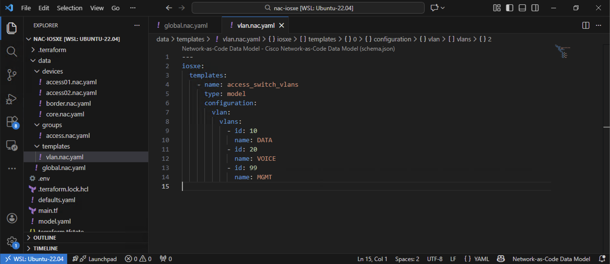
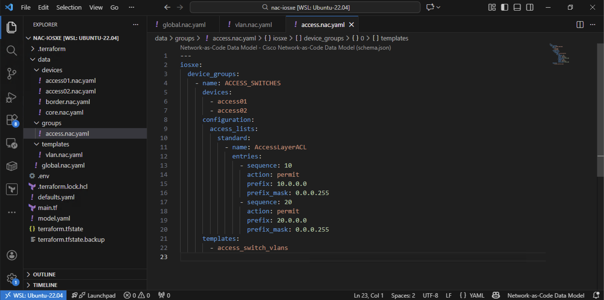
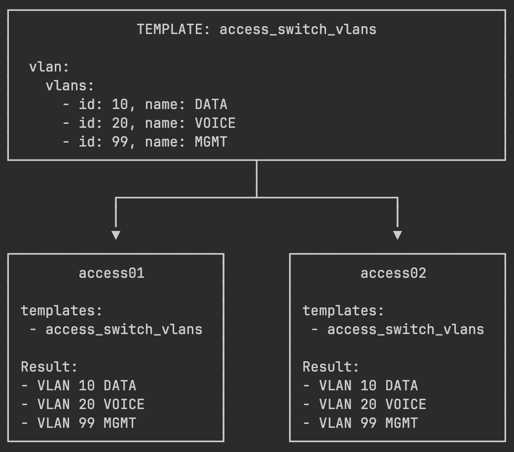
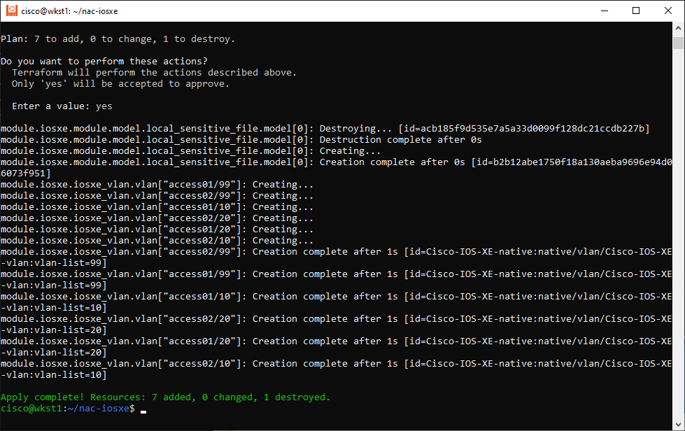

In this task, you'll learn how to use **templates of type 'model'** to define reusable YAML-based configuration blocks that can be applied to multiple devices. The `model` template type is a powerful Network-as-Code feature that promotes configuration reuse, reduces duplication, and ensures consistency across your network infrastructure.

## Templates

Templates in Network-as-Code allow you to define configuration once and apply it to multiple devices by reference. Instead of repeating the same configuration in each device's YAML file, you define a template and simply reference it where needed. This works for any type of configuration - VLANs, interfaces, security policies, QoS settings, and more.

As described in the [IOS XE Template documentation](https://netascode.cisco.com/docs/data_models/iosxe/device/template/), templates provide:

- **Reusability**: Define configuration once, use it many times
- **Consistency**: Ensure identical configuration across devices
- **Maintainability**: Update template in one place, changes propagate everywhere
- **Modularity**: Keep configuration organized in separate, purpose-specific files

**Template Types:**

| Type    | Description                       | Use Case                                            |
|---------|-----------------------------------|-----------------------------------------------------|
| `model` | YAML-based configuration template | Standard configurations (VLANs, ACLs, etc.)         |
| `file`  | External `.tftpl` template files  | Large configurations stored separately              |
| `cli`   | Raw CLI commands                  | IOS XE features not supported in the NAC data model |

In this task, you'll use the `model` type to create a VLAN template as a practical example.

## Use Case: Standard VLANs for Access Switches

Access switches typically share the same VLAN configuration - they need identical VLANs for user traffic, voice, and management. Instead of defining VLANs separately for **access01** and **access02**, you'll create a single template and apply it to both devices.

**VLANs to configure:**

- VLAN 10: `DATA` - User data traffic
- VLAN 20: `VOICE` - VoIP traffic
- VLAN 99: `MGMT` - Management traffic

## Create the Template File

First, create the file using your **WSL Ubuntu terminal**:

```bash
touch ~/nac-iosxe/data/template-vlan.nac.yaml
```

Then open `data/template-vlan.nac.yaml` in VS Code and add the following content. This file defines a reusable VLAN template:

```yaml title="data/template-vlan.nac.yaml"
---
iosxe:
  templates:
    - name: access_switch_vlans
      type: model
      configuration:
        vlan:
          vlans:
            - id: 10
              name: DATA
            - id: 20
              name: VOICE
            - id: 99
              name: MGMT
```

<figure markdown>
  { width="100%" }
</figure>

## Configuration Breakdown

Let's break down the key elements:

**Template Definition:**

- **`templates:`** - List of template definitions at the top level
- **`name: access_switch_vlans`** - Unique identifier for this template
- **`type: model`** - Indicates this is a YAML-based configuration template
- **`configuration:`** - Contains the actual configuration to be applied

**VLAN Configuration:**

- **`vlan:`** - VLAN configuration section
- **`vlans:`** - List of individual VLAN definitions
- **`id:`** - VLAN ID number (1-4094)
- **`name:`** - Descriptive name for the VLAN

## Apply Template to Access Switches

Now you need to apply the template to the access switches. Open the existing `data/config-group-access.nac.yaml` file in VS Code (this file was created in Task04) and add the `templates:` section:

```yaml title="data/config-group-access.nac.yaml" hl_lines="21 22"
---
iosxe:
  device_groups:
    - name: ACCESS_SWITCHES
      devices:
        - access01
        - access02
      configuration:
        access_lists:
          standard:
            - name: AccessLayerACL
              entries:
                - sequence: 10
                  action: permit
                  prefix: 10.0.0.0
                  prefix_mask: 0.0.0.255
                - sequence: 20
                  action: permit
                  prefix: 20.0.0.0
                  prefix_mask: 0.0.0.255
      templates:
        - access_switch_vlans
```

{width=100%}

!!! note "What we added"
    - **`templates:`** - New section to apply templates to all switches in the `ACCESS_SWITCHES` device group
    - **`access_switch_vlans`**: Reference to the VLAN template defined in `template-vlan.nac.yaml`

The template reference is added alongside the existing ACL configuration, so both the access list and VLANs will be deployed to **access01** and **access02**.

## How Templates Work

When Terraform processes your configuration:

1. **Template Resolution**: Terraform reads `template-vlan.nac.yaml` and loads the `access_switch_vlans` template
2. **Device Group Processing**: Terraform finds the `ACCESS_SWITCHES` group and its associated template
3. **Configuration Merge**: For **access01** and **access02** (members of the group), the template's configuration is merged with their settings
4. **Deployment**: VLANs are created on both **access01** and **access02** (but not on **core** or **border**)

<figure markdown>
  { width="50%" }
</figure>


## Verify Project Structure

At this point, your `data/` folder should contain these files:

```
/home/cisco/nac-iosxe/
├── .env
├── main.tf
└── data/
    ├── config-device-access01.nac.yaml  # Task05: access01 device config
    ├── config-device-access02.nac.yaml  # Task05: access02 device config
    ├── config-device-border.nac.yaml    # Task05: border device config
    ├── config-device-core.nac.yaml      # Task05: IP hosts for core
    ├── config-global.nac.yaml           # Task03: Global banner
    ├── config-group-access.nac.yaml     # Task04 + Task07: ACL + templates
    ├── devices.nac.yaml                 # Task02: Device inventory
    └── template-vlan.nac.yaml           # Task07: VLAN template (type: model)
```


## Apply Template Configuration

Open your WSL Ubuntu terminal and run the following steps:

**Step 1:** Navigate to your project directory:

```bash
cd ~/nac-iosxe
```

**Step 2:** Optionally, preview the changes Terraform will make:

```bash
terraform plan
```

**Step 3:** Apply the configuration:

```bash
terraform apply
```

When prompted, type `yes` to confirm the deployment. Terraform will create the three VLANs on both **access01** and **access02** switches.

**What to observe in the plan output:**

- Terraform shows VLAN creation for **access01**
- Terraform shows VLAN creation for **access02**
- Both devices receive identical VLAN configuration

!!! tip "View the Merged Model"
    After running `terraform apply`, open the `model.yaml` file in VS Code to see how templates are rendered and merged with device configurations into a single data model. This is the same file used by Robot Framework for post-change validation in Task11.

<figure markdown>
  { width="100%" }
</figure>

## Verify Template Configuration

After successfully running `terraform apply`, verify that the VLANs were deployed to both access switches.

**Use Solar-PuTTY to connect and verify:**

1. Open **Solar-PuTTY** from your desktop
2. Connect to the **access01** switch (`198.18.130.11`)
3. Run the verification command below
4. Disconnect and repeat for **access02** switch (`198.18.130.12`)

!!! info "Validation via `show vlan brief`"
    Use the following command on both **access01** and **access02** switches to verify the VLANs:

    ```
    show vlan brief
    ```

    ???+ quote "Expected output on both switches"
        ``` hl_lines="11-13"
        access01#show vlan brief

        VLAN Name                             Status    Ports
        ---- -------------------------------- --------- -------------------------------
        1    default                          active    Gi1/0/1, Gi1/0/2, Gi1/0/3, Gi1/0/4,
                                                        Gi1/0/5, Gi1/0/6, Gi1/0/7, Gi1/0/8,
                                                        Gi1/0/9, Gi1/0/10, Gi1/0/11, Gi1/0/12,
                                                        Gi1/0/13, Gi1/0/14, Gi1/0/15, Gi1/0/16,
                                                        Gi1/0/17, Gi1/0/18, Gi1/0/19, Gi1/0/20,
                                                        Gi1/0/21, Gi1/0/22, Gi1/0/23, Gi1/0/24
        10   DATA                             active
        20   VOICE                            active
        99   MGMT                             active
        1002 fddi-default                     act/unsup
        1003 token-ring-default               act/unsup
        1004 fddinet-default                  act/unsup
        1005 trnet-default                    act/unsup
        access01#
        ```

    You should see all three VLANs (10-DATA, 20-VOICE, 99-MGMT) configured on both devices.


## Templates vs Other Configuration Methods

Here's a comparison of when to use templates versus other configuration approaches:

| Method           | Best For                                          | Examples                                                   |
|------------------|---------------------------------------------------|------------------------------------------------------------|
| **Global**       | Settings that apply to ALL devices                | Login banners, NTP, Syslog                                 |
| **Device Group** | Role or location based settings for device groups | ACLs for access layer, routing for core, timezone for site |
| **Device**       | Unique settings for one device                    | Management IP hosts, special features                      |
| **Template**     | Reusable configurations across selected devices   | Standard VLANs, interface templates                        |

**Key Differences:**

- **Global**: Automatically applies to all devices
- **Device Group**: Applies to all members of a group
- **Template**: Only applies to devices that explicitly reference it

Templates give you fine-grained control - you choose exactly which devices get the template configuration by adding the template reference to each device.


## Applying Multiple Templates

One of the most powerful features of templates is the ability to apply **multiple templates** to a device or device group. This allows you to build modular, composable configurations where each template handles a specific aspect of the configuration.

For example, access switches might need:

- **VLAN configuration** (from `access_switch_vlans`)
- **QoS policies** (from `access_switch_qos`)
- **Security settings** (from `access_switch_security`)

Using device groups (as we did in this task), you can apply multiple templates to all group members:

```yaml
---
iosxe:
  device_groups:
    - name: ACCESS_SWITCHES
      devices:
        - access01
        - access02
      templates:
        - access_switch_vlans
        - access_switch_qos
        - access_switch_security
```

## Benefits of Using Templates

1. **Single Source of Truth**: VLAN definitions exist in one place
2. **Easy Updates**: Need to add `VLAN 30`? Update the template once, all devices get it
3. **Selective Application**: Not all devices need the same VLANs - only reference the template where needed
4. **Combine Multiple Templates**: A device can reference multiple templates for different configuration aspects
5. **Separation of concerns**: Whith multiple templates, each can handle one configuration domain


## What You've Accomplished

In this task, you have:

- ✅ Learned about templates and their benefits for Network-as-Code
- ✅ Created a reusable VLAN template (`access_switch_vlans`)
- ✅ Applied the template to multiple access switches
- ✅ Verified consistent VLAN deployment across devices
- ✅ Understood when to use templates vs global/group/device configurations

---

**Next Steps:**

You can continue exploring **optional** template tasks or proceed to the **recommended** path:

- **Optional:** [Task08 - Templates Type File](Task08_Templates_type_file.md) - Learn how to use external template files with dynamic content
- **Recommended:** [Task10 - Schema Validation](Task10_Schema_validation.md) - Skip remaining templates and continue with pre-change validation
