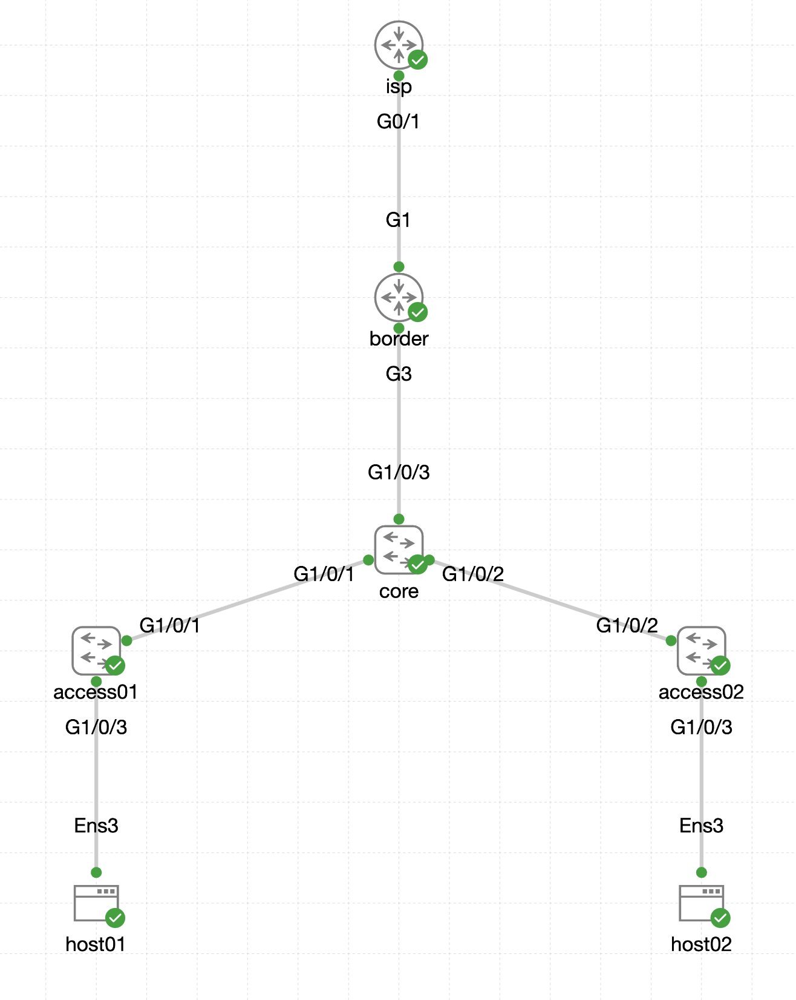

# Task 08 - Templates type `file` (Optional)

**⏱ ~15 minutes**

In this task you'll use **templates of type `file`** to reference external template files that use Terraform templating syntax (`.tftpl`). File templates are the right tool when you need loops, conditionals, or complex structures that plain YAML can't express cleanly.

For detailed documentation, see: [IOS XE as Code Template Documentation](https://netascode.cisco.com/docs/data_models/iosxe/entity/template/#file-templates)

## What you'll learn

By the end of this task you will have:

- Authored a `.tftpl` template file using Terraform templating syntax - loops (`%{ for }`), variable interpolation (`${ }`), whitespace stripping
- Referenced the file template from a device-level configuration on `border`
- Deployed an eBGP session to the pre-configured `isp` peer (AS 65001) and seen the route to `8.8.8.0/24` appear

## File Templates

File templates reference external `.tftpl` files that use **Terraform templating syntax**. This is ideal for:

- **Dynamic configurations**: Configurations with loops and conditionals
- **Complex structures**: Multi-line configurations that need programmatic generation

**Terraform Templating Syntax:**

| Syntax     | Purpose                | Examples                                            |
|------------|------------------------|-----------------------------------------------------|
| `${ }`     | Variable interpolation | `${BGP_AS_NUMBER}`                                  |
| `%{ }`     | Control structures     |                                                     |
| `%{ for }` | For loop               | `%{ for NEIGHBOR in BGP_NEIGHBORS }`, `%{ endfor }` |
| `%{ if }`  | Conditional            | `%{ if OPTION == "A" }`, `%{ else }`, `%{ endif }`  |
| `~`        | Whitespace stripping   | `%{~ endfor ~}`                                     |

**Template Types (reminder):**

| Type    | Description                       | Use Case                                               |
|---------|-----------------------------------|--------------------------------------------------------|
| *model* | YAML-based configuration template | Standard configurations (VLANs, ACLs, etc.) ← *Task07* |
| *file*  | External `.tftpl` template files  | Dynamic configs with variables ← *This task*           |
| *cli*   | Raw CLI commands                  | IOS XE features not in the IOS XE as Code data model ← *Task09*       |

## Use Case: BGP Configuration on border Switch

In this example, you'll configure BGP on the **border** switch for peering with ISP providers. The template will use variables to define BGP neighbors dynamically.

!!! info "Lab Scenario"
    The **border** switch connects to two ISP providers:

    - **isp** (`198.18.100.1`) - Currently active and pre-configured in the lab
    - **isp-x** (`198.18.100.5`) - Placeholder for a future connection

    When you verify the BGP configuration, the **isp neighbor will show as Established**, while **isp-x will show as Idle** (since the remote end is not yet configured).

## Step 1: Create the Template File

First, create the `tftpl` directory and the template file using your **WSL Ubuntu terminal**:

```bash
mkdir -p ~/nac-iosxe/tftpl
```

```bash
touch ~/nac-iosxe/tftpl/bgp.yaml.tftpl
```

Then open `tftpl/bgp.yaml.tftpl` in VS Code and add the following content:

```text title="tftpl/bgp.yaml.tftpl"
routing:
  bgp:
    as_number: ${BGP_AS_NUMBER}
    log_neighbor_changes: true
    neighbors:
%{ for NEIGHBOR in BGP_NEIGHBORS ~}
      - ip: ${NEIGHBOR.IP}
        remote_as: ${NEIGHBOR.REMOTE_AS}
        description: "${NEIGHBOR.DESCRIPTION}"
        timers_keepalive: 60
        timers_holdtime: 180
        timers_minimum_neighbor_holdtime: 30
%{ endfor ~}
    address_family:
      ipv4_unicast:
        neighbors:
%{ for NEIGHBOR in BGP_NEIGHBORS ~}
          - ip: ${NEIGHBOR.IP}
            activate: true
%{ endfor ~}
```

This template uses:

- **`routing: bgp:`** - BGP configuration must be nested under `routing` per the IOS XE as Code [data model](https://netascode.cisco.com/docs/data_models/iosxe/device/bgp/#examples)
- **`${BGP_AS_NUMBER}`** - Variable for the local AS number
- **`%{ for NEIGHBOR in BGP_NEIGHBORS }`** - Loop through list of neighbors (twice, in two sections)
- **`%{ endfor }`** - End of the loops
- **`~`** - Whitespace stripping, cleans up extra spaces/newlines in the rendered output
- **`${NEIGHBOR.IP}`, `${NEIGHBOR.REMOTE_AS}`, `${NEIGHBOR.DESCRIPTION}`** - Access neighbor variables for attributes

!!! note "Template Location"
    The file `bgp.yaml.tftpl` is located in the `tftpl/` folder, outside of the main `data/` folder. Even though the `tftpl/` folder is not included in the module configuration in `main.tf`, the template's content is still accessible because it is referenced in the template definition file that you'll create next.


## Step 2: Create the Template Definition File

Create a new file `data/templates/bgp.nac.yaml` that defines the template:

```bash
touch ~/nac-iosxe/data/templates/bgp.nac.yaml
```

Then open `data/templates/bgp.nac.yaml` in VS Code and add the following content:

```yaml title="data/templates/bgp.nac.yaml"
---
iosxe:
  templates:
    - name: bgp_isp_peering
      type: file
      file: tftpl/bgp.yaml.tftpl
```

This separates the template definition from the device configuration, making it easier to manage and reuse.

## Step 3: Apply the Template to Border Device

Now open the existing `data/devices/border.nac.yaml` file in VS Code (this was created as a placeholder in Task05) and add the template reference with variables:

```yaml title="data/devices/border.nac.yaml" hl_lines="7-26"
---
iosxe:
  devices:
    - name: border
      variables:
        HOSTNAME: border  # Added in Task06
        BGP_AS_NUMBER: 65000
        BGP_NEIGHBORS:
          - IP: 198.18.100.1
            REMOTE_AS: 65001
            DESCRIPTION: eBGP to isp - Production
          - IP: 198.18.100.5
            REMOTE_AS: 65002
            DESCRIPTION: eBGP to isp-x - Future Migration
      templates:
        - bgp_isp_peering
      configuration:
        interfaces:
          ethernets:
            - type: GigabitEthernet
              id: "1"
              description: "isp G0/1"
              shutdown: false
              ipv4:
                address: 198.18.100.2
                address_mask: 255.255.255.252
```

**What's in this configuration:**

- **`devices:`** - Device-specific configuration
- **`name: border`** - The **border** switch where BGP will be configured
- **`variables:`** - Variables that will be substituted into the template
- **`templates:`** - References the `bgp_isp_peering` template defined in `templates/bgp.nac.yaml`
- **`configuration: interfaces`** - Interface configuration for the ISP connection. Refer to the IOS XE as Code [data model](https://netascode.cisco.com/docs/data_models/iosxe/interface/ethernet/#examples)

**Variable Breakdown:**

- **`BGP_AS_NUMBER: 65000`**: **border** switch AS number
- **`BGP_NEIGHBORS`**: List of ISP neighbors:
    - **isp** (65001): Active production peer
    - **isp-x** (65002): Placeholder for future network migration
- **`IP`, `REMOTE_AS`, `DESCRIPTION`**: Attributes used in the template for each neighbor


!!! note "Device-Level Templates"
    Templates can be applied directly to individual devices, as shown here. This is ideal when a template is specific to a single device. For templates shared across multiple devices, you can use device groups (as shown with VLANs in Task07).

## Step 4: Deploy the Configuration

Open your WSL Ubuntu terminal and run the following steps:

**Step 1:** Navigate to your project directory:

```bash
cd ~/nac-iosxe
```

**Step 2:** Optionally, preview the changes Terraform will make:

```bash
terraform plan
```

**Step 3:** Apply the configuration:

```bash
terraform apply
```

When prompted, type `yes` to confirm the deployment.

!!! tip "View the Merged Model"
    After running `terraform apply`, open the `model.yaml` file in VS Code to see how the BGP template file is rendered with your variables and merged into the complete data model. This shows exactly what configuration will be applied to the device.


## Step 5: Verify BGP Configuration

Use **Solar-PuTTY** to connect to the **border** switch and verify the BGP configuration:

!!! tip "BGP convergence takes 30-60 seconds"
    BGP sessions don't come up instantly. After `terraform apply` finishes, expect a 30-60 second window before the neighbor state transitions from `Idle` → `Active` → `OpenSent` → `Established`. If your first `show ip bgp summary` looks like everything is idle, wait a minute and run it again.

```
show ip bgp summary
```

```text { title="Expected Output" hl_lines="6-7" .no-copy }
border#show ip bgp summary
BGP router identifier 198.18.130.20, local AS number 65000
...

Neighbor        V           AS MsgRcvd MsgSent   TblVer  InQ OutQ Up/Down  State/PfxRcd
198.18.100.1    4        65001      23      23        2    0    0 00:16:54        1
198.18.100.5    4        65002       0       0        1    0    0 never    Idle
border#
```

**Understanding the output**

| Neighbor             | Status                               | Explanation                                                |
|----------------------|--------------------------------------|------------------------------------------------------------|
| 198.18.100.1 (isp)   | **Established** (shows prefix count) | Active peer - **isp** is pre-configured in the lab         |
| 198.18.100.5 (isp-x) | **Idle**                             | Expected - **isp-x** is a placeholder for future migration |

The **isp** neighbor shows as **Established** with 1 prefix received, while **isp-x** shows as **Idle** since the remote end is not configured. This is expected behavior in this lab. In real-world scenarios, you often pre-configure BGP neighbors before the remote end is ready. This allows for seamless cutover during network migrations.

!!! info "Lab BGP configuration"
    You can find the pre-configured BGP settings on the **isp** device in [Appendix IV](Appendix-IV.md) of this lab guide.


### Advertised Network

The **isp** neighbor is pre-configured in the lab to advertise the network `8.8.8.0/24` to the **border** switch, to simulate internet connectivity. `8.8.8.8` is a loopback address configured on the **isp** device.

You can verify the received route with (same 30-60 second convergence window applies):

```
show ip route
```

```text { title="Expected Output" hl_lines="9" .no-copy }
border#show ip route
Codes: L - local, C - connected, S - static, R - RIP, M - mobile, B - BGP
...

Gateway of last resort is 198.18.128.1 to network 0.0.0.0

S*    0.0.0.0/0 [1/0] via 198.18.128.1
      8.0.0.0/24 is subnetted, 1 subnets
B        8.8.8.0 [20/0] via 198.18.100.1, 00:20:04
      198.18.100.0/24 is variably subnetted, 2 subnets, 2 masks
C        198.18.100.0/30 is directly connected, GigabitEthernet1
L        198.18.100.2/32 is directly connected, GigabitEthernet1
C     198.18.128.0/20 is directly connected, GigabitEthernet2
      198.18.130.0/32 is subnetted, 1 subnets
L        198.18.130.20 is directly connected, GigabitEthernet2
border#
```

## Advanced challenge - for learners who finish early

!!! tip "Skip this if you're running short on time"
    This is an optional extension inside an already-optional task. Come back to it if you've completed the recommended path and still have time left. If not, the same challenge is repeated in the **Conclusion** as something to try at home.

**The goal:** extend `border` so that traffic from `host01` / `host02` can actually reach the "internet" via the ISP BGP peering you just configured. Right now the BGP session is up and advertising `8.8.8.0/24`, but `border` has no interface facing the host subnet, so nothing from the hosts can get there.

| Host       | IP address          | Default gateway |
|------------|---------------------|-----------------|
| `host01`   | 192.168.100.100/24  | 192.168.100.1   |
| `host02`   | 192.168.100.200/24  | 192.168.100.1   |

Your job: add an interface configuration on `border` so that `GigabitEthernet3` (facing the host network) has IP `192.168.100.1/24`. The hosts are already configured with that IP as their default gateway.

<figure markdown>
  { width="100%" }
</figure>

**Primary verification** (easy path - just SSH into `border`):

```bash
show ip interface brief | include GigabitEthernet3
show ip route 8.8.8.0
```

You should see `GigabitEthernet3` up with `192.168.100.1/24`, and `8.8.8.0/24` as a BGP-learned route via the ISP neighbor.

??? tip "End-to-end verification via CML console (more work, more satisfying)"
    To prove actual end-to-end reachability, ping `8.8.8.8` from inside one of the hosts:

    1. Open the CML web interface: [https://198.18.130.34/login](https://198.18.130.34/login).
    2. Log in with `guest` / `CiscoLive`.
    3. Click on **NAC IOSXE-AS-CODE Topology**.
    4. Right-click **host01** → **Console** → **Open Console**.
    5. Log in with `cisco` / `cisco`.
    6. Run: `ping 8.8.8.8`.
    7. Repeat for `host02`.

    This takes a minute to set up but is the only way to confirm the full end-to-end path from host → gateway → BGP → ISP loopback.

**Try it yourself first.** You've seen every Network as Code concept you need to solve this - per-device config, interface definitions, and the same `ethernets` list you just used for GigabitEthernet1. Browse the [Ethernet data model docs](https://netascode.cisco.com/docs/data_models/iosxe/interface/ethernet/#examples) if you get stuck.

??? tip "Solution"
    Open `data/devices/border.nac.yaml` in VS Code and extend the `interfaces.ethernets` list with a second entry for `GigabitEthernet3`:

    ```yaml title="data/devices/border.nac.yaml" hl_lines="22-28"
    ---
    iosxe:
      devices:
        - name: border
          host: 198.18.130.20
          variables:
            HOSTNAME: border
            BGP_AS_NUMBER: 65000
            BGP_NEIGHBORS:
              - IP: 198.18.100.1
                REMOTE_AS: 65001
                DESCRIPTION: eBGP to isp - Production
              - IP: 198.18.100.5
                REMOTE_AS: 65002
                DESCRIPTION: eBGP to isp-x - Future Migration
          templates:
            - bgp_isp_peering
          configuration:
            interfaces:
              ethernets:
                - type: GigabitEthernet
                  id: "1"
                  description: "isp G0/1"
                  shutdown: false
                  ipv4:
                    address: 198.18.100.2
                    address_mask: 255.255.255.252
                - type: GigabitEthernet
                  id: "3"
                  description: "host network G1/0/3"
                  shutdown: false
                  ipv4:
                    address: 192.168.100.1
                    address_mask: 255.255.255.0
    ```

    Run `terraform apply`, then verify with the `show` commands above. For bonus points, ping `8.8.8.8` from `host01` via CML console.


## What you've accomplished

- ✅ Created a `.tftpl` template file with Terraform templating syntax in `tftpl/` folder
- ✅ Created a separate template definition file (`templates/bgp.nac.yaml`)
- ✅ Used variable interpolation (`${ }`) for dynamic values
- ✅ Used loops (`%{ for }`) for multiple BGP neighbors
- ✅ Applied templates at device level to the **border** switch
- ✅ Configured BGP peering on **border** switch for ISP connectivity

---

**← Previous:** [Task 07 - Templates type `model`](Task07_Templates_type_model.md)

**Next Steps:**

You can continue exploring **optional** template tasks or proceed to the **recommended** path:

- **Optional:** [Task 09 - Templates type `cli`](Task09_Templates_type_cli.md) - raw CLI commands for unsupported features
- **Recommended:** [Task 10 - Schema validation](Task10_Schema_validation.md) - skip remaining templates and continue with pre-change validation

