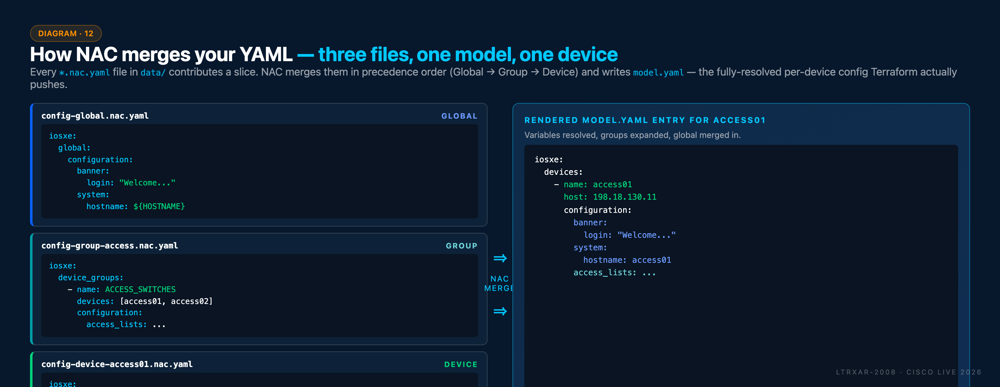

# Task 10 — Pre-checks with schema validation

**⏱ ~15 minutes**

You've been creating NAC YAML files and deploying them with Terraform. How do you ensure your YAML is correctly structured and contains valid data **before** hitting a device?

Pre-change validation catches errors at the YAML layer — before `terraform plan` ever opens a connection to a switch. It's the same principle as compiling code before running it: fail fast, fail cheap, fail with a clear error message.

## What you'll learn

By the end of this task you will have:

- Installed `nac-validate` and run it against your `data/` directory
- Read a schema-validation error message and mapped it back to the offending YAML key
- Understood the difference between **syntactic** validation (what `nac-validate` does by default) and **semantic** validation (custom rules)

## First, what is NAC actually validating?

Before `nac-validate` runs, it's useful to see what it's validating *against*. NAC doesn't look at your individual YAML files in isolation — it builds a **merged data model** by combining every YAML in `data/` according to precedence (Global → Group → Device), resolving variables and template references, then producing one entry per device:

<figure markdown>
  { width="100%" }
</figure>

That merged model is what Terraform ultimately sends to each device (you've seen it written to `model.yaml` after each `terraform apply`). Schema validation checks the merged result — so an error might come from a bad key in a global file that only affects one group's rendered output. `nac-validate` tells you exactly which file and which path in the merged model caused the problem.

## What is schema validation?

Schema validation verifies that your YAML configuration files:

- Follow the correct structure (proper indentation, key names, nesting)
- Contain valid data types (strings, integers, booleans)
- Use valid values (IP addresses in correct format, enums like `permit`/`deny`)
- Include all required fields
- Don't include unsupported attributes

This is similar to how a compiler checks code before running it, catching errors at "build time" rather than "run time".


## The nac-validate Tool

The **nac-validate** tool checks your YAML files against a schema definition. The schema acts as a contract that defines what attributes are allowed, what data types are expected, what values are valid, and which fields are mandatory vs. optional. This is called syntactic validation.

The tool can also perform semantic validation based on custom rules. These rules can check that the configuration is correct (e.g. by verifying references or conflicting IDs), enforce policies based on config best practices or check customer requirements (e.g. a custom naming convention). However, this lab focuses only on the schema-based syntactic validation.


## The Schema File

The complete schema for IOS XE Network as Code is documented on the [Cisco NetAsCode website](https://netascode.cisco.com/docs/data_models/iosxe/overview/). For this lab, [Appendix II](Appendix-II.md) contains only a subset of the schema relevant to the configurations you have deployed, including: global settings, devices, device groups, templates, banner, access lists, IP hosts, VLANs, BGP routing, and system settings. You can also find a copy of the schema in the WSL filesystem in the `~/schema/` directory.

**Create the schema file in your project:**

Copy the `~/schema/.schema.yaml` schema file to your `~/nac-iosxe/` working directory using the command below in the WSL terminal:

```bash
cp ~/schema/.schema.yaml ~/nac-iosxe/.schema.yaml
```

??? info "Alternative: Manually Create the Schema File"
    If you need to, you can copy the schema content from [Appendix II](Appendix-II.md) manually.

    First, create the file using the `touch` command in your WSL Ubuntu terminal:

    ```bash
    cd ~/nac-iosxe
    touch ~/nac-iosxe/.schema.yaml
    ```

    Then use **VS Code** to copy-paste the schema content into the file.

    1. Open VS Code and navigate to your `nac-iosxe` folder
    2. Open the `.schema.yaml` file you just created
    3. Copy the complete schema content from [Appendix II](Appendix-II.md)
    4. Paste it into the file and save

Your project structure should now include:
```text { hl_lines="17" .no-copy }
/home/cisco/nac-iosxe/
│
├── data/
│   ├── devices/access01.nac.yaml # Task02: access01 registration
│   ├── devices/access02.nac.yaml # Task02: access02 registration
│   ├── devices/border.nac.yaml   # Task02 + Task08 (optional): border + BGP
│   ├── devices/core.nac.yaml     # Task02 + Task05: core + Loopback0
│   ├── global.nac.yaml          # Task03 + Task06: banner + hostname
│   ├── groups/access.nac.yaml    # Task04 + Task07 (optional): ACL + VLAN template
│   ├── templates/bgp.nac.yaml           # Task08: BGP file template definition (optional)
│   ├── templates/logging.nac.yaml       # Task09: Logging alias CLI template (optional)
│   └── templates/vlan.nac.yaml          # Task07: VLAN model template (optional)
├── tftpl/
│   └── bgp.yaml.tftpl                  # Task08: BGP template file (optional)
├── .env
├── .schema.yaml                        # ← New schema file
├── defaults.yaml                       # Generated by Terraform (default values)
├── main.tf
└── model.yaml                          # Generated by Terraform (merged config)
```

!!! note "Generated Files"
    As shown earlier, the `model.yaml` and `defaults.yaml` files are automatically generated after you run `terraform apply`. These files are created by the NAC module based on the `write_model_file` and `write_default_values_file` parameters in your `main.tf`. The `model.yaml` contains the complete merged configuration, while `defaults.yaml` shows the default values used by the module.

??? abstract "How defaults get applied — precedence order"
    `defaults.yaml` shows the *effective* defaults at merge time. Those values come from three possible sources, merged in this precedence order (later wins):

    1. **Module built-in defaults** — shipped inside the NAC module itself. You don't see or edit them.
    2. **Your own defaults file** — optional YAML you place in `data/` matching the `defaults:` schema root. Overrides module built-ins.
    3. **Per-device / per-group / global values in your intent YAML** — explicit values in `config-*.nac.yaml` files. Override both default tiers.

    The formal rule is documented at [netascode.cisco.com/docs/guides/concepts/default_values/](https://netascode.cisco.com/docs/guides/concepts/default_values/). Practical implication: if something in `model.yaml` isn't what you expected, `defaults.yaml` is the first place to look — a module built-in may be setting the value you thought was empty.


## Install the nac-validate Tool

First, install the **nac-validate** tool using pip in your **WSL Ubuntu terminal**:

```bash
pip install nac-validate
```

Then add the local bin directory to your PATH:

```bash
export PATH=$PATH:~/.local/bin
```

## Run Schema Validation

Navigate to your project directory:

```bash
cd ~/nac-iosxe
```

Run validation:

```bash
nac-validate -s .schema.yaml data/
```

**Command breakdown:**

- **`nac-validate`** - The validation tool
- **`-s .schema.yaml`** - Specifies the schema file to validate against
- **`data/`** - The directory containing your YAML configuration files

## Successful Validation

If your YAML files are correct, the command will return without any output – you'll just get your prompt back:

```text { .no-copy }
cisco@wkst1:~/nac-iosxe$ nac-validate -s .schema.yaml data/
cisco@wkst1:~/nac-iosxe$
```

**No output means success!** This confirms that:

- ✅ Your YAML syntax is correct
- ✅ All attributes match the schema
- ✅ Data types are correct
- ✅ Values are valid (e.g., IP addresses are properly formatted)

## Validation Error Examples

Let's intentionally introduce errors to see how validation catches them.

### Example 1: Invalid IP address

If you accidentally typed an invalid IP like `198.51.100.1010` in `data/devices/core.nac.yaml` (the Loopback0 address from Task 05):

```yaml { title="data/devices/core.nac.yaml" hl_lines="7" .no-copy }
...
configuration:
  interfaces:
    loopbacks:
      - id: 0
        ipv4:
          address: 198.51.100.1010  # Invalid - octet > 255
          address_mask: 255.255.255.255
```

Running `nac-validate -s .schema.yaml data/` would produce:

```text { .no-copy }
ERROR - Syntax error 'data/devices/core.nac.yaml':
iosxe.devices.[name=core].configuration.interfaces.loopbacks.[id=0].ipv4.address: '198.51.100.1010' is not a ip.
```

### Example 2: Wrong attribute name

If you misspelled an attribute like `banner` as `banners` in `data/global.nac.yaml`:

```yaml { title="data/global.nac.yaml" hl_lines="4" .no-copy }
...
global:
  configuration:
    banners:  # Should be "banner" (singular)
      login: |
        ...
```

Running `nac-validate -s .schema.yaml data/` would produce:

```text { .no-copy }
ERROR - Syntax error 'data/global.nac.yaml':
iosxe.global.configuration.banners: Unexpected element
```

### Example 3: Invalid enum value

If you used an invalid action in an ACL in `data/groups/access.nac.yaml`:

```yaml { title="data/groups/access.nac.yaml" hl_lines="7" .no-copy }
...
access_lists:
  standard:
    - name: AccessLayerACL
      entries:
        - sequence: 10
          action: allow  # Should be "permit" or "deny"
          prefix: 10.0.0.0
          prefix_mask: 0.0.0.255
        ...
```

Running `nac-validate -s .schema.yaml data/` would produce:

```text { .no-copy }
ERROR - Syntax error 'data/groups/access.nac.yaml':
iosxe.device_groups.[name=ACCESS_SWITCHES].configuration.access_lists.standard.[name=AccessLayerACL].entries.[sequence=10].action: 'allow' not in ('deny', 'permit')
```


If everything is correct, you'll get your prompt back with no output. If there are errors, the tool will tell you exactly what's wrong and where.

!!! tip "IMPORTANT: Fix and Re-validate"
    Correct the introduced typos in your YAML files and run `nac-validate -s .schema.yaml data/` again to confirm that all files are now correct. Don't continue until you have fixed the typos.


## Common Validation Errors and Fixes

| Error Message                         | Cause                                         | Fix                                                  |
|---------------------------------------|-----------------------------------------------|------------------------------------------------------|
| `Required field missing`              | Missing a mandatory attribute                 | Add the required field to your YAML                  |
| `Unexpected element`                  | Attribute name is misspelled or not supported | Check spelling against schema.yaml                   |
| `mapping values are not allowed here` | Potentially incorrect indentation             | Correct the YAML syntax as per schema.yaml           |
| `... not in enum(...)`                | Using invalid value for a field               | Use one of the allowed values from the error message |
| `... is not a regex match`            | String does not match expected pattern        | Ensure string format matches schema requirements     |
| `... is not a int`                    | Value is not an integer                       | Change value to an integer                           |
| `... is not a list`                   | Expected a list but got something else        | Use YAML list format (`[]` or `-` before each item)  |

## Integrating Validation into Your Workflow

**Best practice workflow:**

1. Edit your YAML files in VS Code
2. **Run `nac-validate`** to check for errors
3. Fix any errors reported
4. Run `terraform plan` to preview changes
5. Run `terraform apply` to deploy

By validating before running Terraform, you catch configuration errors immediately without attempting to connect to devices. This saves time and prevents partial deployments of invalid configurations.

!!! tip "CI/CD Integration"
    In [Task13 - Run CI/CD Pipeline](Task13_Run_CI-CD_pipeline.md), you'll see how schema validation is automatically integrated into the GitLab CI/CD workflow. The pipeline runs `nac-validate` as part of the automated process, ensuring that every configuration change is validated before deployment – without manual intervention.


## Extensibility — semantic validation

Schema validation (everything above) is **syntactic**: does the YAML match the shape of the data model? `nac-validate` can also do **semantic** validation — rules that answer "does this configuration make sense in context?".

Cisco CX ships a rule pack covering common semantic checks:

- Key attributes are unique (no duplicate device names, no overlapping ACL sequence numbers, etc.).
- IP routing is enabled when a routing protocol (BGP, OSPF, EIGRP, IS-IS) is configured.
- VLAN IDs referenced from an interface exist in the VLAN database.

You can also write your own. Rules are Python classes that subclass a base and implement a `match` method against the merged data model.

!!! example "A custom rule: flag `permit any` in ACLs"
    A rule that fails validation if any standard ACL entry permits `any` — a common security anti-pattern:

    ```python title=".nac-validate/rules/no_permit_any.py"
    from nac_validate.rule import Rule

    class NoPermitAny(Rule):
        id = "CX101"
        description = "Standard ACLs must not have 'permit any' entries"
        severity = "HIGH"

        def match(self, data):
            errors = []
            acls = data.get("iosxe", {}).get("configuration", {}) \
                       .get("access_lists", {}).get("standard", [])
            for acl in acls:
                for entry in acl.get("entries", []):
                    if entry.get("action") == "permit" and entry.get("any"):
                        errors.append(
                            f"ACL '{acl['name']}' entry {entry['sequence']} permits any"
                        )
            return errors
    ```

    Run with `nac-validate -r .nac-validate/rules/ data/` and the rule executes against every YAML file.

## Where to find the full schema

The lab's `.schema.yaml` is a curated subset covering just the data-model paths exercised across Tasks 03–09. The full schema — with every supported IOS XE configuration option — is published at [netascode.cisco.com/docs/data_models/iosxe/overview/](https://netascode.cisco.com/docs/data_models/iosxe/overview/).

!!! tip "Need the schema subset used in this lab?"
    See [Appendix II](Appendix-II.md) for the full `.schema.yaml` you copied in earlier. It's a useful reference if you want to know what keys are valid without running into them via error messages.

## Reference

For more details on the `nac-validate` tool, see the official documentation [here](https://netascode.cisco.com/docs/tools/nac-validate/overview/).


## What You've Accomplished

In this task, you have:

- ✅ Understood the importance of pre-change validation
- ✅ Learned about schema-based validation
- ✅ Installed and used the nac-validate tool
- ✅ Validated your YAML configuration files
- ✅ Understood common validation errors and how to fix them
- ✅ Integrated validation into your Network as Code workflow

You now have a safety check in place to catch configuration errors before they reach your network devices. This is a critical DevOps practice that prevents misconfigurations and improves reliability.

---

**← Previous:** [Task 06 — Variables](Task06_Variables.md)

**Next Steps:**

You can explore the **optional** post-checks task or continue with the **recommended** cleanup:

- **Optional:** [Task 11 — Post-checks with nac-test](Task11_Post-checks.md) — automate post-change validation
- **Recommended:** [Task 12 — Cleanup](Task12_Cleanup.md) — skip Robot Framework and proceed to cleanup before CI/CD
