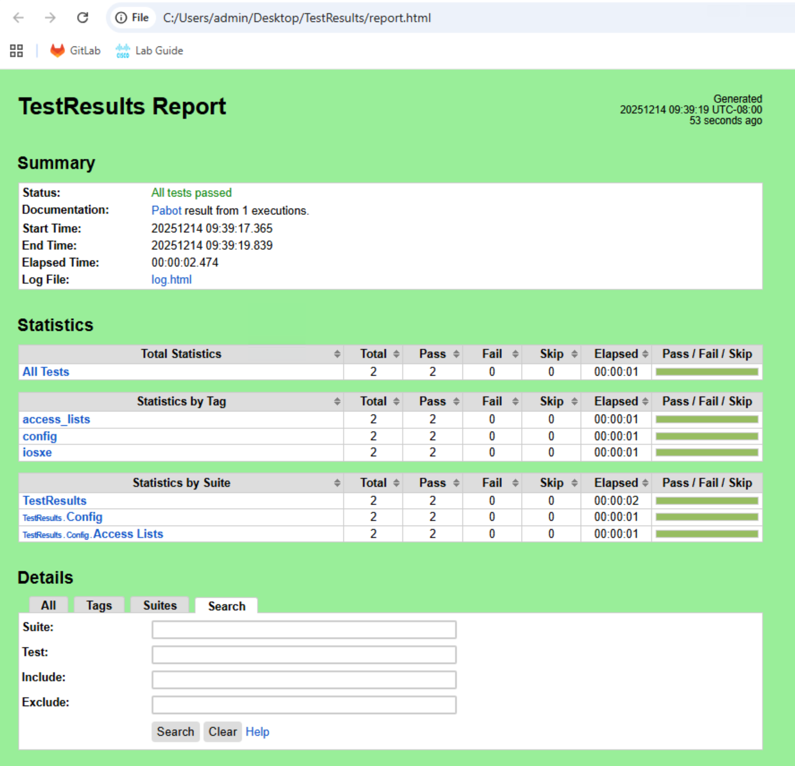

After deploying configuration changes, how do you verify they were applied correctly? For a single device, you might SSH in and run `show running-config`. But what about when you're managing multiple switches? What about config that's not in the running configuration, such as the VLAN database? Manual verification doesn't scale.

In this task, you'll learn how to automate **post-change validation** using Robot Framework. Instead of manually verifying configurations on each device, you'll use the `nac-test` tool to automatically validate that your intent configuration was deployed correctly.

!!! warning "Time Check"
    This is the most laborious task in the lab. If you're running short on time and want to experience the CI/CD pipeline, consider skipping this task and moving directly to **Task 11: Cleanup** followed by **Task 12: Run CI/CD Pipeline**.

## Understanding Post-Change Validation

The Network-as-Code framework automates post-change validations using:

- **Robot Framework** - An open-source automation framework for testing. It's keyword-driven, making test cases easy to write and understand.
- **Pabot** - A parallel executor for Robot Framework that speeds up test execution by running tests simultaneously across multiple processes.

The key insight is that **tests are rendered from your intent configuration YAML files**. This means you don't write tests manually - they're automatically generated based on what you intended to configure.

## Use Case: Validating Access-List Configuration

In Task04, you deployed an access-list to the access01 and access02 switches using device groups. You'll now validate that configuration was applied correctly using Robot Framework.

!!! note "Lab Scope vs Production"
    In production environments, Robot Framework tests validate the **full configuration** - including VLANs, routing, interfaces, and all other deployed settings; you'll typically work with 100+ Robot test files covering all configuration aspects. For this lab, we're only validating the ACL configuration to demonstrate the concept and workflow.

Here's the intent configuration you deployed (`data/config-group-access.nac.yaml`):

```yaml title="data/config-group-access.nac.yaml"
---
iosxe:
  device_groups:
    - name: ACCESS_SWITCHES
      devices:
        - access01
        - access02
      configuration:
        access_lists:
          standard:
            - name: AccessLayerACL
              entries:
                - sequence: 10
                  action: permit
                  prefix: 10.0.0.0
                  prefix_mask: 0.0.0.255
                - sequence: 20
                  action: permit
                  prefix: 20.0.0.0
                  prefix_mask: 0.0.0.255
```

## Step 1: Prepare the File Structure

To run `nac-test` in the lab, you need the following file structure:

```text
nac-iosxe/
│
├── data/
│   └── config-group-access.nac.yaml
│
└── tests/
    ├── filters/
    │   └── url_encode.py
    │
    └── templates/
        ├── iosxe_common.resource
        ├── lib/
        │   └── UtilsLib.py
        └── config/
            └── access_lists.robot
```

You can copy all files in the `tests/` directory from the WSL Ubuntu home directory:

```bash
cp -r ~/tests ~/nac-iosxe/
```

??? info "Alternative: Create Files Manually"
    If you need to, you can also create the files manually as follows:

    Create the directory structure and files in your **WSL Ubuntu terminal**:

    ```bash
    mkdir -p ~/nac-iosxe/tests/templates/config
    ```

    ```bash
    mkdir -p ~/nac-iosxe/tests/templates/lib
    ```

    ```bash
    mkdir -p ~/nac-iosxe/tests/filters
    ```

    ```bash
    touch ~/nac-iosxe/tests/templates/iosxe_common.resource
    ```

    ```bash
    touch ~/nac-iosxe/tests/templates/lib/UtilsLib.py
    ```

    ```bash
    touch ~/nac-iosxe/tests/templates/config/access_lists.robot
    ```

    ```bash
    touch ~/nac-iosxe/tests/filters/url_encode.py
    ```

    After creating the files, they will appear in VS Code's file explorer. Open each file and copy-paste the content from **[Appendix III - Robot Testing Files](Task17_Appendix-III.md)**:

    - Copy the **url_encode.py** content into `tests/filters/url_encode.py`
    - Copy the **UtilsLib.py** content into `tests/templates/lib/UtilsLib.py`
    - Copy the **iosxe_common.resource** content into `tests/templates/iosxe_common.resource`
    - Copy the **access_lists.robot** content into `tests/templates/config/access_lists.robot`


**File descriptions:**

- **`data/config-group-access.nac.yaml`** - Your intent configuration from Task04 (already exists)
- **`tests/templates/config/access_lists.robot`** - Jinja2 template for generating access-list tests
- **`tests/templates/iosxe_common.resource`** - Robot Framework resource file with reusable keywords for IOSXE testing
- **`tests/filters/url_encode.py`, `tests/templates/lib/UtilsLib.py`** - Utility files for the `nac-test` tool

## Step 2: Generate the Model File

Before running `nac-test`, you need to run Terraform to generate the merged model file (`model.yaml`) that `nac-test` uses for rendering tests. If you haven't run the terraform commands below yet, do so now in your **WSL Ubuntu terminal**:

```bash
cd ~/nac-iosxe
```

```bash
terraform plan
```

```bash
terraform apply
```
When prompted, type `yes` to confirm the deployment.

This generates two files in your project directory:

- **`model.yaml`** - The merged YAML data model (all your configuration files combined)
- **`defaults.yaml`** - The default values used by the module

## Step 3: Install nac-test

Install the **nac-test** tool using pip in your **WSL Ubuntu terminal**:

```bash
pip install nac-test
```

## Step 4: Run nac-test

Once you have the model files and test templates in place, run the `nac-test` command in your **WSL Ubuntu terminal**:

```bash
nac-test \
  --data ./model.yaml \
  --data ./defaults.yaml \
  --templates ./tests/templates \
  --filters ./tests/filters \
  --output /mnt/c/Users/admin/Desktop/TestResults
```


**What this command does:**

1. **Loads data** - Reads the merged model and defaults generated by Terraform
2. **Loads filters** - Loads custom Jinja2 filters from `./tests/filters`
3. **Renders templates** - Each template in `./tests/templates` is rendered with your configuration data
4. **Executes tests** - Pabot runs all test suites in parallel and creates reports in the specified output directory

!!! info "Output Location"
    The test results are saved to your Windows Desktop (`C:\Users\admin\Desktop\TestResults`) for easy access. You can open the HTML reports directly in your browser.

## Step 5: Review the Generated Robot Test

After running `nac-test`, check the generated test file:

```text
C:\Users\admin\Desktop\TestResults\
└── config/
    └── access_lists.robot
```

This is the **TestResults** folder on the Windows 10 desktop. You can view the generated test file using your **WSL Ubuntu terminal**:

```bash
cat /mnt/c/Users/admin/Desktop/TestResults/config/access_lists.robot
```

The `access_lists.robot` file contains tests automatically generated from your intent configuration:

```text
*** Settings ***
Documentation   Verify Access Lists Configuration
Suite Setup     Login IOSXE
Resource        ../iosxe_common.resource
Default Tags    config   iosxe   access_lists

*** Test Cases ***

Verify Standard Access List AccessLayerACL Device access01
    ${r}=   GET On Session   IOSXE_access01   url=/restconf/data/Cisco-IOS-XE-native:native/ip/access-list/Cisco-IOS-XE-acl:standard=AccessLayerACL
    Log   Response Status Code: ${r.status_code}
    Should Be Equal Value Json String   ${r.json()}   $..name   AccessLayerACL
    ${entry}=   Set Variable   $..access-list-seq-rule[?(@.sequence=='10')]
    Should Be Equal Value Json String   ${r.json()}   ${entry}..remark
    Should Be Equal Value Json String   ${r.json()}   ${entry}..permit.std-ace.ipv4-address-prefix   10.0.0.0
    Should Be Equal Value Json String   ${r.json()}   ${entry}..permit.std-ace.mask   0.0.0.255
    Should Be Equal Value Json Bool   ${r.json()}   ${entry}..permit.std-ace.any
    Should Be Equal Value Json Bool   ${r.json()}   ${entry}..permit.std-ace.host
    Should Be Equal Value Json Bool   ${r.json()}   ${entry}..permit.std-ace.log
    ${entry}=   Set Variable   $..access-list-seq-rule[?(@.sequence=='20')]
    Should Be Equal Value Json String   ${r.json()}   ${entry}..remark
    Should Be Equal Value Json String   ${r.json()}   ${entry}..permit.std-ace.ipv4-address-prefix   20.0.0.0
    Should Be Equal Value Json String   ${r.json()}   ${entry}..permit.std-ace.mask   0.0.0.255
    Should Be Equal Value Json Bool   ${r.json()}   ${entry}..permit.std-ace.any
    Should Be Equal Value Json Bool   ${r.json()}   ${entry}..permit.std-ace.host
    Should Be Equal Value Json Bool   ${r.json()}   ${entry}..permit.std-ace.log
```

## Step 6: Review the Test Results

The terminal output from `nac-test` shows the test execution:

```text
cisco@wkst1:~/nac-iosxe$ nac-test \
  --data ./model.yaml \
  --data ./defaults.yaml \
  --templates ./tests/templates \
  --filters ./tests/filters \
  --output /mnt/c/Users/admin/Desktop/TestResults
Robot Framework remote server at 127.0.0.1:50179 started.
Storing .pabotsuitenames file
2025-06-21 06:24:01.385307 [PID:517] [0] [ID:0] EXECUTING Iosxe.Config.Access Lists
2025-06-21 06:24:02.793314 [PID:517] [0] [ID:0] PASSED Iosxe.Config.Access Lists in 1.4 seconds
1 tests, 1 passed, 0 failed, 0 skipped.
===================================================
Output:  /mnt/c/Users/admin/Desktop/TestResults/output.xml
XUnit:   /mnt/c/Users/admin/Desktop/TestResults/xunit.xml
Log:     /mnt/c/Users/admin/Desktop/TestResults/log.html
Report:  /mnt/c/Users/admin/Desktop/TestResults/report.html
Stopping PabotLib process
Robot Framework remote server at 127.0.0.1:50179 stopped.
PabotLib process stopped
Total testing: 1.40 seconds
Elapsed time:  1.80 seconds
```

**Output artifacts:**

- **output.xml** - Test results in Robot Framework format
- **xunit.xml** - Results in xUnit format for CI/CD integration
- **log.html** - Detailed execution log
- **report.html** - Human-readable summary report

Open the report in a browser to see the visual results. Navigate to your Desktop and open the `TestResults` folder, then double-click `report.html`:

<figure markdown>
  { width="100%" }
</figure>

## Step 7: Try Additional Tests (Optional)

Now that you understand the process, try expanding your tests:

**Add more access-list entries:**

1. Update `data/config-group-access.nac.yaml` with additional access-list entries
2. Run `terraform apply` to deploy the changes (this also regenerates `model.yaml`)
3. Run `nac-test` again
4. Check the updated `access_lists.robot` file - it will include tests for your new entries

## What You've Accomplished

In this task, you have:

- ✅ Learned how Robot Framework automates post-change validation
- ✅ Created the required file structure for testing (templates and filters)
- ✅ Ran `nac-test` to generate and execute tests from your configuration
- ✅ Reviewed the auto-generated Robot test cases
- ✅ Understood how to interpret test results and reports

!!! tip "CI/CD Integration"
    In [Task14 - Add Robot Testing Stage to CI/CD](Task14_Add_Robot_testing_stage_to_CI-CD.md), you'll see how `nac-test` tests are automatically integrated into the GitLab CI/CD workflow. The pipeline runs these tests after every deployment, ensuring continuous validation without manual intervention.

---

**Next:** [Task12 - Cleanup](Task12_Cleanup.md)
