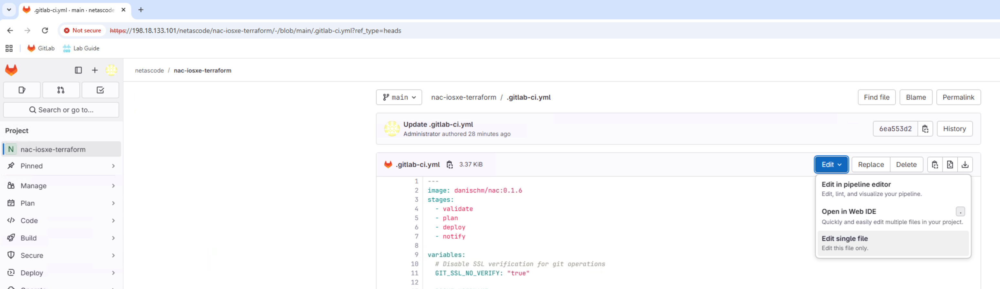

In Task11, you ran a CI/CD pipeline with validation, planning, and deployment stages. In this task, you'll enhance the pipeline by adding a **test stage** that automatically validates your deployments after they're applied.

## Understanding the Test Stage

Adding automated testing to your CI/CD pipeline ensures that:

- Configurations are correctly applied to devices
- The deployment is idempotent (running it again produces no changes)
- Any issues are detected immediately after deployment

You'll add two test jobs:

| Job | Purpose |
|-----|---------|
| `test-integration` | Runs `nac-test` to verify configurations match expected state |
| `test-idempotency` | Runs `terraform plan` again to confirm no drift |

## Step 1: Open the Pipeline Configuration File

In GitLab, navigate to **netascode/nac-iosxe-terraform** project and open the `.gitlab-ci.yml` file for editing:

1. Click on `.gitlab-ci.yml` in the file list
2. Click the **Edit** button (or press `e`)

<!-- SCREENSHOT: GitLab file edit button -->
<figure markdown>
  { width="100%" }
</figure>

## Step 2: Add the Test Stage

Find the `stages` section at the top of the file. You need to add `test` between `deploy` and `notify`.

**Find this section:**

```yaml
stages:
  - validate
  - plan
  - deploy
  - notify
```

**Change it to:**

```yaml
stages:
  - validate
  - plan
  - deploy
  - test
  - notify
```

## Step 3: Add the Test-Integration Job

After the `deploy` job section, add the `test-integration` job. This job runs `nac-test` to verify your configurations.

**Add this new job after the `deploy:` section:**

```yaml
test-integration:
  stage: test
  script:
    - set -o pipefail && nac-test --data ./model.yaml --data ./defaults.yaml --templates ./tests/templates --filters ./tests/filters --output ./tests/results |& tee test_output.txt
  artifacts:
    when: always
    paths:
      - tests/results/*.html
      - tests/results/xunit.xml
      - test_output.txt
    reports:
      junit: tests/results/xunit.xml
  dependencies:
    - deploy
  needs:
    - deploy
  only:
    - main
```

**What this job does:**

- **script**: Runs `nac-test` with your data files and test templates
- **artifacts**: Saves test results (HTML reports and JUnit XML)
- **reports: junit**: Integrates test results into GitLab's test reporting UI
- **dependencies/needs**: Ensures this job runs after `deploy` completes
- **only: main**: Only runs on the main branch (not merge requests)

## Step 4: Add the Test-Idempotency Job

Add another test job that verifies idempotency - running Terraform again should show no changes if the deployment was successful.

**Add this job after `test-integration:`:**

```yaml
test-idempotency:
  stage: test
  resource_group: iosxe
  script:
    - terraform init -input=false
    - terraform plan -input=false -detailed-exitcode
  dependencies:
    - deploy
  needs:
    - deploy
  only:
    - main
```

**What this job does:**

- **terraform plan -detailed-exitcode**: Returns exit code 2 if there are changes, failing the job
- **resource_group: iosxe**: Prevents concurrent access to devices
- If this job passes, it confirms your deployment is idempotent

## Step 5: Commit Your Changes

After making all the changes:

1. Scroll down to the **Commit changes** section
2. Enter a commit message: `Add test stage to CI/CD pipeline`
3. Ensure **main** branch is selected
4. Click **Commit changes**

<!-- SCREENSHOT: GitLab commit changes dialog -->
<figure markdown>
  { width="100%" }
</figure>

## Step 6: Verify the Pipeline

After committing, a new pipeline will automatically start. Navigate to **Build** → **Pipelines** to watch its progress.

You should now see **5 stages** in the pipeline:

1. **validate** - Schema and format validation
2. **plan** - Terraform planning
3. **deploy** - Apply configuration
4. **test** - Integration and idempotency tests
5. **notify** - Success/failure notifications

<!-- SCREENSHOT: Pipeline with 5 stages including test -->
<figure markdown>
  { width="100%" }
</figure>

## Step 7: Review Test Results

After the pipeline completes, click on the `test-integration` job to view the test results.

GitLab displays test results in a user-friendly format:

<!-- SCREENSHOT: Test results in GitLab -->
<figure markdown>
  { width="100%" }
</figure>

You can also download the HTML test report from the job artifacts.

## Summary of Changes

Here's a complete summary of what you added to `.gitlab-ci.yml`:

| Change | Location | Description |
|--------|----------|-------------|
| Add `test` stage | `stages:` section | New stage between deploy and notify |
| Add `test-integration` job | After `deploy:` | Runs nac-test for configuration validation |
| Add `test-idempotency` job | After `test-integration:` | Verifies no configuration drift |

## What You've Accomplished

- ✅ Added a test stage to the CI/CD pipeline
- ✅ Configured integration tests with `nac-test`
- ✅ Added idempotency verification
- ✅ Verified the enhanced pipeline runs successfully

## Reference

For the complete `.gitlab-ci.yml` file with all changes, see **Appendix I**.
