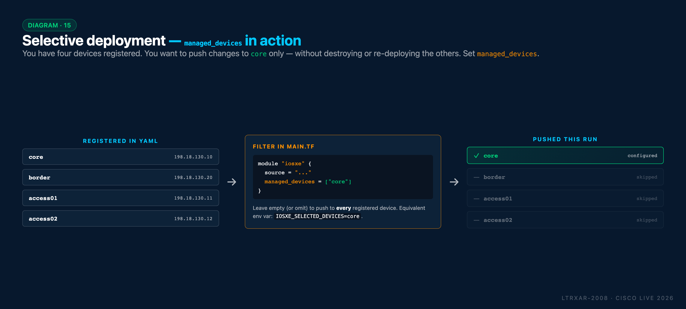

# Task 12 - Cleanup

**Estimated Time to Complete:** ~5 minutes

Before moving to CI/CD automation, clean up the manual work you've done so far. This ensures a clean starting point for the GitLab-based workflow.

## What you'll learn

By the end of this task you will have:

- Run `terraform destroy` to remove all Terraform-managed configuration from the lab devices
- Understood **why** state separation matters - two Terraform environments fighting over the same devices produces unpredictable results
- Prepared a clean environment ready for the GitLab-driven workflow starting in Task 13

!!! warning "Important Note"
    Once you run the cleanup, you will no longer be able to complete the optional [Tasks 07-09 (Templates)](Task07_Templates_type_model.md), or [Task 11 (Post-check Tests)](Task11_Post-checks.md). The cleanup removes all previous configuration from your devices to prepare for the CI/CD tasks.

    Please take a moment and check your remaining time to decide whether to proceed to the CI/CD section or spend more time on the optional tasks.

## Why clean up?


In the previous tasks, you:

- Created configuration files manually in VS Code
- Ran Terraform commands directly from WSL Ubuntu
- Deployed configurations to the IOS XE devices

Starting from the next task, you'll use **GitLab CI/CD pipelines** to automate all of this. The GitLab repository already contains a complete project setup, so you need to:

1. **Remove configurations from devices** - Undo the changes made during manual tasks
2. **(Optionally) Delete local files** - You may clean up the manually created project folder as it's no longer needed

## Step 1: Destroy Terraform resources


First, remove all configurations that Terraform deployed to the IOS XE devices. Open your WSL Ubuntu terminal.

Navigate to the project folder:

```bash { .terminal title="cisco@wkst1:~$" }
cd ~/nac-iosxe
```

Run Terraform destroy:

```bash { .terminal title="cisco@wkst1:~/nac-iosxe$" }
terraform destroy
```

When prompted, type `yes` to confirm. Terraform will:

- Connect to each IOS XE device
- Remove all configurations it previously applied (banners, ACLs, VLANs, etc.)
- Update the state file to reflect the clean state

!!! note "The destroy process may take a few minutes"
    Wait until you see "Destroy complete!" before proceeding.

!!! warning "Terraform destroy Warning"
    The `terraform destroy` command removes all configurations that were applied by Terraform. Use it with caution! In a production environment, do not run this command unless you intend to completely remove the deployed infrastructure.

    If you made any manual changes directly on the devices outside of Terraform, those changes will remain.

!!! tip "Need to clean up just *one* device? Use `managed_devices`"
    `terraform destroy` unconfigures every device the module manages. If you only want to touch a subset, the Network as Code module exposes a filter variable - `managed_devices` - that restricts Terraform's scope to a specific list of device names. Every other registered device is left alone.

    <figure markdown>
      { width="100%" }
    </figure>

    To use it, edit `main.tf`:

    ```terraform title="main.tf" hl_lines="4"
    module "iosxe" {
      source              = "git::https://github.com/netascode/terraform-iosxe-nac-iosxe.git"
      yaml_directories    = ["data/"]
      managed_devices     = ["core"]   # only core is in scope this run
    }
    ```

    The equivalent environment variable, useful for CI jobs without editing `main.tf`, is `IOSXE_SELECTED_DEVICES=core` (comma-separated for multiple).

    `managed_devices = []` (the default, or omitting the variable) means "all registered devices" - which is the behavior you're using in this lab.

## Step 2: Verify Network as Code configurations are removed (optional)


You can use **Solar-PuTTY** to connect to one of the devices and verify the configurations have been removed. As you did in Task 01, double-click on the **core** switch to connect.

Once connected, check that the banner, hostname and other configurations you applied are no longer present. You can also check the running configuration.

```text { .device-cli title="core" }
show running-config
```

!!! note "Default Hostnames"
    If you completed [Task 06 - Variables](Task06_Variables.md), the hostnames revert to default (for example, `Switch` or `Router`). Running `terraform destroy` removes all changes made during the lab, reverting to defaults even if they were pre-configured manually before Terraform. Don't worry, the hostnames will be re-applied in the next task.


## Step 3: Delete the local project folder (optional)


If you wish, you may also remove the manually created project folder, `nac-iosxe`, as it's no longer needed.

??? info "Remove Project Folder (Optional)"
    To delete the project folder, run the following commands in your WSL Ubuntu terminal:

    ```bash { .terminal title="cisco@wkst1:~/nac-iosxe$" }
    cd ~
    ```

    ```bash { .terminal title="cisco@wkst1:~$" }
    rm -rf ~/nac-iosxe
    ```

    This deletes:

    - `.env` - Credentials file
    - `main.tf` - Terraform configuration
    - `data/` - All YAML configuration files
    - `tftpl/` - Template files (.tftpl)
    - `tests/` - Robot Framework test files
    - `.terraform/` - Downloaded modules and providers
    - `terraform.tfstate` - State file

    You can verify the folder is deleted by listing the home directory contents:

    ```bash { .terminal title="cisco@wkst1:~$" }
    ls -la ~/
    ```
    You should no longer see the `nac-iosxe` folder listed.


## Step 4: Close VS Code and WSL terminal


In the next tasks, you will no longer need VS Code and the WSL Ubuntu terminal. You can close both applications now.


## What you've accomplished


- ✅ Removed all Terraform-deployed configurations from IOS XE devices
- ✅ (Optionally) deleted the manually created project folder
- ✅ Prepared a clean environment for CI/CD automation

## Next steps


In the next task, you'll work with **GitLab** to:

- Use an existing project with pre-configured CI/CD pipelines
- Make changes through the GitLab Web IDE
- Let the pipeline automatically validate, plan, and deploy configurations

While manual Terraform commands are useful for learning and small-scale changes, in production environments you will typically use automated CI/CD pipelines to implement the Network as Code workflow.

---

**← Previous:** [Task 10 - Schema validation](Task10_Schema_validation.md)  ·  **Next:** [Task 13 - Run a CI/CD pipeline](Task13_Run_CI-CD_pipeline.md)

