!!! warning "Prerequisite"
    Complete [Task12 - Cleanup](./Task12_Cleanup.md) before starting this task to ensure a clean environment. You need to run `terraform destroy` to remove previous configurations from the lab devices.


!!! note "Why Cleanup is Important"
    You never want to have the same resources (i.e. network device configurations) present in multiple Terraform states at the same time. If you have two different Terraform environments managing the same network device, with different configurations, every time you run `terraform apply` from either environment, it will try to overwrite the changes made by the other environment, leading unpredictable results, conflicts and potential failures.


In previous tasks, you manually ran Terraform commands (`terraform init`, `terraform plan`, `terraform apply`) from the command line.
While this works for learning and testing, production environments require the Terraform workflow to be automated using CI/CD pipelines and DevOps practices. In this task, you'll learn how to run the same workflow automatically using **GitLab CI/CD pipelines**.

## CI/CD for Network-as-Code

CI/CD (Continuous Integration / Continuous Deployment) automates the process of validating and deploying your network configurations.
In this lab, there is a pre-configured GitLab repository with a CI/CD pipeline already set up for you.
When you push changes to GitLab, a pipeline automatically:

1. **Validates** your YAML configurations with `nac-validate`
2. **Plans** the changes with `terraform plan`
3. **Applies** the changes with `terraform apply`

This ensures every configuration change goes through the same consistent process, reducing human error and providing an audit trail of all changes.

## Step 1: Access GitLab

In **Chrome**, navigate to GitLab – open the following link in a new tab:

[https://198.18.133.101](https://198.18.133.101)

!!! warning "Certificate Warning"
    You may see a security warning because the lab uses a self-signed certificate. Click **Advanced** and then **Proceed to 198.18.133.101** to continue.

If prompted, log in with credentials: **Username:** `root` / **Password:** `C1sco12345`

<!-- SCREENSHOT: GitLab login page with username/password fields -->
<figure markdown>
  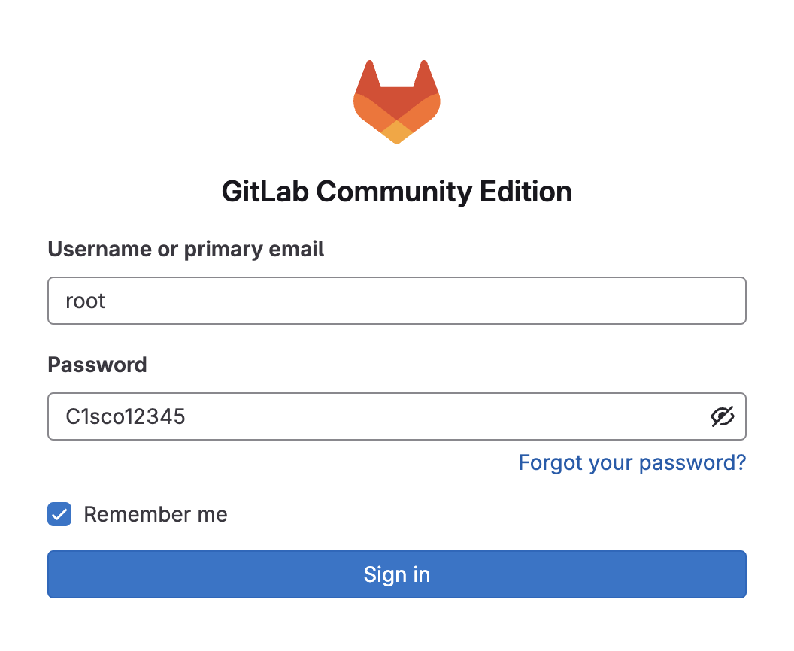{ width="50%" }
</figure>

!!! note "You can use any browser, from the VM or your host machine"
    Since you're connected to the lab network via VPN, you can also use a browser on your host machine to access GitLab. Task 13-15 can be completed entirely from your browser without needing to use the Windows 10 VM.

    The screenshots in Task 13-15 are taken from a Mac host, but the steps are identical on Windows or Linux.


## Step 2: Navigate to the NAC-IOSXE Project

After logging in, you'll see the GitLab dashboard. Click on the **netascode/nac-iosxe-terraform** project to open it.

<!-- SCREENSHOT: GitLab dashboard showing the netascode/nac-iosxe-terraform project -->
<figure markdown>
  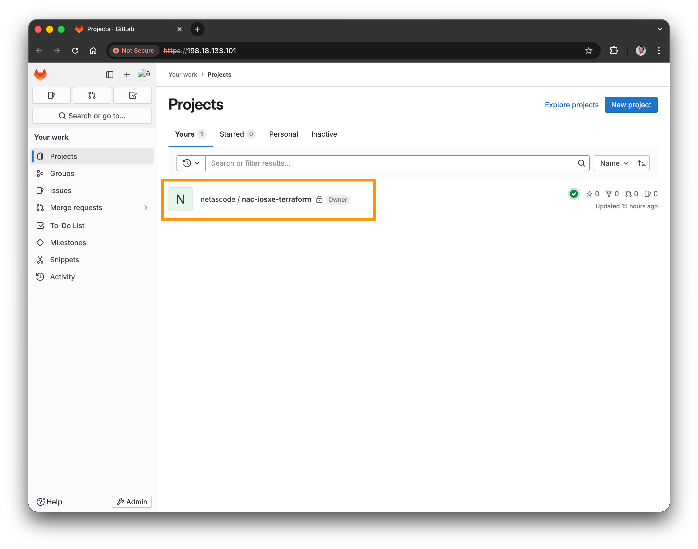{ width="100%" }
</figure>

The project page shows your repository files, including:

- `data/` folder with your YAML configurations – Same as you created in Task 02
- `tests/` folder with your ROBOT tests – Same as the ACL tests from optional Task 11
- `main.tf` - Terraform configuration – Same as you created in Task 02
- `.schema.yaml` - The Network-as-Code for IOS-XE schema – Same as you used in Task 10
- `.gitlab-ci.yml` - CI/CD pipeline definition file – This is new!


<figure markdown>
  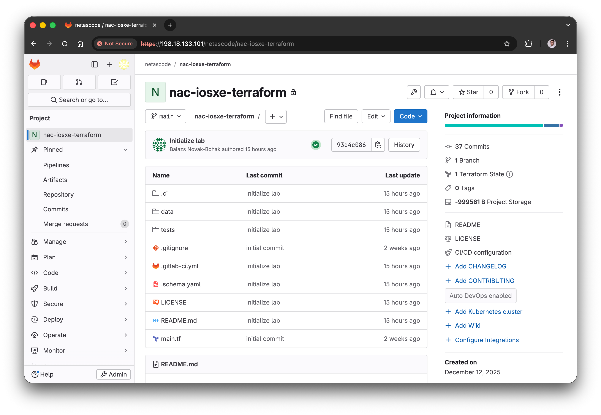{ width="100%" }
</figure>

## CI/CD Pipeline Configuration

Before running the pipeline, let's understand how it's configured. Click on `.gitlab-ci.yml` to view the pipeline definition:

<figure markdown>
  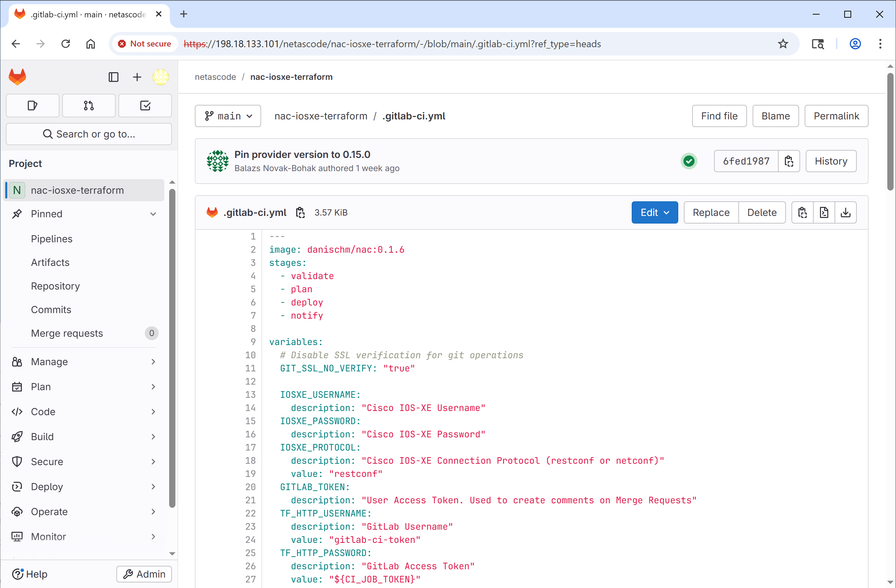{ width="100%" }
</figure>

A CI/CD pipeline is an automated workflow of tasks that enables changes to be deployed in a consistent and repeatable manner. In this lab, we are leveraging pipelines to automate the tasks you previously performed manually. This pipeline example includes the following stages: `validate`, `plan`, `deploy`, and `notify`.

```yaml { title=".gitlab-ci.yml Snippets" .no-copy }
image: danischm/nac:0.1.6
stages:
  - validate
  - plan
  - deploy
  - notify

variables:
  IOSXE_USERNAME:
    description: "Cisco IOS-XE Username"
  IOSXE_PASSWORD:
    description: "Cisco IOS-XE Password"
  IOSXE_PROTOCOL:
    description: "Cisco IOS-XE Connection Protocol (restconf or netconf)"
    value: "restconf"
  # ... additional variables for GitLab tokens, Terraform state, Webex notifications ...

cache:
  key: terraform_modules_and_lock
  paths:
    - .terraform
    - .terraform.lock.hcl
    - defaults.yaml
    - model.yaml

validate:
  stage: validate
  script:
    - set -o pipefail && terraform fmt -check |& tee fmt_output.txt
    - set -o pipefail && nac-validate ./data/ |& tee validate_output.txt
  # ... artifacts and rules configuration ...

plan:
  stage: plan
  script:
    - terraform init -upgrade -input=false
    - terraform plan -out=plan.tfplan -input=false
    - terraform show -no-color plan.tfplan > plan.txt
    # ... additional plan output processing ...
  # ... artifacts, dependencies, and branch rules ...

deploy:
  stage: deploy
  script:
    - terraform init -input=false
    - terraform apply -input=false -auto-approve plan.tfplan
  # ... runs only on main branch ...

failure:
  stage: notify
  script:
    - python3 .ci/webex-notification-gitlab.py -f
  when: on_failure

success:
  stage: notify
  script:
    - python3 .ci/webex-notification-gitlab.py -s
  when: on_success
```

!!! info "Abbreviated View"
    The YAML above shows the key structure of `.gitlab-ci.yml`. The actual file (~150 lines) includes additional configuration for variables, artifacts, caching, and branch rules. You can view the complete file in the GitLab repository.

**Key concepts:**

- **image** - Uses a pre-built Docker container with Terraform, `nac-validate`, and other tools
- **stages** - Define the order of execution (validate → plan → deploy → notify)
- **variables** - Pipeline variables for credentials (IOS XE, GitLab), entered at runtime
- **cache** - Preserves Terraform modules and state between pipeline runs
- **validate** - Runs `terraform fmt` check and `nac-validate` schema validation
- **plan** - Creates the Terraform execution plan and generates reports
- **deploy** - Applies the configuration automatically (runs on main branch only)
- **failure/success** - Send Webex notifications based on pipeline outcome

!!! note "Webex Notifications"
    The **notify** job typically use a Python script to send messages to a Webex room. In this lab, this functionality is intentionally omitted, the notify stage is only included as a placeholder for demonstration purposes.

    If you're interested in implementing notifications, reach out to your instructors for guidance.


## View Existing Pipelines

To see the pipeline history, navigate to **Build** → **Pipelines** in the left sidebar.

<!-- SCREENSHOT: Left sidebar with Build > Pipelines highlighted -->
<figure markdown>
  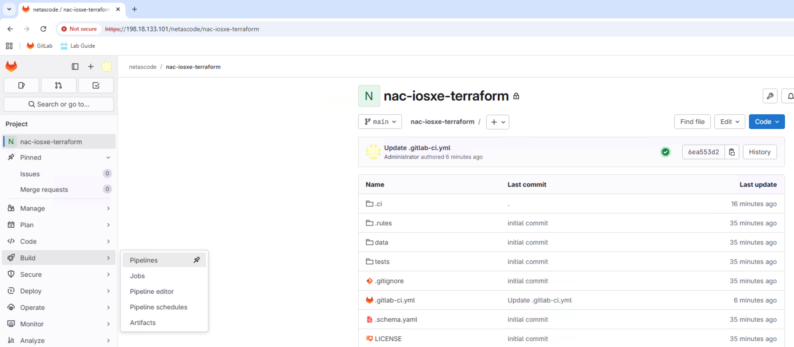{ width="100%" }
</figure>

You'll see a list of past pipeline runs with their status (passed, failed, running).

<!-- SCREENSHOT: Pipeline list showing multiple runs with status -->
<figure markdown>
  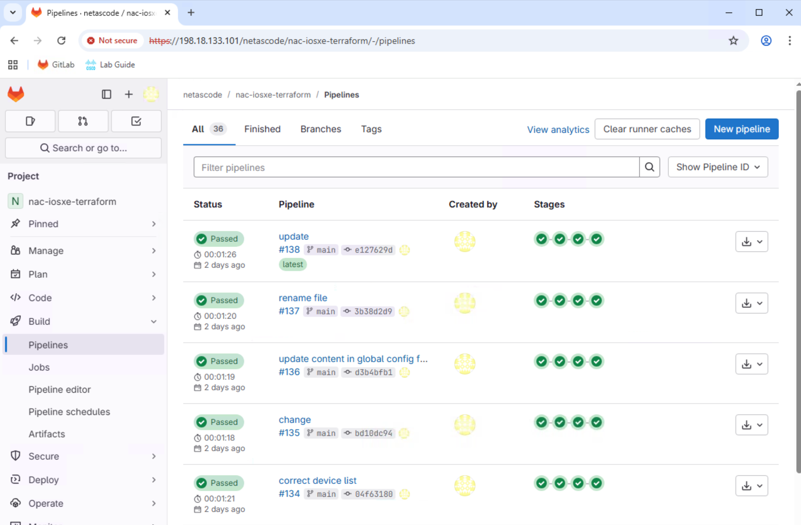{ width="100%" }
</figure>


## State File Management

Navigate to Home (GitLab icon in the top left), select **netascode/nac-iosxe-terraform**, then open the` main.tf `file.

The pipeline uses GitLab's **http backend** to store the Terraform state file on the GitLab server. This allows multiple pipeline runs to share the same state, ensuring consistency across deployments.

It is configured in the `main.tf` file with the following `backend` block under the `terraform` section:

```text
backend "http" {
  skip_cert_verification = true
}
```

!!! note "Certificate Verification"
    The `skip_cert_verification = true` setting is used here because the lab environment uses self-signed certificates. In production, you should use valid certificates.

For more details on how this is set up, refer to the [GitLab Docs](https://docs.gitlab.com/user/infrastructure/iac/terraform_state/#initialize-an-opentofu-state-as-a-backend-by-using-gitlab-cicd).


## Step 3: Make a Change

The best way to see the CI/CD pipeline in action is to make a configuration change.
You'll add the global configuration (from [Task 03 - Global configuration](Task03_Global_configuration.md) and [Task 06 - Variables](Task06_Variables.md)). This includes the login banner and hostnames.
To edit the configuration files, we'll use GitLab's built-in **Web IDE** – an editor similar to VS Code that runs directly in your browser.

### Open the Web IDE

1. From the project page, click the **Edit** dropdown button (with a pencil icon)
2. Select **Web IDE**

<!-- SCREENSHOT: Edit dropdown showing Web IDE option -->
<figure markdown>
  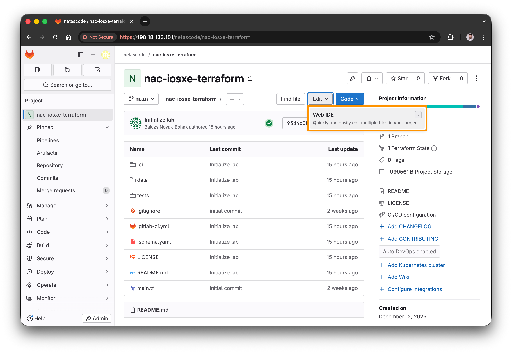{ width="100%" }
</figure>

The Web IDE opens with a familiar VS Code-like interface:

<!-- SCREENSHOT: GitLab Web IDE interface -->
<figure markdown>
  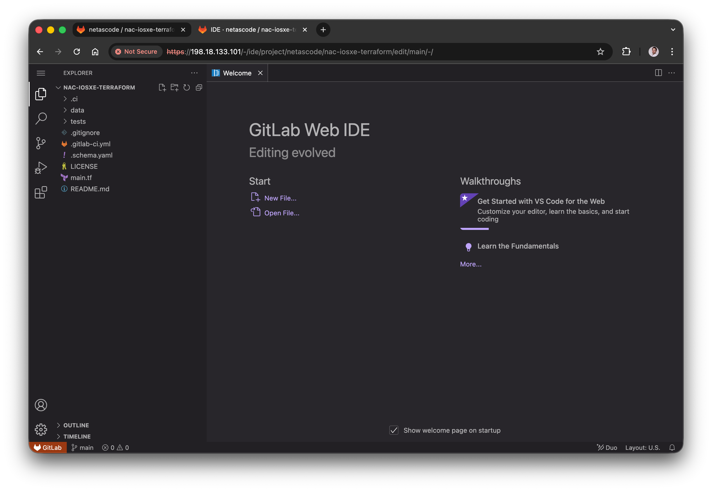{ width="100%" }
</figure>

### Lab configuration files

Take a look at the `data/` folder in the file explorer (left panel). This folder contains the same configuration files that we've used before in this lab in Task 2-6. However, we replaced some of the file extensions from `.yaml` to `.yaml_` (with an underscore at the end). We did this intentionally to ignore these files for now.

!!! note "`.yaml_` vs. `.yaml` files"
    The Network-as-Code framework only uses `.yaml` files from the `yaml_directories` defined in `main.tf` (in our case, the `data/` folder). Files with other extensions (like `.yaml_`) are ignored.

The only files that are currently not ignored are:

- `devices.nac.yaml` - Device inventory file (Same as in Task 02)
- `devices-variables.nac.yaml` - Device variables file (Same content as in Task 06)

    !!! info "Variables file"
        You can inspect the `devices-variables.nac.yaml` file to see that now we have all `HOSTNAME` variables defined in this single file (instead of per-device files as before).

For this task, you'll update the global configuration (similar to what we did in Task 03 and Task 06).


### Add Global Configuration

1. In the file explorer (left panel), navigate to the **data** folder
2. Find the file `config-global.nac.yaml_` (note the underscore at the end)
3. Right-click on the file and select **Rename**
4. **Rename the file** from `config-global.nac.yaml_` to `config-global.nac.yaml` (remove the underscore)
5. Click on the file to open it and inspect the banner content:

```yaml title="config-global.nac.yaml" hl_lines="10"
---
iosxe:
  global:
    configuration:
      banner:
        login: |
          ######################################
          #                                    #
          #   Welcome to Network-as-Code Lab!  #
          #           GitLab - CI/CD           #
          #                                    #
          ######################################
          Device: ${HOSTNAME}
      system:
        hostname: ${HOSTNAME}

```
!!! note
    Note that we modified the banner text compared to what we used before, indicating that now we're using GitLab CI/CD.

Optionally, you can also change the banner text to something new, if you'd like.


<!-- SCREENSHOT: Editing config-global.nac.yaml in Web IDE -->
<!-- <figure markdown>
  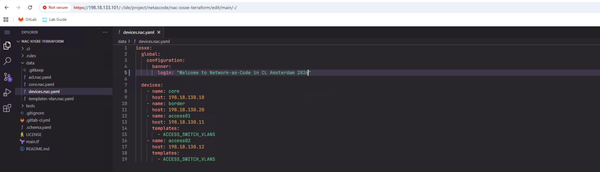{ width="100%" }
</figure> -->

## Step 4: Commit Change to Trigger Pipeline

<figure markdown>
  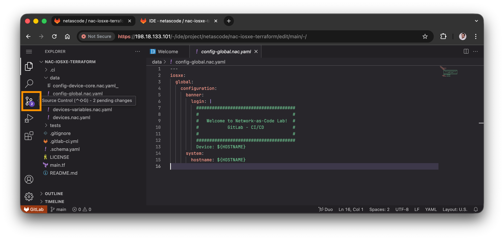{ width="100%" }
</figure>

1. Click on **Source Control** icon in the left sidebar
2. You'll see your modified file listed
3. Enter a commit message: `Add global config for banner and hostname`
4. Click **Commit and push to 'main'**
5. If prompted with “You're committing your changes to the default branch. Do you want to continue?”. Select **Continue**.

<!-- SCREENSHOT: Commit dialog in Web IDE -->
<figure markdown>
  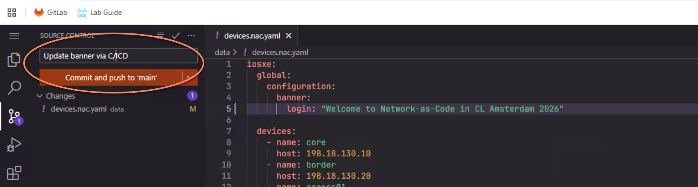{ width="100%" }
</figure>


!!! info "Pipeline Auto-Trigger"
    When you commit to the `main` branch, GitLab automatically triggers the CI/CD pipeline. No manual action required!

## Step 5: Monitor Pipeline Execution

To view the pipeline progress, navigate to **Build** → **Pipelines** in the left sidebar, then click on the top pipeline showing **running** status.

!!! tip
    You need to click on the pipeline status icon or the pipeline ID.

<!-- SCREENSHOT: Pipeline detail view showing stages -->
<figure markdown>
  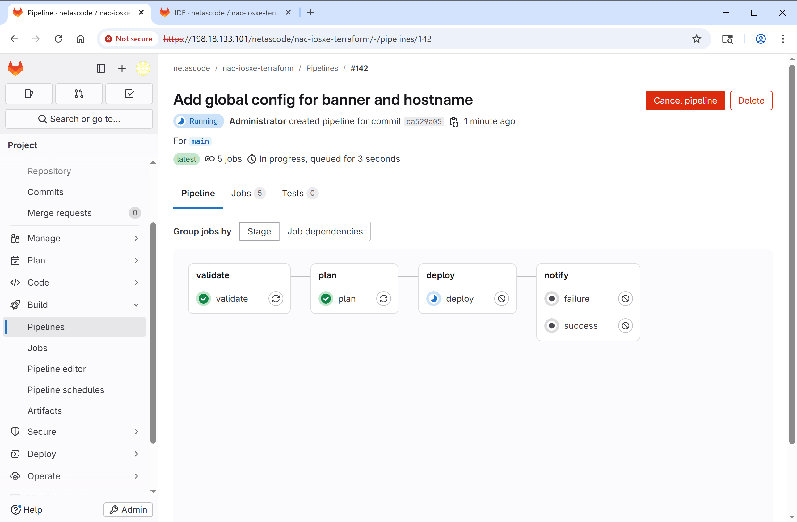{ width="100%" }
</figure>

You'll see each stage progressing:

1. **validate** - Green checkmark when YAML validation passes
2. **plan** - Generates the Terraform plan
3. **deploy** - Applies the configuration to devices
4. **notify** - Sends success or failure notifications (not used in this lab)

Click on any stage to view its detailed logs.

<!-- SCREENSHOT: Job logs showing terraform plan output -->
<figure markdown>
  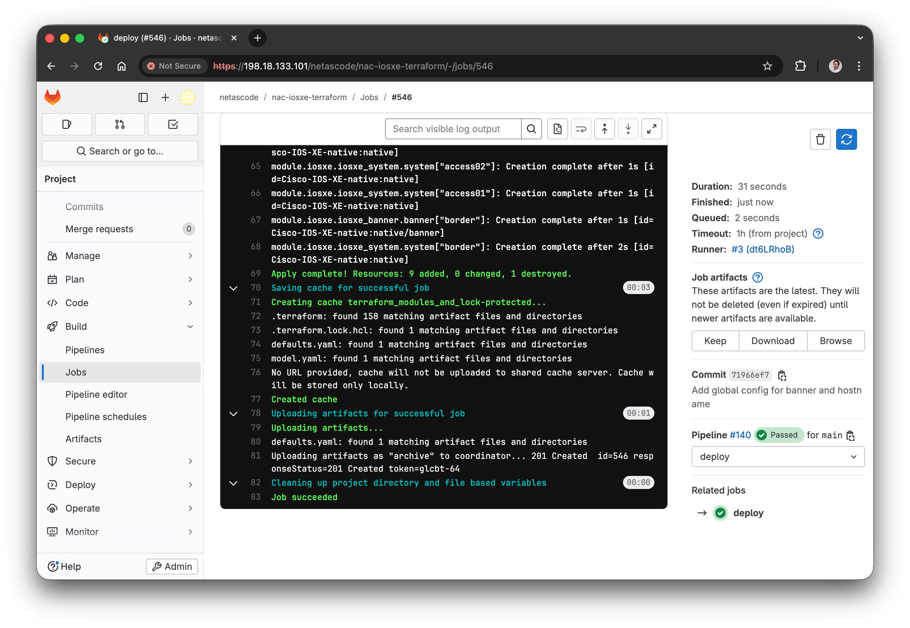{ width="100%" }
</figure>

## Step 6: Verify Pipeline Success

When all stages complete successfully, the pipeline shows a green **passed** status.

<!-- SCREENSHOT: Completed pipeline with all stages green -->
<figure markdown>
  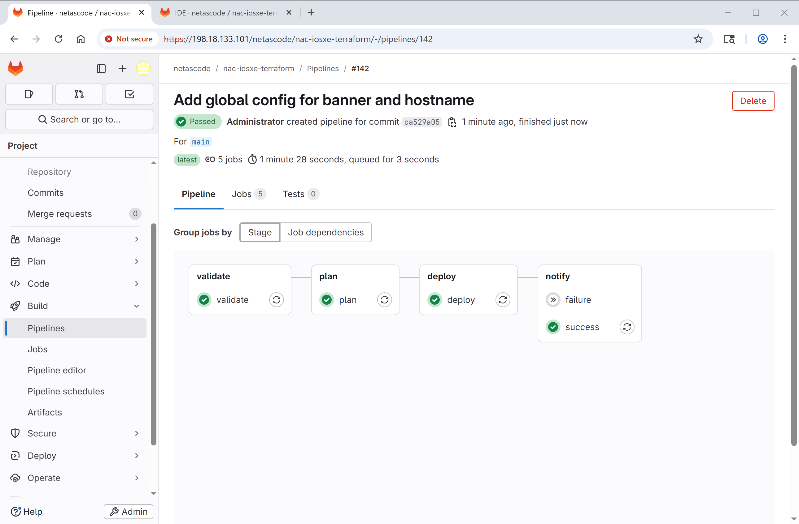{ width="100%" }
</figure>

You can verify the configuration was applied to the devices using **Solar-PuTTY**:

1. Open **Solar-PuTTY** from your desktop
2. Connect to one of the devices (e.g., **core** switch)
3. Check the banner and hostname – The banner will now include `GitLab – CI/CD`

<figure markdown>
  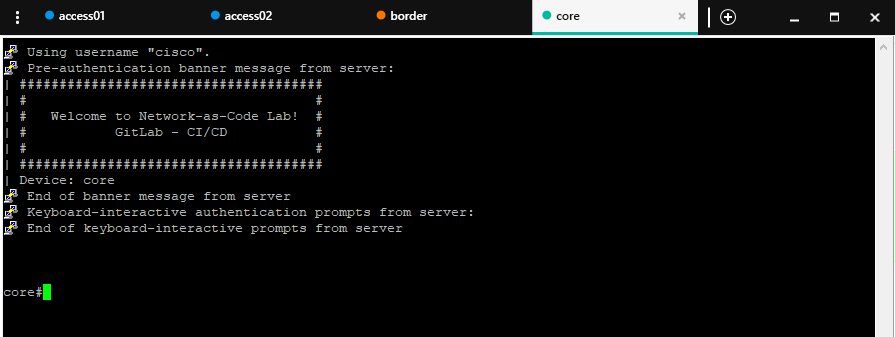{ width="95%" }
</figure>


## Validation Test (Optional)

Additionally, you may also test the validation stage by introducing an error in the configuration, just like we did in [Task 10 - Schema validation](Task10_Schema_validation.md).

If the validation fails, the pipeline will stop, and you'll see a red **failed** status.


## What You've Accomplished

- ✅ Accessed GitLab and navigated to the NAC-IOSXE project
- ✅ Understood the CI/CD pipeline configuration
- ✅ Triggered a pipeline by committing a change
- ✅ Monitored pipeline execution through all stages

---

## Next Steps

You can explore **optional** advanced CI/CD tasks or proceed to the **conclusion**:

- **Optional:** [Task14 - Edit CI/CD](Task14_Edit_CI-CD.md) - Enhance your pipeline with automated testing
- **Optional:** [Task15 - Branch and Merge Request](Task15_Branch_and_merge_request.md) - Learn change approval workflows
- **Conclusion:** [Lab Conclusion](Workend01_conclusion.md) - Complete the lab and review what you've learned
