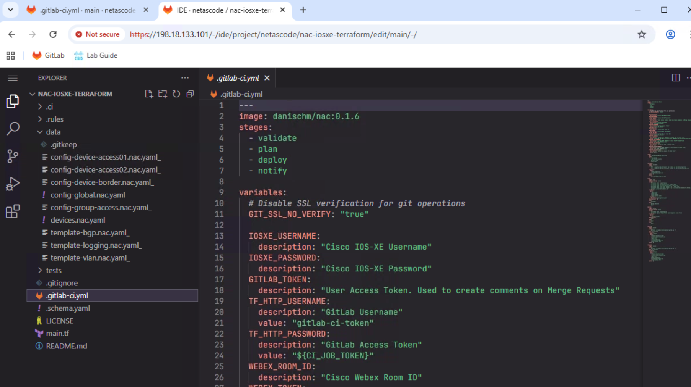
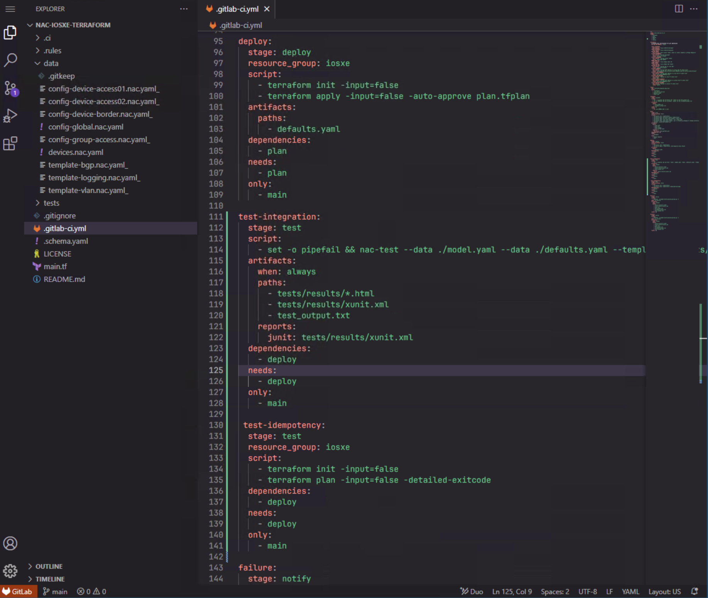
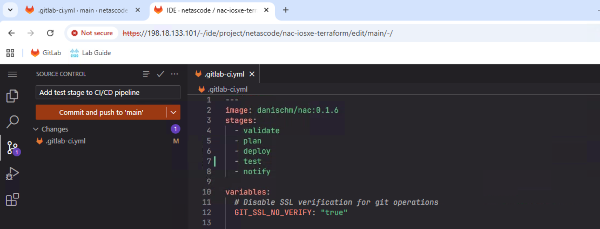
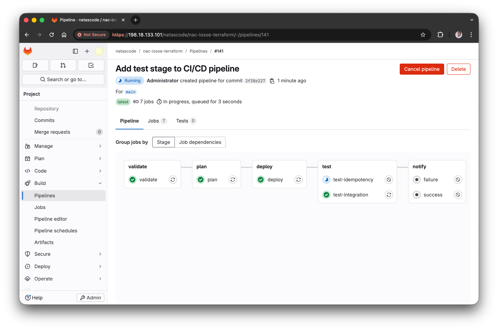
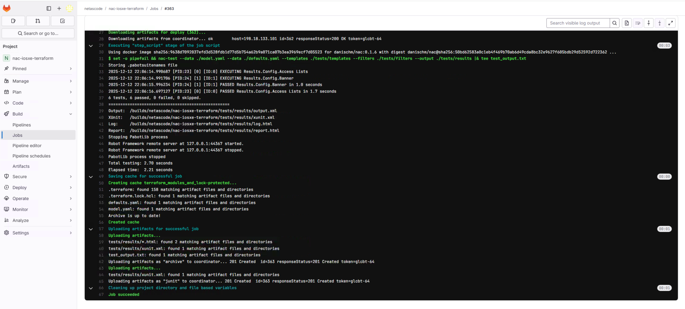

In Task13, you ran a CI/CD pipeline with validation, planning, and deployment stages. In this task, you'll enhance the pipeline by adding a **test stage** that automatically validates your deployments after they're applied, similarly to how you ran `nac-test` manually in [Task 11 - Post-checks](Task11_Post-checks.md).

## Understanding the Test Stage

Adding automated testing to your CI/CD pipeline ensures that:

- Configurations are correctly applied to devices
- The deployment is idempotent (running it again produces no changes)
- Any issues are detected immediately after deployment

You'll add two test jobs:

- **`test-integration`** - Runs `nac-test` to verify configurations match expected state
- **`test-idempotency`** - Runs `terraform plan` again to confirm no drift

## Step 1: Open the Web IDE

!!! tip "Already Open?"
    You probably still have the Web IDE open in another Google Chrome tab from Task 13. If so, simply switch to that tab and skip to the next step.

If you need to reopen it, navigate to the **netascode/nac-iosxe-terraform** project in GitLab:

1. From the project page, click the **Edit** dropdown button (with a pencil icon)
2. Select **Web IDE**

Once the Web IDE opens, click on `.gitlab-ci.yml` in the file explorer to open it for editing.

<figure markdown>
  { width="100%" }
</figure>


## Step 2: Add the Test Stage

Find the `stages` section at the top of the file. You need to add `test` between `deploy` and `notify`.

**Find this section:**

```yaml
stages:
  - validate
  - plan
  - deploy
  - notify
```

**Add `test` so it looks like this:**

```yaml hl_lines="5"
stages:
  - validate
  - plan
  - deploy
  - test
  - notify
```

## Step 3: Add the Test-Integration Job

After the `deploy` job section (around line 111 in the file), add the `test-integration` job. This job runs `nac-test` to verify your configurations.

**Add this new job after the `deploy:` section:**

```yaml
test-integration:
  stage: test
  script:
    - set -o pipefail && nac-test --data ./model.yaml --data ./defaults.yaml --templates ./tests/templates --filters ./tests/filters --output ./tests/results |& tee test_output.txt
  artifacts:
    when: always
    paths:
      - tests/results/*.html
      - tests/results/xunit.xml
      - test_output.txt
    reports:
      junit: tests/results/xunit.xml
  dependencies:
    - deploy
  needs:
    - deploy
  only:
    - main
```

**What this job does:**

- **script**: Runs `nac-test` with your data files and test templates
- **artifacts**: Saves test results (HTML reports and JUnit XML)
- **reports: junit**: Integrates test results into GitLab's test reporting UI
- **dependencies/needs**: Ensures this job runs after `deploy` completes
- **only: main**: Only runs on the main branch (not merge requests)

## Step 4: Add the Test-Idempotency Job

Add another test job that verifies idempotency - running Terraform again should show no changes if the deployment was successful.

**Add this job after `test-integration:`:**

```yaml
test-idempotency:
  stage: test
  resource_group: iosxe
  script:
    - terraform init -input=false
    - terraform plan -input=false -detailed-exitcode
  dependencies:
    - deploy
  needs:
    - deploy
  only:
    - main
```

**What this job does:**

- **terraform plan -detailed-exitcode**: Returns exit code 2 if there are changes, failing the job
- **resource_group: iosxe**: Prevents concurrent access to devices
- If this job passes, it confirms your deployment is idempotent

<figure markdown>
  { width="100%" }
</figure>

## Step 5: Commit Your Changes

After making all the changes:

1. Click on **Source Control** icon in the left sidebar (as you did in Task 13)
2. You'll see the modified `.gitlab-ci.yml` file listed
3. Enter a commit message: `Add test stage to CI/CD pipeline`
4. Click **Commit and push to 'main'**

<figure markdown>
  { width="100%" }
</figure>

## Step 6: Verify the Pipeline

After committing, a new pipeline will automatically start. Navigate to **Build** → **Pipelines** and click on the pipeline showing **running** status to watch its progress.

You should now see **5 stages** in the pipeline:

1. **validate** - Schema and format validation
2. **plan** - Terraform planning
3. **deploy** - Apply configuration
4. **test** - Integration and idempotency tests
5. **notify** - Success/failure notifications

<figure markdown>
  { width="100%" }
</figure>

## Step 7: Review Test Results

After the pipeline completes, click on the `test-integration` job to view the test results.

GitLab displays test results in a user-friendly format:

<figure markdown>
  { width="100%" }
</figure>

You can also download the HTML test report from the job artifacts.

## Summary of Changes

Here's a complete summary of what you added to `.gitlab-ci.yml`:

- **Add `test` stage** in the `stages:` section - New stage between deploy and notify
- **Add `test-integration` job** after `deploy:` - Runs nac-test for configuration validation
- **Add `test-idempotency` job** after `test-integration:` - Verifies no configuration drift

## What You've Accomplished

- ✅ Added a test stage to the CI/CD pipeline
- ✅ Configured integration tests with `nac-test`
- ✅ Added idempotency verification
- ✅ Verified the enhanced pipeline runs successfully

## Reference

For the complete `.gitlab-ci.yml` file with all changes, see **Appendix I**.

---

**Next Steps:**

You can explore the **optional** merge request workflow or proceed to the **conclusion**:

- **Optional:** [Task15 - Branch and Merge Request](Task15_Branch_and_merge_request.md) - Learn change approval workflows with branches and merge requests
- **Conclusion:** [Lab Conclusion](Workend01_conclusion.md) - Complete the lab and review what you've learned
