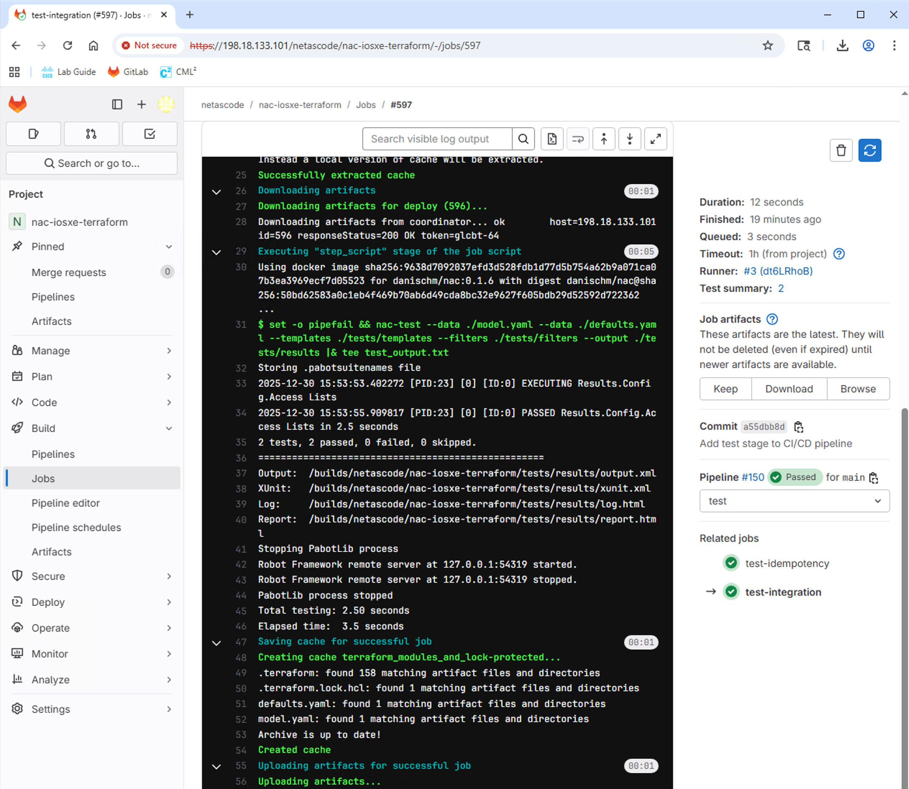
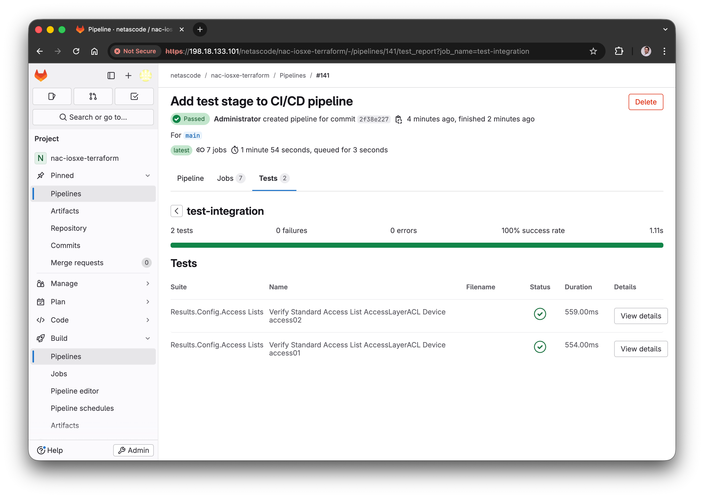
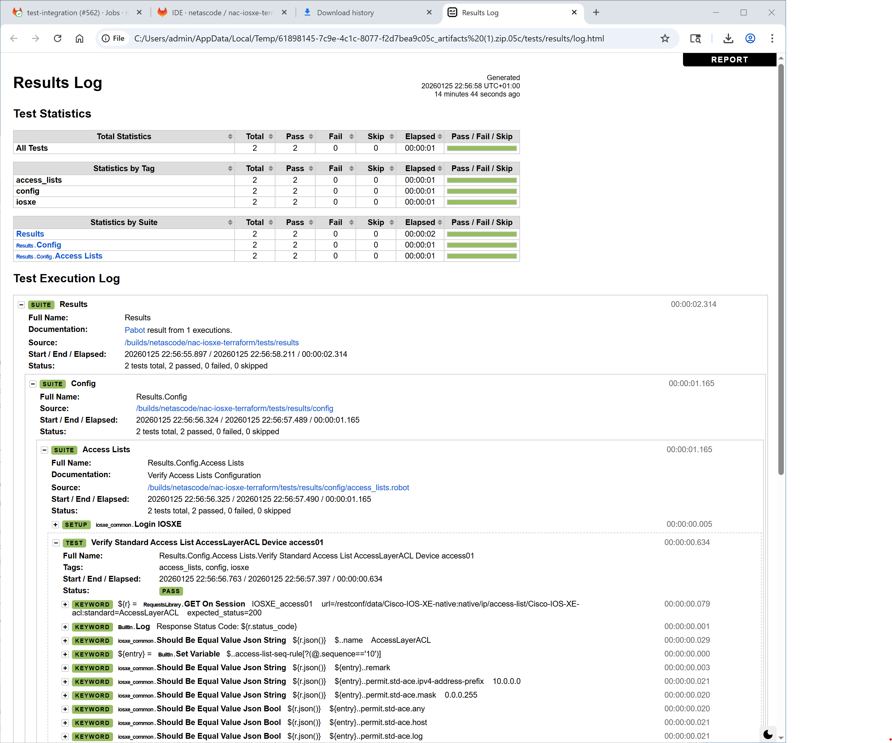

In Task13, you ran a CI/CD pipeline with validation, planning, and deployment stages. In this task, you'll enhance the pipeline by adding a **test stage** that automatically validates your deployments after they're applied, similarly to how you ran `nac-test` manually in [Task 11 - Post-checks](Task11_Post-checks.md).

## Test Stage

Adding automated testing to your CI/CD pipeline ensures that:

- Configurations are correctly applied to devices
- The deployment is idempotent (running it again produces no changes)
- Any issues are detected immediately after deployment

You'll add two test jobs:

- **`test-integration`** - Runs `nac-test` to verify configurations match expected state
- **`test-idempotency`** - Runs `terraform plan` again to confirm no drift

## Step 1: Open Pipeline Definition File

??? info "How to Open Web IDE"
    1. Open GitLab in a new tab: [https://198.18.133.101](https://198.18.133.101)
    2. Navigate to the **netascode/nac-iosxe-terraform** project
    3. From the project page, click the **Edit** dropdown button (with a pencil icon)
    4. Select **Web IDE**

    <figure markdown>
      { width="100%" }
    </figure>

In the Web IDE, click on `.gitlab-ci.yml` in the Explorer panel to open it for editing.

<figure markdown>
  { width="100%" }
</figure>


## Step 2: Add the Test Stage

Find the `stages` section at the top of the file. You need to add `test` between `deploy` and `notify`.

**Find this section:**

```yaml { .no-copy }
stages:
  - validate
  - plan
  - deploy
  - notify
```

**Add `test` so it looks like this:**

```yaml hl_lines="5"
stages:
  - validate
  - plan
  - deploy
  - test
  - notify
```

## Step 3: Add the Test-Integration Job

After the `deploy` job section (around line 115 in the file), add the `test-integration` job. This job runs `nac-test` to verify your configurations.

**Add this new job after the `deploy:` section:**

```yaml
test-integration:
  stage: test
  script:
    - set -o pipefail && nac-test --data ./model.yaml --data ./defaults.yaml --templates ./tests/templates --filters ./tests/filters --output ./tests/results |& tee test_output.txt
  artifacts:
    when: always
    paths:
      - tests/results/*.html
      - tests/results/xunit.xml
      - test_output.txt
    reports:
      junit: tests/results/xunit.xml
  dependencies:
    - deploy
  needs:
    - deploy
  only:
    - main
```

**What this job does:**

- `script`: Runs `nac-test` with your data files and test templates
- `artifacts`: Saves test results (HTML reports and JUnit XML)
- `reports: junit`: Integrates test results into GitLab's test reporting UI
- `dependencies` and `needs`: Ensure this job runs after `deploy` completes
- `only: main`: Only runs on the main branch (not merge requests)

## Step 4: Add the Test-Idempotency Job

Add another test job that verifies idempotency – running Terraform again should show no changes if the deployment was successful.

**Add this job right after the `test-integration:` job block:**

```yaml
test-idempotency:
  stage: test
  resource_group: iosxe
  script:
    - terraform init -input=false
    - terraform plan -input=false -detailed-exitcode
  dependencies:
    - deploy
  needs:
    - deploy
  only:
    - main
```

**What this job does:**

- `terraform plan -detailed-exitcode`: Returns exit code 2 if there are changes, failing the job
- `resource_group: iosxe`: Prevents concurrent access to devices
- If this job passes, it confirms your deployment is idempotent

<figure markdown>
  { width="100%" }
</figure>

!!! info
    You can refer to [Appendix I](Appendix-I.md) for the complete `.gitlab-ci.yml` file with all changes included.


## Step 5: Add ACL Configuration

Just as we did in [Task 11 - Post-checks](Task11_Post-checks.md), we will add the ACL configuration to test the pipeline.

1. In the Web IDE file explorer, navigate to `data/` and rename `config-group-access.nac.yaml_` to `config-group-access.nac.yaml` (remove the trailing underscore).
2. You may review the ACL configuration by opening the file – it defines the standard ACL named `AccessLayerACL` that we configured in [Task 4 - Device group configuration](Task04_Device_group_config.md). You will notice that we have added additional entries to the Access List.


## Step 6: Commit Your Changes

After making all the changes:

1. In your Web IDE, click on **Source Control** icon in the left sidebar (as you did in Task 13)
2. You'll see the modified files listed: `.gitlab-ci.yml` and `data/config-group-access.nac.yaml`
3. Enter a commit message: `Add test stage to CI/CD pipeline`
4. Click **Commit and push to 'main'**

<!-- <figure markdown>
  { width="100%" }
</figure> -->

## Step 7: Verify the Pipeline

After committing, a new pipeline will automatically start. Navigate to **Build** → **Pipelines** and click on the pipeline showing **running** status to watch its progress.

You should now see **5 stages** in the pipeline:

1. **validate** - Schema and format validation
2. **plan** - Terraform planning
3. **deploy** - Apply configuration
4. **test** - Integration and idempotency tests
5. **notify** - Success/failure notifications

<figure markdown>
  { width="100%" }
</figure>

## Step 8: Review Test Results

- After the pipeline completes, click on the `test-integration` job to view the test results.
- Review the logs to see the output of `nac-test`. You should see that all tests have passed successfully: `2 tests, 2 passed, 0 failed, 0 skipped.`

<figure markdown>
  { width="100%" }
</figure>

- Click on **Test Summary** on the right sidebar. This is where GitLab displays the test results from the JUnit report.

<figure markdown>
  { width="100%" }
</figure>

- Go back to the job page and find the **Job artifacts** section on the right sidebar. Click on **Download** to download the test report and log HTML files.
- Open and inspect the `report.html` and `log.html` files in your web browser. The report will show the same tests as in [Task 11 - Post-checks](Task11_Post-checks.md), confirming the configurations were applied correctly.

<figure markdown>
  { width="100%" }
</figure>


## What You've Accomplished

- ✅ Added a test stage to the CI/CD pipeline
- ✅ Configured integration tests with `nac-test`
- ✅ Added idempotency verification
- ✅ Verified the enhanced pipeline runs successfully


---

**Next Steps:**

You can explore the **optional** merge request workflow or proceed to the **conclusion**:

- **Optional:** [Task15 - Branch and Merge Request](Task15_Branch_and_merge_request.md) - Learn change approval workflows with branches and merge requests
- **Conclusion:** [Lab Conclusion](Workend01_conclusion.md) - Complete the lab and review what you've learned
