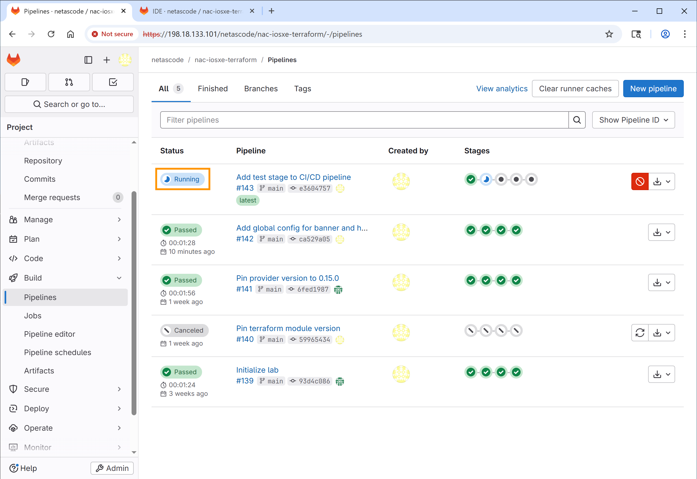
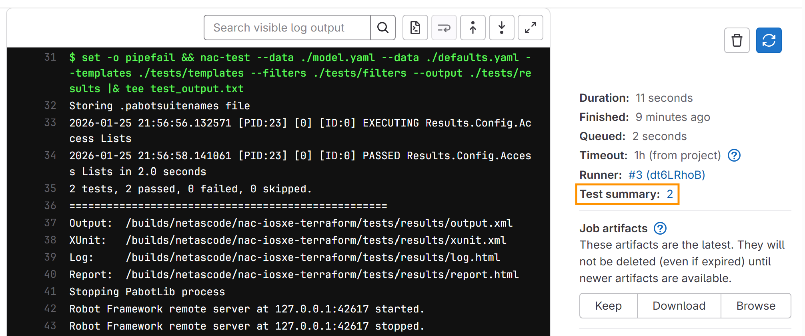
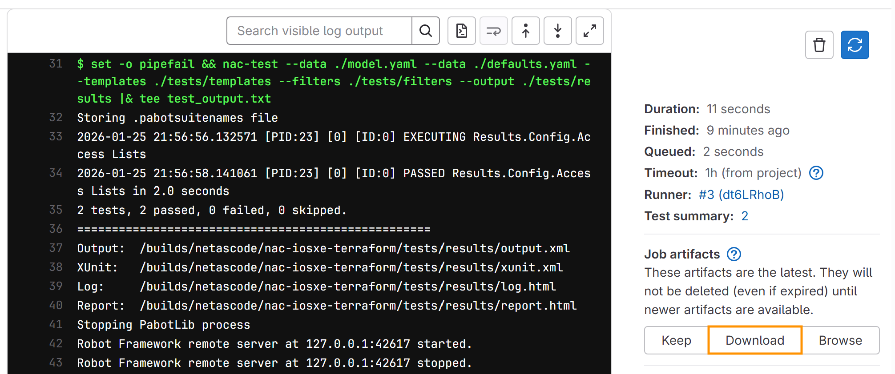

# Task 14 - Extend the pipeline with automated tests (Optional)

**Estimated Time to Complete:** ~15 minutes

In Task 13 you ran a CI/CD pipeline with validate, plan, and deploy stages. In this task you'll extend it with a **test stage** that automatically validates deployments after they're applied - the same thing you ran manually in [Task 11](Task11_Post-checks.md), now on every merge.

## What you'll learn

By the end of this task you will have:

- Edited `.gitlab-ci.yml` to add a new **`test`** stage between `deploy` and `notify`
- Added a `test-integration` job that runs `nac-test` against the live devices
- Added a `test-idempotency` job that runs `terraform plan -detailed-exitcode` to catch configuration drift
- Read the test results as JUnit reports attached to the pipeline

## Test stage


Adding automated testing to your CI/CD pipeline ensures that:

- Configurations are correctly applied to devices
- The deployment is idempotent (running it again produces no changes)
- Any issues are detected immediately after deployment

You'll add two test jobs:

- **`test-integration`** - Runs `nac-test` to verify configurations match expected state
- **`test-idempotency`** - Runs `terraform plan` again to confirm no drift

## Step 1: Open pipeline definition file


??? info "How to Open Web IDE"
    1. Open GitLab in a new tab: [https://198.18.133.101](https://198.18.133.101)
    2. Navigate to the **netascode/nac-iosxe-terraform** project
    3. From the project page, click the **Edit** dropdown button (with a pencil icon)
    4. Select **Web IDE**

    <figure markdown>
      { width="100%" }
    </figure>

In the Web IDE, click on `.gitlab-ci.yml` in the Explorer panel to open it for editing.

<figure markdown>
  { width="100%" }
</figure>


## Step 2: Add the test stage


Find the `stages` section at the top of the file. You need to add `test` between `deploy` and `notify`.

**Find this section:**

```yaml { title=".gitlab-ci.yml" .no-copy }
stages:
  - validate
  - plan
  - deploy
  - notify
```

**Add `test` so it looks like this:**

```yaml { title=".gitlab-ci.yml" hl_lines="5" }
stages:
  - validate
  - plan
  - deploy
  - test
  - notify
```

## Step 3: Add the test-integration job


After the `deploy` job section (around line 115), add the `test-integration` job. This job runs `nac-test` to verify your configurations.

**Add this new job after the `deploy:` section:**

```yaml
test-integration:
  stage: test
  script:
    - echo "=== PWD and tree ==="; pwd; ls -la
    - echo "=== Inputs nac-test needs ==="; ls -la model.yaml defaults.yaml || true
    - echo "=== tests/ scaffolding ==="; ls -la tests/ tests/templates tests/filters || true
    - echo "=== nac-test version ==="; nac-test --version || true
    - mkdir -p tests/results
    - set -o pipefail && nac-test --data ./model.yaml --data ./defaults.yaml --templates ./tests/templates --filters ./tests/filters --output ./tests/results |& tee test_output.txt
  after_script:
    - echo "=== tests/results contents (post-run) ==="; ls -la tests/results || true
    - echo "=== last 50 lines of test_output.txt ==="; tail -n 50 test_output.txt || true
  artifacts:
    when: always
    paths:
      - tests/results/
      - test_output.txt
    reports:
      junit: tests/results/xunit.xml
  dependencies:
    - deploy
  needs:
    - deploy
  only:
    - main
```

**What this job does:**

- The pre-`nac-test` `echo`/`ls` lines print the working directory, the data files (`model.yaml`, `defaults.yaml`), and the `tests/` scaffolding so a missing input is obvious in the log instead of being inferred from a downstream failure.
- `mkdir -p tests/results` guarantees the output directory exists before `nac-test` writes to it, so the artifact glob never trips on a missing parent.
- `script`: Runs `nac-test` with your data files and test templates.
- `after_script`: Always runs (even on failure) and prints the contents of `tests/results/` plus the tail of `test_output.txt`, so you see what `nac-test` actually produced.
- `artifacts`: Uploads the entire `tests/results/` directory (HTML reports, log, output.xml, xunit.xml) so a partial run is still inspectable.
- `reports: junit`: Integrates test results into GitLab's test reporting UI.
- `dependencies` and `needs`: Ensure this job runs after `deploy` completes.
- `only: main`: Only runs on the main branch (not merge requests).

!!! tip "Reading the log when this job fails"
    Scroll to the lines just above `Uploading artifacts ...` in the job log:

    - A missing `model.yaml` or `defaults.yaml` in the first `ls` block means the file wasn't passed to this job - check the `deploy` job's artifacts and the top-level `cache:` block.
    - A missing `tests/templates` or `tests/filters` means the `tests/` scaffolding isn't committed on `main`.
    - `Suite '...' contains no tests or tasks` from Robot Framework means the templates rendered an empty suite - usually because no input data matched (for example, `data/groups/access.nac.yaml_` was never renamed in Step 5, so `model.yaml` has no ACLs to test).

## Step 4: Add the test-idempotency job


Add another test job that verifies idempotency - running Terraform again should show no changes if the deployment was successful.

**Add this job right after the `test-integration:` job block:**

```yaml
test-idempotency:
  stage: test
  resource_group: iosxe
  script:
    - terraform init -input=false
    - terraform plan -input=false -detailed-exitcode
  dependencies:
    - deploy
  needs:
    - deploy
  only:
    - main
```

In the end, your test stage section should look like this:

<figure markdown>
  { width="100%" }
</figure>

**What the `test-idempotency` job does:**

- `terraform plan -detailed-exitcode`: Returns exit code 2 if there are changes, failing the job
- `resource_group: iosxe`: Prevents concurrent access to devices
- If this job passes, it confirms your deployment is idempotent


!!! info "Complete Pipeline Reference"
    You can refer to [Appendix I](Appendix-I.md) for the complete `.gitlab-ci.yml` file with all changes included.


## Step 5: Add ACL configuration


Just as in [Task 11 - Post-checks](Task11_Post-checks.md), you will add the ACL configuration to test the pipeline.

1. In the Web IDE file explorer, navigate to `data/` and rename `groups/access.nac.yaml_` to `groups/access.nac.yaml` (remove the trailing underscore).
2. You may review the ACL configuration by opening the file - it defines the standard ACL named `AccessLayerACL` that you configured in [Task 4 - Device group configuration](Task04_Device_group_config.md). You will notice that additional entries have been added to the Access List.


## Step 6: Commit your changes


After making all the changes:

1. In your Web IDE, click on **Source Control** icon in the left sidebar (as you did in Task 13)
2. You'll see the modified files listed: `.gitlab-ci.yml` and `data/groups/access.nac.yaml`
3. Enter a commit message:
   ```
   Add test stage to CI/CD pipeline
   ```
4. Click **Commit and push to 'main'**


## Step 7: Verify the pipeline


After committing, a new pipeline will automatically start. Navigate to **Build** → **Pipelines** and click on the pipeline showing **running** status to watch its progress.

<figure markdown>
  { width="100%" }
</figure>

You should now see **5 stages** in the pipeline:

1. **validate** - schema and format validation. *Usually <10s.*
2. **plan** - Terraform planning. *~30-60s.*
3. **deploy** - apply configuration. *~60-90s.*
4. **test** - integration (`nac-test`) + idempotency (`terraform plan -detailed-exitcode`). *~45-60s - nac-test does the heaviest work here.*
5. **notify** - success/failure notifications. *<5s.*

End-to-end with the test stage, expect about **3-4 minutes** total. If `test` sits on running for more than 3 minutes, it's probably waiting on a device that didn't respond - click into the job to see which assertion timed out.

<figure markdown>
  { width="100%" }
</figure>

## Step 8: Review test results


- After the pipeline completes, click on the `test-integration` job to view the test results.
- Review the logs to see the output of `nac-test`. You should see that all tests have passed successfully: `2 tests, 2 passed, 0 failed, 0 skipped.`

<figure markdown>
  { width="100%" }
</figure>

- Click on **Test Summary** on the right sidebar.

<figure markdown>
  { width="100%" }
</figure>

This is where GitLab displays the test results from the JUnit report. You should see a summary indicating all tests passed.

<figure markdown>
  { width="100%" }
</figure>

- Go back to the job page and find the **Job artifacts** section on the right sidebar. Click on **Download** to download the test report and log HTML files.

<figure markdown>
  { width="100%" }
</figure>

- Open and inspect the `report.html` and `log.html` files in your web browser. The report will show the same tests as in [Task 11 - Post-checks](Task11_Post-checks.md), confirming the configurations were applied correctly.

<figure markdown>
  { width="100%" }
</figure>


## What you've accomplished


- ✅ Added a test stage to the CI/CD pipeline
- ✅ Configured integration tests with `nac-test`
- ✅ Added idempotency verification
- ✅ Verified the enhanced pipeline runs successfully


---

## What's next

Task 15 is the last **optional** task - it introduces the merge request
workflow with protected branches, so changes land on `main` only after
review. If you're at the end of your time box, jump to the
[Conclusion](Workend01_conclusion.md).

---

**← Previous:** [Task 13 - Run a CI/CD pipeline](Task13_Run_CI-CD_pipeline.md)  ·  **Next:** [Task 15 - Merge request workflow](Task15_Branch_and_merge_request.md)
