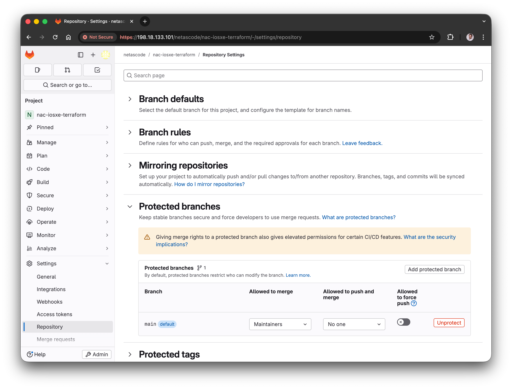
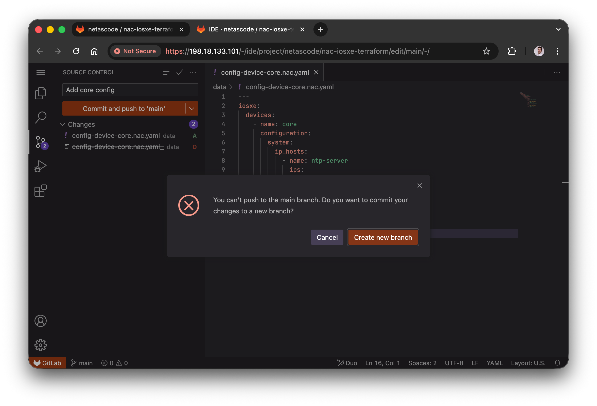
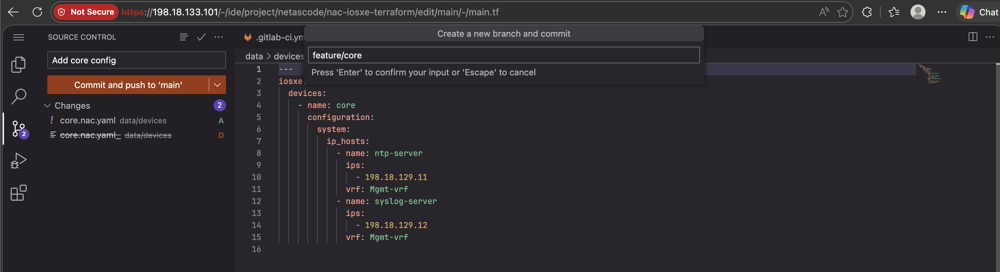
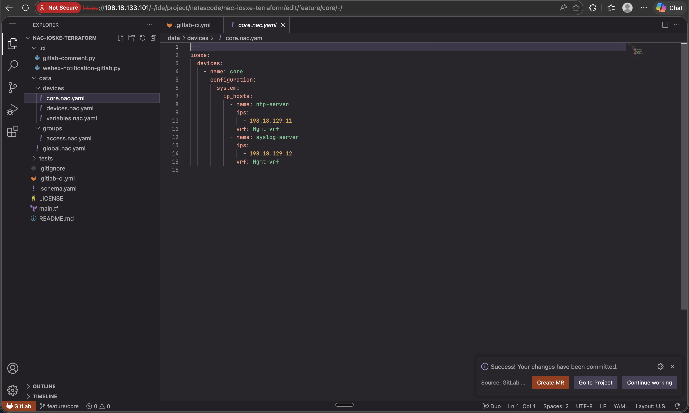
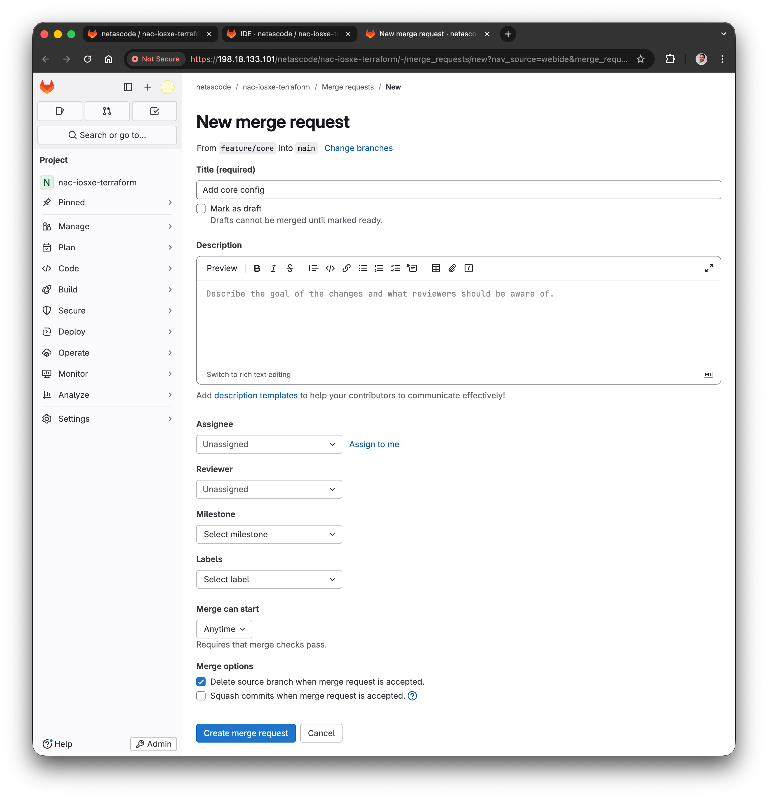
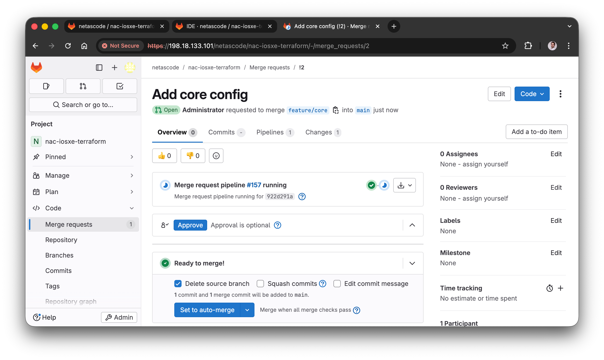
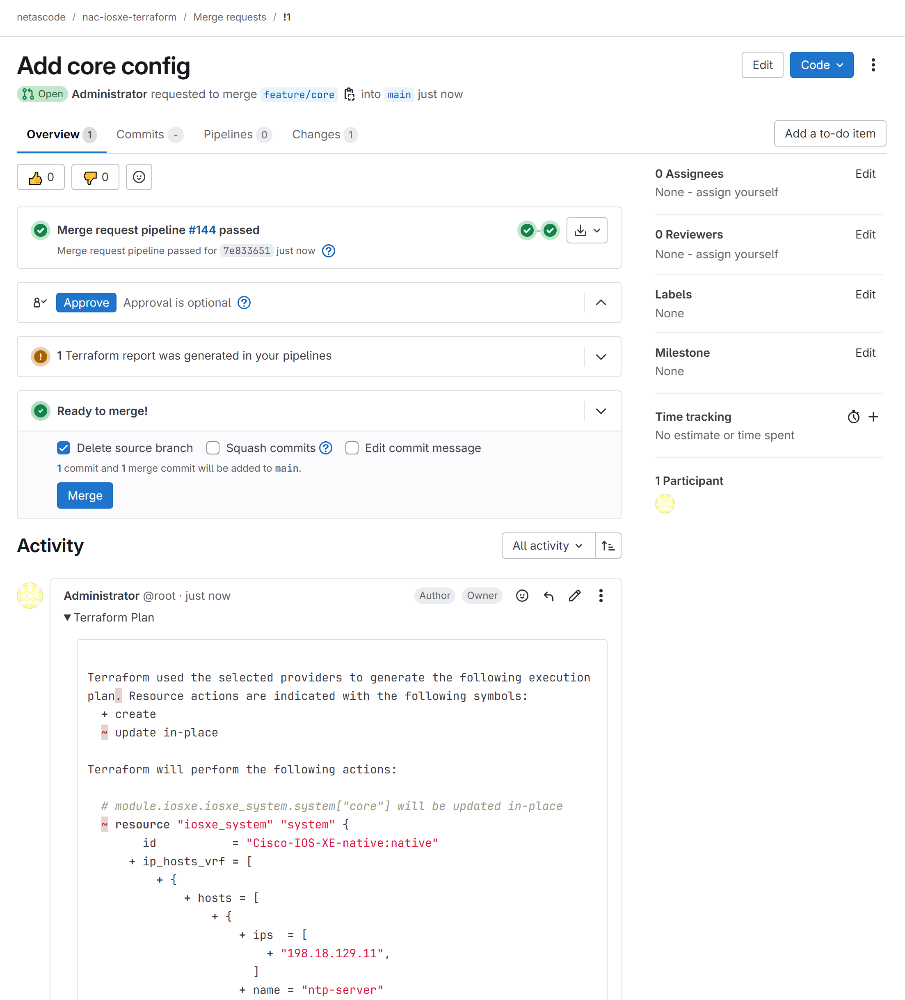
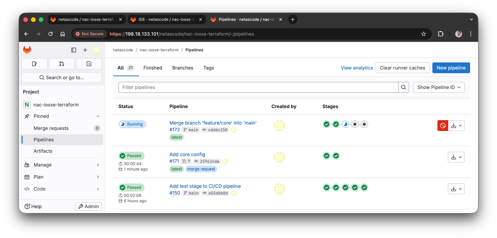

!!! warning "Prerequisite"
    This is an advanced task that requires a basic understanding of **Git** and **GitLab** concepts such as branches and merge requests.


## Why This Task Matters

In Tasks 13 and 14, you triggered CI/CD pipelines by committing directly to the `main` branch. While this approach works for learning purposes, **it's not how production environments operate**.

In Network-as-Code, the `main` branch represents the live production network configuration.
In real-world scenarios, many engineers collaborate on the same codebase. To ensure stability, reliability, and accountability, changes must go through a structured review process before being applied to production.

!!! note "Best Practice"
    Committing directly to the `main` branch (as done in earlier tasks) is generally **not recommended** in production environments. This task teaches you the proper way to manage changes using branches and merge requests.


## Lab Exercise: Complete Branch and Merge Request Workflow

In this exercise, you will:

1. Protect the `main` branch to require merge requests
2. Create a feature branch for your changes: `feature/core`
3. Add the **core** switch configuration with host IP host entries, and commit the changes to the `feature/core` branch
4. Create a merge request
5. Observe the first pipeline (validate + plan)
6. Approve and merge the request
7. Observe the second pipeline (validate + plan + deploy + test + notify)

<figure markdown>
  { width="70%" }
  { width="70%" }
</figure>

!!! note "Merge Request (MR) vs. Pull Request (PR)"
    Different version control platforms use different terminology. In GitLab, the term is **Merge Request (MR)**, while in GitHub, it's called a **Pull Request (PR)**. Both serve the same purpose: to propose changes from one branch to another and facilitate code review.


## Step 1: Protect the Main Branch

First, you'll set up branch protection of the `main` branch. This means that you can no longer push changes directly to `main`; instead, all changes must go through a merge request (MR) process.


### What is a Protected Branch?

A **protected branch** is a branch with restrictions that prevent accidental or unauthorized changes. When you protect the `main` branch:

- **Direct commits are blocked**: No one can push changes directly to main
- **Force push is not allowed**: History cannot be rewritten
- **Merge requests are required**: All changes must go through the review/approval process


### Configure Main Branch Protection

**Access GitLab**

1. Open **Chrome** on the Windows 10 VM and navigate to GitLab: [https://198.18.133.101](https://198.18.133.101)
2. Log in with credentials: **Username:** `root` / **Password:** `C1sco12345`
3. Navigate to the **netascode/nac-iosxe-terraform** project.

**Open Branch Protection Settings**

1. In your project, click on **Settings** in the left sidebar
2. Select **Repository**
3. Scroll down to find the **Protected branches** section
4. Expand section to see the settings


**Protect the Main Branch**

1. In the **Protected branches** section, you should already see `main (default)` listed
2. Configure the following settings:

| Setting                       | Value        | Explanation                                 |
|-------------------------------|--------------|---------------------------------------------|
| **Allowed to merge**          | Maintainers  | Only maintainers can merge approved changes |
| **Allowed to push and merge** | No one       | Prevents direct commits to main             |


<!-- SCREENSHOT PLACEHOLDER: gitlab-protected-branch.png -->
<figure markdown>
  { width="100%" }
</figure>

!!! info "Default Branch Protection in GitLab"
    By default, GitLab protects the `main` branch, but as you already saw, direct pushes are still allowed from maintainers. In this lab, the user `root` is a maintainer, so you need to explicitly block direct pushes to enforce the MR workflow.


### Verify Branch Protection

To confirm that the `main` branch is protected:

1. Open the **Web IDE** from the project page
2. Add the **core** device configuration: rename `data/config-device-core.nac.yaml_` to `data/config-device-core.nac.yaml` (remove the trailing underscore)
3. Click on the **Source Control** icon in the left sidebar
4. Enter a commit message:
    ```
    Add core config
    ```
5. Attempt to commit the change directly to `main`: click **Commit and push to 'main'**

<figure markdown>
  { width="100%" }
</figure>

!!! warning "You can't push to the main branch"
    You should see an error message indicating that pushing to the protected branch is not allowed. This confirms that the `main` branch is successfully protected.


## Step 2: Create a Feature Branch and Commit Changes

In the previous step, the Web IDE already prompted you to create a new branch when you tried to commit to `main`.

1. Press the **Create new branch** button
2. Enter the branch name:
    ```
    feature/core
    ```
3. Press Enter to create the branch

<figure markdown>
  { width="100%" }
</figure>

!!! success "Branch Created"
    You have successfully created a new branch named `feature/core`. This branch is now your isolated workspace to make changes without affecting the main production branch.

    You can also see `feature/core` displayed in the bottom-left corner, indicating you're working on your new branch. The commit `Add core config` is already pushed to it.


??? tip "Branch Naming Conventions"
    Use descriptive branch names that indicate the purpose of the changes:

    | Example Branch Name      | Purpose                        |
    |-------------------------|---------------------------------|
    | `feature/add-vlan-100`  | Adding a new feature            |
    | `fix/acl-typo`          | Fixing a bug or error           |
    | `update/banner-message` | Updating existing configuration |

    This makes it easy to see what each branch contains without looking at the code.


## Step 3: Create Merge Request

After committing to your feature branch, you need to create a merge request to propose merging your changes into main. Luckily, the GitLab Web IDE makes this very easy too: after pushing the commit, it shows a prompt to create a merge request.

<figure markdown>
  { width="100%" }
</figure>

Click the **Create merge request** button to proceed. It will take you to the merge request creation page.

<figure markdown>
  { width="100%" }
</figure>

You can leave the default values as they are for now. The source branch should be `feature/core`, and the target branch is `main`.

Click **Create merge request** at the bottom to finalize.

??? info "Alternatively, Create Merge Request From the GitLab UI"
    If you missed the prompt in the Web IDE, you can also create a merge request manually from the GitLab UI:

    1. Go to your project in GitLab
    2. Go to **Code** → **Merge requests** in the left sidebar
    3. Click **New merge request**
    4. Select the source branch (`feature/core`) and target branch (`main`)
    5. Click **Compare branches and continue**

The merge request is now created! You should see the merge request page with details about the changes.

<figure markdown>
  { width="100%" }
</figure>


## Step 4: Observe the First Pipeline (Validate + Plan)

When you create the merge request, GitLab automatically triggers the same pipeline used in the previous tasks. However, since this is a merge request, the pipeline only runs the **validate** and **plan** stages – it does NOT deploy anything yet.

**View the Pipeline Details**

1. On the merge request page, click on the pipeline ID (#157 in the image above)
2. You'll see a pipeline running or completed

The pipeline uses the config from your feature branch (`feature/core`) and runs the following stages:

| Stage        | Job                             | Purpose                                               |
|--------------|---------------------------------|-------------------------------------------------------|
| **validate** | `terraform fmt`, `nac-validate` | Check YAML syntax and schema compliance (See Task 10) |
| **plan**     | `terraform plan`                | Show what changes will be made to the network         |

!!! note "No Deploy Stage!"
    Notice that the **deploy** stage does NOT run on merge request pipelines. This is intentional – you want to see what will change without actually changing anything yet.

The **plan** stage also adds the terraform plan output as a comment to the merge request for easy review. Once the pipeline completes, you can expand the **Terraform plan** section in the comment under **Activity**.

<figure markdown>
  { width="100%" }
</figure>


## Step 5: Review and Approve the Merge Request

This is your opportunity to verify that the changes are correct before approving! In this case, you can see that the IP host entries will be added on the **core** switch.

In a real environment, a team lead or senior engineer would review the merge request. For this lab, you'll continue on your own.

**Approval Step**

In this lab, the approval step is not required to merge. In production environments, you would typically configure the project to require at least one approval from another team member.

!!! tip
    You can also set up the project to require successful pipeline completion, and potentially perform other checks before allowing the merge.


## Step 6: Merge to Main

!!! warning "Verify Pipeline Passed"
    Before merging, ensure that the pipeline completed successfully, all stages passed, the config and the plan looks good.

You can now proceed to merge the changes into `main`.

<!-- TODO: UPDATE OPTIONS (ACCORDING TO SCREENSHOT) -->

1. On the merge request page, review the changes and the merge options
2. You will see the following options:
    - **Delete source branch** - Removes the feature branch after merging
    - **Squash commits** - Combines all commits from the feature branch into one before merging to main
    - **Edit commit message** - You could also change the commit message for the merge commit here
3. Leave the **Delete source branch** option checked - to keep the repository clean
4. Click **Merge**

<!-- TODO: ADD SCREENSHOT -->

!!! success "Congratulations!"
    Your changes have been merged into the main branch! This triggers the deployment pipeline.


## Step 7: Observe the Deployment Pipeline

Merging to main triggers a new pipeline – this time including the deployment and test stages. This pipeline is identical to the one run in Tasks 13 and 14.


**View the Deployment Pipeline**

1. Go to **Build** → **Pipelines** in the left sidebar
2. You'll see a new pipeline that was triggered by the merge
3. Click on it to view the stages

<figure markdown>
  { width="100%" }
</figure>

The main branch pipeline runs ALL stages:

- **validate**
- **plan**
- **deploy**
- **test**
- **notify**

After the pipeline completes successfully, you can verify the changes on the network devices.


## Troubleshooting – Common Issues

??? failure "You cannot push to this branch"
    This means the branch protection is working! Create a feature branch instead of trying to push to main directly.

??? failure "Validation failed"
    Check the job logs for `nac-validate` to see what schema or syntax errors occurred. Fix them in your feature branch and push again.

    For more details, refer to [Task 10 - Schema Validation](Task10_Schema_validation.md).

??? failure "Merge conflicts"
    If there are merge conflicts, GitLab will notify you on the MR page. To resolve:

    1. Fetch the latest main branch into your feature branch
    2. Resolve conflicts locally or in the Web IDE
    3. Commit and push the resolved changes to your feature branch
    4. The MR will update automatically

??? failure "Terraform plan or apply failed"
    Check the job logs for `terraform plan` or `terraform apply` to see what went wrong. Common issues include:

    - Connectivity issues to devices
    - Authentication failures
    - Configuration errors

    If you see "Failed to install provider", re-run the job.

??? failure "Pipeline failures"
    This can happen for various reasons. Common steps to resolve:

    1. Check the job logs for specific errors
    2. Fix the issues in your feature branch
    3. Commit and push again to your feature branch – the MR pipeline will re-run automatically

If you need help, feel free to ask your instructors!


---

## What You've Accomplished

In this task, you have:

- ✅ Configured the main branch as **protected** to enforce change control
- ✅ Created a **feature branch** for your configuration changes
- ✅ Modified configuration safely in your branch
- ✅ Created a **merge request** and observed the preview pipeline (validate + plan)
- ✅ Experienced the **review and approval** process
- ✅ Merged changes and observed the deployment pipeline (validate + plan + deploy + test + notify)
- ✅ Learned the complete **end-to-end workflow** used in production environments


---

**Next:** [Lab Conclusion](Workend01_conclusion.md) - Complete the lab and review what you've learned
